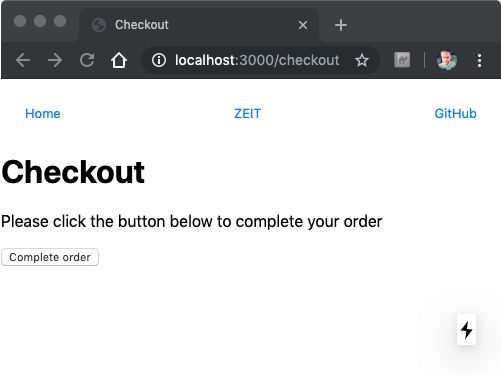
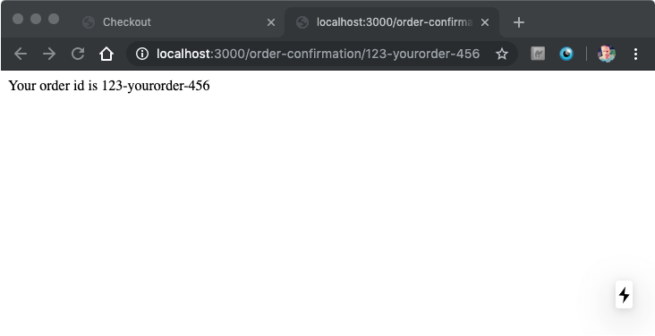
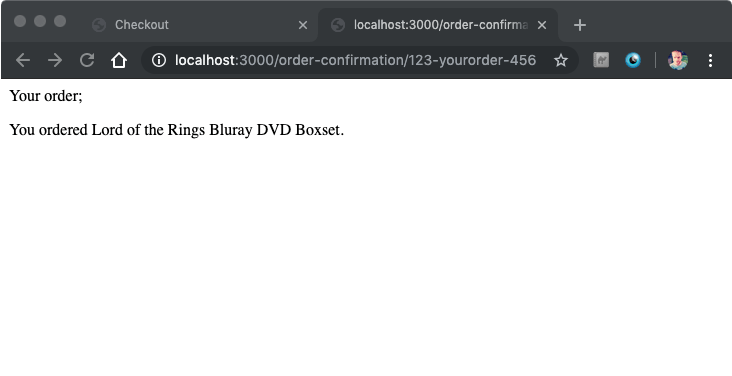

Next.js is an all-powerful, React based development platform, with everything you need to build a blazing fast, production ready, scalable, enterprise level web application. Next.js (from now on referred to simply as Next) is zero config out of the box, meaning that all the hard work of configuring tooling has been abstracted away into a couple of simple commands, meaning that you can simply get on with coding. Next gets out of your way, so you can focus your time and energy on what really matters, delivering top quality websites for yourself and your customers.

## Why choose Next.js?

Next has a comprehensive list of features out of the box, almost too many to list, as well as many official and community made plugins. Next is well established, a truly mature product, with a thriving community base and long list of happy users and companies using the product in production.

1. **Zero effort setup**. Not to be under-appreciated, you can create a Next web app, with all the bells and whistles, using one simple command; `npx create-next-app`.
2. **It feels lightweight**. Your `package.json` file consists of 3 dependencies; React, React DOM, and Next. You also get 3 commands, `dev` (for development builds), `build` (to generate a production build), and `start` (to run a production build). Out-of-the-box the page load is small enough (about 150KB), and I especially love the fact that my repo is not littered with dot files, not a single one in sight.
3. **TypeScript is crazy easy to set up**. To enable TypeScript, simply rename one of the files in your app with a `.tsx` file extension, and run `npm run dev`. Next will advise you of a command you should run to install missing dependencies. Once done, Next will automatically configure TypeScript for you, and generate a global type definitions file for better autocomplete/intellisense.
4. **It is easy to add a back-end**. Next has server-side rendering enabled out-of-the-box, which is awesome. Next also levels up by allowing you to extend the back-end via plugins/middleware. You can add Express and whatever other plugins/middleware you feel most comfortable with. You build a full-fledged Node app with whatever custom functionality you need. Result.
5. **Developing is so fast its hot**. Next has built-in Hot Module Reloading (HMR), which means that your changes get from editor to browser in a flash, no more hanging around for slow builds and refreshes.
6. **Bonus 1: Next is also a static site generator**. Next is a viable, and desirable, alternative to popular static site generators like Gatsby and Jekyll. Next can generate a static site that can be hosted cheaply with no back-end, say on GitHub pages or via an AWS S3 bucket.
7. **Bonus 2: Browser support is ideal**. Next has excellent modern browser support, and support for IE11. Next takes care of polyfilling IE11. You do not need to think about it. Job done.

## Getting started with Next.js

Getting started with Next is very straightforward. To create your first Next.js web app, run the following command in your favourite terminal;

```shell
npx create-next-app
```

Next will prompt you for a name for your new project. Enter a name and press enter.


You can build and run the website in the browser by running the following command;

```shell
cd name-of-your-project
npm run dev
```

Then open your web browser to `http://localhost:3000`. Congratulations, you're up and running. Yep, it really is that easy.

## How to use Express.js with Next.js

Express.js is arguably one of the moment popular web frameworks for Node.js and Next has full support for it, allowing you to plug in your own custom routes, database calls, and basically anything else.

Carrying on from the starter, we will add Express.js and an example route.

Start by installing Express.js;

```shell
npm i --save express
```

Now create a new folder in the root of your project for the server code, and add an `index.js`.

```shell
mkdir server
cd server
touch index.js
```

Open `index.js` and add the following code;

```javascript
const express = require('express')
const next = require('next')

const dev = process.env.NODE_ENV !== 'production'
const nextApp = next({ dev })
const handle = nextApp.getRequestHandler()

const port = 3000

nextApp.prepare().then(() => {
  const app = express()

  app.get('/my-custom-route', (req, res) =>
    res.status(200).json({ hello: 'Hello, from the back-end world!' })
  )

  app.get('*', (req, res) => {
    return handle(req, res)
  })

  app.listen(port, err => {
    if (err) throw err
    console.log(`> Ready on localhost:${port}`)
  })
})
```

We need to tweak the `package.json` NPM script to start Node directly rather than calling Next. Update your scripts as follows;

```diff
"scripts": {
-  "dev": "next dev",
+  "dev": "node server/index.js",
  "build": "next build",
  "start": "next start"
},
```

Open your web browser to `http://localhost:3000` and then `http://localhost:3000/my-custom-route` respectively and note the response from both.


You now have custom routing, but you have to manually restart the process to see any server-side changes you make, which can be a bit annoying after a while. Let's fix that.

## How to use Nodemon with Next.js and Express

To speed up web application development, it can be beneficial to use Nodemon with Next.js when you have a custom back-end. Nodemon will watch your server code for changes and automatically restart the Node process so you can see the impact of your changes quicker.

To install Nodemon, add the following code;

```shell
npm install --save-dev nodemon
```

And create a new file in root of your project, called `nodemon.json`;

```json
{
  "watch": ["server"],
  "exec": "node server/index.js",
  "ext": "js"
}
```

This will watch all the files in the `server` directory that have a `.js` file extension and restart your Node process automatically when changes are detected.

Finally, update your `package.json` so that the `dev` script calls `nodemon` instead;

```diff
"scripts": {
- "dev": "node server/index.js",
+ "dev": "nodemon",
  "build": "next build",
  "start": "next start"
},
```

Change you `server/index.js` file as follows;

```diff
app.get("/my-custom-route", (req, res) =>
-  res.status(200).json({ hello: "Hello, from the back-end world!" })
+  res.status(200).json({ hello: "Hello, from the updated back-end world!" })
);
```

Observe in the terminal that the process was restarted. Refresh your web browser to see the updated message.

## Next.js convention-based routing

Routing in Next is file system based, meaning as long as you create files with the right name in the right place, your routes will be configured automatically.

To add a new page called `checkout`, create a new file in `pages` called `checkout.js`, and add the following code;

```javascript
import React from 'react'
import Link from 'next/link'
import Head from 'next/head'
import Nav from '../components/nav'

const Checkout = () => (
  <div>
    <Head>
      <title>Checkout</title>
    </Head>

    <Nav />

    <h1>Checkout</h1>
    <p>Please click the button below to complete your order</p>
    <a>Complete order</a>
  </div>
)

export default Checkout
```



Navigate your browser to `http://localhost:3000/checkout` and observe that a new page has been created and is available immediately (with no config!).

## Next.js dynamic routing

Next has full support for dynamic routing. It is common to pass simple state around in the URL, lets say an `orderId` as an example. The `orderId` might be added to the URL on one page (say the checkout page) and then utilsed on the next page (say the order confirmation page). With Next's dynamic routing, it is easy to create pages where the full URL is not necessarily known at build time.

To demonstrate, open `checkout.js` and make the following alternation;

```diff
import React from 'react'
+import Link from 'next/link'
import Head from 'next/head'
import Nav from '../components/nav'

const Checkout = () => (
  <div>
    <Head>
      <title>Checkout</title>
    </Head>

    <Nav />

    <h1>Checkout</h1>
    <p>Please click the button below to complete your order</p>
+   <Link href="/order-confirmation/123-yourorder-456">
      <a>Complete order</a>
+   </Link>
  </div>
)

export default Checkout
```

Clicking the _Complete Order_ link will redirect you to a 404 page, because we haven't created the page yet!

In the pages folder, create a new directory called `order-confirmation` and a file called `[id].js`.

```shell
cd pages
mkdir order-confirmation
cd order-confirmation
touch [id].js
```

Open `[id].js` and add the following;

```javascript
import * as React from 'react'
import { useRouter } from 'next/router'

function OrderConfirmation() {
  const router = useRouter()
  return <div>Your order id is {`${router.query.id}`}</div>
}

export default OrderConfirmation
```

You should see the order number written out on the page.



Now of course this is not terribly helpful, you probably want to use `orderId` to actually fetch the order. For optimal performance, you will want to fetch the data _server-side_. I.e. for optimal performance you want the order to be fetched when the page renders on the server, not on the client. Next to the rescue again!

## Fetch data server-side using Next.js getInitialProps

Next has a built-in mechanism for fetching data on the server. You could use your own fetch library (like Axios for example) or, with an isomorphic polyfill, the native `fetch` API. Next looks for a static function on your component called `getInitialProps`, which it will automatically call on the server-side render, when it exists.

For this example, we will use `isomorphic-unfetch` as our polyfill, so install it as follows;

```shell
npm install --save isomorphic-unfetch
```

We want to use the `orderId` to fetch the actual order from the server on render, so open `server/index.js` and add the following route;

```diff
const express = require("express");
const next = require("next");

const dev = process.env.NODE_ENV !== "production";
const nextApp = next({ dev });
const handle = nextApp.getRequestHandler();

const port = 3000;

nextApp.prepare().then(() => {
  const app = express();

  app.get("/my-custom-route", (req, res) =>
    res.status(200).json({ hello: "Hello, from the back-end world!" })
  );

+ app.get("/api/order/:id", (req, res) => {
+   const { id } = req.params;
+
+   if (id) {
+     switch (id) {
+       case "123-yourorder-456":
+         return res.status(200).json({
+           success: true,
+           item: "Lord of the Rings Bluray DVD Boxset"
+         });
+       case "456-someother-333":
+         return res.status(200).json({
+           success: true,
+           item:
+             "The Best of Classical Music - Mozart, Beethoven, Bach, Chopin... Classical Music Piano Playlist Mix"
+         });
+     }
+   }
+   return res.status(404).json({
+     success: false
+   });
+ });

  app.get("*", (req, res) => {
    return handle(req, res);
  });

  app.listen(port, err => {
    if (err) throw err;
    console.log(`> Ready on localhost:${port}`);
  });
});
```

Now we can call `/api/order` with an `orderId` and the details for that order will be returned to us for rendering.

Here are the URL's you could call with a `GET` request;

```text
/api/order/123-yourorder-456
/api/order/456-someother-333
```

We need to utilise `getInitialProps` for calling our newly created order API, so add the following code;

```diff
import * as React from 'react'
import { useRouter } from 'next/router'

function OrderConfirmation() {
  const router = useRouter()
  return <div>Your order id is {`${router.query.id}`}</div>
}

+OrderConfirmation.getInitialProps = async ({ query }) => {
+  const result = await fetch(`http://localhost:3000/api/order/${query.id}`);
+  if (result.status === 200) return { order: await result.json() };
+
+  return { order: undefined };
+};

export default OrderConfirmation
```

When the order is successfully fetched, it will be returned to our component (we will use in next). If we were unable to find the order, or the request to our API fails for some reason, we will return `undefined` and display an appropriate error message.

Update your component as follows;

```diff
import * as React from 'react'
-import { useRouter } from 'next/router'
+import fetch from "isomorphic-unfetch";

-function OrderConfirmation() {
-  const router = useRouter()
-  return <div>Your order id is {`${router.query.id}`}</div>
-}
+function OrderConfirmation({ order }) {
+  if (!order) {
+    return <div>Sorry, we could not find your order!</div>;
+  }

+  return (
+    <div>
+      Your order;
+      <p>You ordered {order.item}.</p>
+    </div>
+  );
+}

OrderConfirmation.getInitialProps = async ({ query }) => {
  const result = await fetch(`http://localhost:3000/api/order/${query.id}`);
  if (result.status === 200) return { order: await result.json() };

  return { order: undefined };
};

export default OrderConfirmation
```

Don't forget to import `isomorphic-unfetch`, which is a server-side compatible polyfill for the browser Fetch API.



Now the order is displayed on screen!

Requesting an invalid order should result in the appropriate error message. Note that you can disable client-side JavaScript and the code still works! Pretty sweet.

## Next.js automatic code splitting and lazy loading

Next takes care of code splitting automatically. If a module is used on more than half of pages, it is included in the main bundle for the site, otherwise it will exist in a page-specific bundle.

Modules can be deferred until they are needed, meaning they can be lazy loaded. This is because Next supports the upcoming [Dynamic Imports feature](https://github.com/tc39/proposal-dynamic-import) (which officially lands in ES2020). Modules can also be loaded in a way which means they are only rendered on the client and not on the server (where SSR might not be supported).

Take the following example;

```javascript
const Webcam = dynamic(import('react-webcam').then(instance => instance.Webcam), {
  ssr: false
})
```

The **React Webcam** library is perfect for capturing pictures of you user via the Webcam or Selfie camera. Problem is, Webcams just don't exist server-side, so you can pass in `{ ssr:false }` to have the module only loaded client side!

## Styling in Next.js

Next has several built-in mechanisms for dealing with styling.

### Next.js CSS

Next has good support for _regular_ CSS files and CSS modules.

Supported is provided via a package called `@zeit/next-css`, which you can install as follows;

```shell
npm install --save @zeit/next-css
```

Now create a new file in the root of your project called `next.config.js`;

```shell
touch next.config.js
```

And add the following;

```javascript
// next.config.js
const withCSS = require('@zeit/next-css')
module.exports = withCSS({
  /* config options here */
})
```

That's it, you now have CSS support.

Create a new file in `pages` called `global.css`, and add the following;

```css
code {
  background-color: pink;
  padding: 4px;
  border: 1px solid red;
}
```

Then open `pages/index.js` and import your styles as follows;

```javascript
import './global.css'
```


All elements on the site that use the `code` tag should now have some lovely styling, as shown in the image above.

### Next.js CSS Modules

With the previously discussed CSS plugin, we also have support for CSS modules. Make the following changes to `next.config.js`;

```diff
// next.config.js
const withCSS = require("@zeit/next-css");
module.exports = withCSS({
-  /* config options here */
+  cssModules: true
});
```

This allows us to import CSS module files directly into our components and apply styles directly to specific elements. The styles will be scoped so the styles cannot bleed/cascade to other elements.

Create a new file in `pages` called `checkout.module.css` and add the following;

```css
.title {
  font-size: 10rem;
}
```

Now open `checkout.js` and import the css file and apply the style to the `h1` tag;

```diff
import React from "react";
import Link from "next/link";
import Head from "next/head";
import Nav from "../components/nav";

+import styles from "./checkout.module.css";

const Checkout = () => (
  <div>
    <Head>
      <title>Checkout</title>
    </Head>

    <Nav />

-   <h1>Checkout</h1>
+   <h1 className={styles.title}>Checkout</h1>
    <p>Please click the button below to complete your order</p>
    <Link href="/order-confirmation/123-yourorder-456">
      <a>Complete order</a>
    </Link>
  </div>
);

export default Checkout;
```

The title should now be considerably larger than before.

## Next.js CSS-In-JS

The recommended way of styling a Next web app is to use a CSS-in-JS solution.

Next comes with built in support for Styled JSX, allowing you to define your styles in `<style />` tags.

Consider the following code;

```javascript{17}
const Checkout = () => (
  <>
    <div>
      <Head>
        <title>Checkout</title>
      </Head>

      <Nav />

      <h1 className={styles.title}>Checkout</h1>
      <p>Please click the button below to complete your order</p>
      <Link href="/order-confirmation/123-yourorder-456">
        <a>Complete order</a>
      </Link>
    </div>

    <style jsx>
      {`
        p {
          color: yellow;
        }
      `}
    </style>
  </>
)
```

We define a `<style>` tag with the `jsx` property (being set to `true` here is inferred). This tells Next that we are using Styled JSX. Even though we have used a selector here that would normal effect every paragraph tag on the page, only the `<p>` tag in this specific component is styled. This is because `<style>` tags in Next/Styled JSX are scoped to the specific component, in a similar fashion to how we saw CSS modules earlier.

Global styles can still be applied with the following alteration;

```diff
-<style jsx>
+<style global jsx>
  {`
    p {
      color: yellow;
    }
  `}
 </style>
```

Now all the `p` tags on the page are appropriately styled.

There are a range of CSS-in-JS solutions available, including; Styled components, Styletron, Glamor, Cxs, Aphrodite, Fela and many more. I highly recommend [checking out their excellent documentation](https://github.com/zeit/next.js#css-in-js) on this topic.

## Next.js static site generator

As if all that was not enough, Next also has a built-in static site generator mode. This means that you can compile everything down to just plain old HTML and JavaScript and run everything on a traditional static host, from and S3 bucket, from GitHub pages, or from pretty much anywhere else. Most importantly, running a static site is almost always considerably cheaper than using a Linux based host, if not free.

This does, of course, mean that your website cannot have dynamic, server-side elements. Static site is exactly that, static.

When your app does not have dynamic elements, you can run the following commands to generate a static build;

```shell
npm run next build
npn run next export
```

This will generate all the static files in a folder called `out`. You can then use any HTTP Server to run the site locally (or remotely, on a web server).

For example, try;

```shell
npm install -g http-server
http-server ./out -o
```

Navigate your browser to `http://localhost:8080/` to see your static site in action.

## Summary

We covered a lot of ground at a high level in this post. We discussed why you might want to use Next at all, and what some of the main features are. We talked about how to configure a custom back-end with Express and some custom routes. We also discussed how to fetch data from a custom API using `fetch`, `getInitialProps` and `isomorphic-unfetch`. Next has rich support for various methods of styling, including using traditional global CSS files, CSS modules, and CSS-in-JS. Finally, we discussed how to use Next to generate a static site that can be hosted cheaply (or for free) on many popular web hosts, including AWS S3 and GitHub pages.
