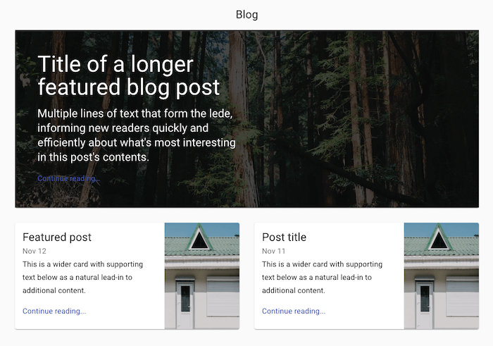

We love Next.js, and we love Material UI. In fact, we blog about it [quite a bit around here](/react/). Using it a lot, however, we have noticed that we have started repeating ourselves when it comes to getting the two to play nicely, so we figured we would put the set-up for Next.js and Material UI right here, and refer back to it instead. We will keep this post up to date as the set-up changes over time.

## Set-up your project quickly with Next.js

The fastest and easiest (and in my opinion, the best) way to get started with a full-stack server-side rendered React application today is using [Next.js](https://nextjs.org/). Next.js gets out of the way and enables us to focus on solving the problem at hand, building our website. Next takes care of all the heavy lifting and is extensible enough that we can plug in our own custom back-end.

<div class="alert alert-primary">
<p class="mb-0">If you need a crash course on getting started with Next.js, you should consider reading my aptly named post <a href="/react/getting-started-nextjs/">Getting started with Next.js</a>.</p>
</div>

First the easy bit, creating a Next project. Open your terminal to an appropriate folder and run the following command in your terminal of choice;

```shell
npx create-next-app
```

Enter a name for your project. For the purposes of this tutorial I went with `next-material-ui-setup-learning`. Next will set itself up and install all required dependencies.

Run the following;

```shell
cd next-material-ui-setup-learning && npm run dev
```

Then open your web browser to `http://localhost:3000`. Congratulations, you’re up and running. Yep, it really is that easy.

## How to set-up Material UI with Next.js

Material UI is a collection of React components built using the [Material UI design framework](https://material.io/design/). Material UI gives us a stylish and modern look, with minimal effort required to get started.

Start by installing Material UI as follows;

```shell
npm install --save @material-ui/core
```

Open `pages/index.js`, delete all the existing code, and add the following;

```javascript
import React from 'react'
import { makeStyles } from '@material-ui/core/styles'
import CssBaseline from '@material-ui/core/CssBaseline'
import Toolbar from '@material-ui/core/Toolbar'
import Paper from '@material-ui/core/Paper'
import Typography from '@material-ui/core/Typography'
import Grid from '@material-ui/core/Grid'
import Card from '@material-ui/core/Card'
import CardActionArea from '@material-ui/core/CardActionArea'
import CardContent from '@material-ui/core/CardContent'
import CardMedia from '@material-ui/core/CardMedia'
import Hidden from '@material-ui/core/Hidden'
import Link from '@material-ui/core/Link'
import Container from '@material-ui/core/Container'

const useStyles = makeStyles(theme => ({
  toolbar: {
    borderBottom: `1px solid ${theme.palette.divider}`
  },
  toolbarTitle: {
    flex: 1
  },
  mainFeaturedPost: {
    position: 'relative',
    backgroundColor: theme.palette.grey[800],
    color: theme.palette.common.white,
    marginBottom: theme.spacing(4),
    backgroundImage: 'url(https://source.unsplash.com/user/erondu)',
    backgroundSize: 'cover',
    backgroundRepeat: 'no-repeat',
    backgroundPosition: 'center'
  },
  overlay: {
    position: 'absolute',
    top: 0,
    bottom: 0,
    right: 0,
    left: 0,
    backgroundColor: 'rgba(0,0,0,.7)'
  },
  mainFeaturedPostContent: {
    position: 'relative',
    padding: theme.spacing(3),
    [theme.breakpoints.up('md')]: {
      padding: theme.spacing(6),
      paddingRight: 0
    }
  },
  card: {
    display: 'flex'
  },
  cardDetails: {
    flex: 1
  },
  cardMedia: {
    width: 160
  }
}))

const featuredPosts = [
  {
    title: 'Featured post',
    date: 'Nov 12',
    description:
      'This is a wider card with supporting text below as a natural lead-in to additional content.'
  },
  {
    title: 'Post title',
    date: 'Nov 11',
    description:
      'This is a wider card with supporting text below as a natural lead-in to additional content.'
  }
]

const Blog = () => {
  const classes = useStyles()

  return (
    <>
      <CssBaseline />
      <Container maxWidth="lg">
        <Toolbar className={classes.toolbar}>
          <Typography
            component="h2"
            variant="h5"
            color="inherit"
            align="center"
            noWrap
            className={classes.toolbarTitle}
          >
            Blog
          </Typography>
        </Toolbar>
        <main>
          {/* Main featured post */}
          <Paper className={classes.mainFeaturedPost}>
            {/* Increase the priority of the hero background image */}
            {
              
            }
            <div className={classes.overlay} />
            <Grid container>
              <Grid item md={6}>
                <div className={classes.mainFeaturedPostContent}>
                  <Typography component="h1" variant="h3" color="inherit" gutterBottom>
                    Title of a longer featured blog post
                  </Typography>
                  <Typography variant="h5" color="inherit" paragraph>
                    Multiple lines of text that form the lede, informing new readers
                    quickly and efficiently about what&apos;s most interesting in this
                    post&apos;s contents.
                  </Typography>
                  <Link variant="subtitle1" href="#">
                    Continue reading…
                  </Link>
                </div>
              </Grid>
            </Grid>
          </Paper>
          {/* End main featured post */}
          {/* Sub featured posts */}
          <Grid container spacing={4}>
            {featuredPosts.map(post => (
              <Grid item key={post.title} xs={12} md={6}>
                <CardActionArea component="a" href="#">
                  <Card className={classes.card}>
                    <div className={classes.cardDetails}>
                      <CardContent>
                        <Typography component="h2" variant="h5">
                          {post.title}
                        </Typography>
                        <Typography variant="subtitle1" color="textSecondary">
                          {post.date}
                        </Typography>
                        <Typography variant="subtitle1" paragraph>
                          {post.description}
                        </Typography>
                        <Typography variant="subtitle1" color="primary">
                          Continue reading...
                        </Typography>
                      </CardContent>
                    </div>
                    <Hidden xsDown>
                      <CardMedia
                        className={classes.cardMedia}
                        image="https://source.unsplash.com/random"
                        title="Image title"
                      />
                    </Hidden>
                  </Card>
                </CardActionArea>
              </Grid>
            ))}
          </Grid>
          {/* End sub featured posts */}
        </main>
      </Container>
    </>
  )
}

export default Blog
```

The above code should result in the following blog post website design;



Note that the images are random, so yours might look visually different.

We're not here to discuss the intricate details of how Material UI works, we [strongly suggest reading the documentation for that](https://material-ui.com).

We're almost done, we just have to fix one problem first, which is the main reason why this post exists.

If you already had your development server running when you added the code above into your project, you _may_ have a page that looks like the screenshot above. However, what happens when you refresh the page?

The layout is now broken.


What happened? You may notice that it's mainly styling that is missing. The reason is that we need some stylesheets to be injected into the DOM for us, and this is not currently happening.

Thankfully, Next makes this easy to do.

In your `pages` directory, create a new page called `_document.jsx`, and add the following code;

```javascript
import React from 'react'
import Document, { Html, Head, Main, NextScript } from 'next/document'
import { ServerStyleSheets } from '@material-ui/styles'
import { createMuiTheme, responsiveFontSizes } from '@material-ui/core/styles'

const theme = responsiveFontSizes(createMuiTheme())

class MyDocument extends Document {
  render() {
    return (
      <Html>
        <Head>
          <meta charSet="utf-8" />
          <meta
            name="viewport"
            content="minimum-scale=1, initial-scale=1, width=device-width, shrink-to-fit=no"
          />
          <meta name="theme-color" content={theme.palette.primary.main} />
          <link
            rel="stylesheet"
            href="https://fonts.googleapis.com/css?family=Roboto:300,400,500,700|Roboto+Slab:400,700|Material+Icons"
          />
          <style jsx global>
            {`
              html,
              body {
                height: 100%;
                width: 100%;
              }
              *,
              *:after,
              *:before {
                box-sizing: border-box;
              }
              body {
                font-family: 'Roboto', 'Helvetica', 'Arial', sans-serif;
                font-size: 1rem;
                margin: 0;
              }
            `}
          </style>
        </Head>
        <body>
          <Main />
          <NextScript />
        </body>
      </Html>
    )
  }
}

MyDocument.getInitialProps = async ctx => {
  // Render app and page and get the context of the page with collected side effects.
  const sheets = new ServerStyleSheets()
  const originalRenderPage = ctx.renderPage

  ctx.renderPage = () =>
    originalRenderPage({
      enhanceApp: App => props => sheets.collect(<App {...props} />)
    })

  const initialProps = await Document.getInitialProps(ctx)

  return {
    ...initialProps,
    // Styles fragment is rendered after the app and page rendering finish.
    styles: [
      <React.Fragment key="styles">
        {initialProps.styles}
        {sheets.getStyleElement()}
      </React.Fragment>
    ]
  }
}

export default MyDocument
```

We don't need to dive into a great deal of detail here. Just know that the styles for Material UI are being injected into the document for you so that the page renders correctly on load and on client-side hydration/hot module reloading.

When you refresh the page, the styles should still work correctly.

## Summary

That's it! In this short post we discussed how to create a new project using Next.js, and how to install and create a basic page with Material UI. Once done, we discussed how to fix the problem of Material UI styles going missing when the page is refreshed.
