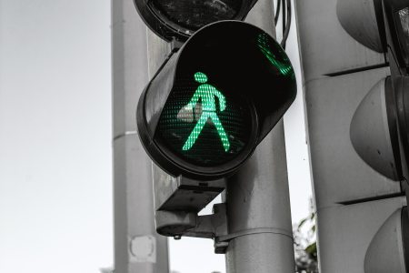
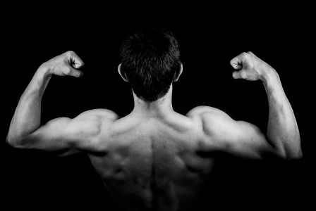

Fasting is a very efficient means of accelerating weight loss and boosting ketone levels. Fasting, meaning to refrain from eating food and only consuming water (sometimes referred to as _water fasting_) has been practiced by humans for millennia and was once a natural part of the human diet (and still is across large parts of the world). The ketogenic diet (keto) alters the body chemistry (lowers blood sugar levels and insulin resistance), which enables the body to start a process called ketogenesis, which makes it possible to utilize fat for energy. When fasting, the body can tap into stored fat (subcutaneous belly fat and visceral fat) and sustain itself for extended periods of time. The feeling of hunger and desire to eat evaporates and you can be left feeling healthy, energetic, clear of mind, and feel as though you have tapped into some long forgotten human super-power.

## When should I start fasting?

Keto enables people to get _in tune_ with their body. Once carbohydrate based foods are removed, it is like all the background noise suddenly quietens and signals from your body become easier to hear and interpret. For example, one of the first things you learn when starting keto is how to tell the difference between _hunger_ and _thirst_. People typically think that when their stomach _rumbles_, this is a sign of hunger. More often than not, however, this is wrong and is usually a sign of dehydration. When starting keto, this signal becomes clearer and the effects on the body of drinking water when thirsty are more obvious.

The same is true of fasting. Your body will communicate to you when it is time to start fasting. Fasting will come naturally and is not something we recommend that you try to instigate on some arbitrary schedule.

<figure>

<figcaption class="text-center mt-3">Your body will communicate to you when it is time to start fasting</figcaption>
</figure>

## Skipping meals

The simplest form of fasting is to skip meals. Eating high fat foods, especially dairy and nuts, will make you feel satisfied and _full_, and the desire to eat frequently will gradually trail off. If you eat a large breakfast consisting of; bacon (great source of salt, fat, and protein), eggs, sausage, cheese, and black pudding (cooked in olive oil) you will probably take in around 1250-1500 calories.

A gram of fat has more than twice the number of calories as a gram of carbs, so you will get more than twice as much energy from each meal compared to the equivalent sized carb based meal.

The typical adult requires between 1800-2500 calories per day depending on age, height, gender, and level of physical activity. Given such a large breakfast, you will need about 300-1000 more calories to meet your daily requirement (and maintain your current weight), which you could get easily from one more meal. As evening dinner is usually a social event, people will often start by skipping lunch.

## Different types of fasting

We believe there are several different types of fasting, and they each have a role to play.

### Intermittent fasting

This is probably the best known form of fasting, as there are various _traditional_ weight loss programs that use it as part of their marketing strategy.

There are two forms of intermittent fasting;

- Eating only during set periods of time, otherwise known as _eating windows_. For example, you may allow yourself to eat between 12pm-8pm, and refrain from eating the rest of the time. As there is a 16 hour gap which no food and 8 hours where you can eat, this may be referred to as 16/8. Were you to refrain from eating for 20 hours of the day, and eat only during a 4 hour window, this would be referred to as 20/4.
- Eating _normally_ some days, and severely restricting calories on others. Some _diets_ encourage participants to eat _normal_ amounts of food for some days of the week (for example, eat as usual for 5 days of the week) and then restrict calorie intake to some arbitrarily low number, like 500, on the other two days.

When we refer to intermittent fasting, we are specifically talking about skipping meals and isolating eating to only certain times of the day. This could be 16/8, or 20/4, or whatever period of time works best for you.

We have found that having days where we restrict calorie intake to that equivalent to a very small meal makes us feel **worse** than skipping food altogether. This might be because consuming food wakes up the metabolism and the body starts up processes like producing stomach acid, raising insulin levels, salivating, and more in expectation of food arriving. When that does not happen the body has fired up those processes for nothing.

Intermittent fasting, once you are keto adapted, will probably come about naturally for most people, and we recommend that you embrace it and make it form part of your daily routine.

### One meal a day

This is a natural progression of intermittent fasting and is centered around getting all of the days nutrition and calories from a single meal or from a very tight time window, 1 hour for example. The idea is that you eat a very large meal once per day, which is complete with your daily need for fat, protein, salt, and other macro/micronutrients.

We have found this to be a very effective means of fasting and this has become our default way of eating. This technique allows you to eat large amounts of delicious food with your family on a daily basis. Eating a meal of such size leaves you feeling full, satiated, and emotionally happier. The thought of eating food at other times of day (breakfast, lunch) melts away and leaves you with more time to spend on other activities, like going out for an afternoon walk.

### Extended fasting

Extended fasting stretches the no-eating window beyond 24 hours to 48-96 hours. This is a more advanced fasting strategy and we recommend that you build up to it over time rather than diving straight in. You should be fully keto adapted before attempting this.

Read our extended fast survival guide below for tips and advice.

### Prolonged fasting

Advanced fasting, whereby one refrains from eating food for 96 hours or longer. Like _extended fasting_, you should be keto adapted first and work your way up to this.

A common strategy in the keto and fasting communities to maximize weight loss is to fast for 5 days, then feast for 2 days, repeating the cycle each week. People often find it easier to embark on a prolonged fast on weekdays, then enjoy their food in unlimited quantities at the weekend.

By the way, the human body is capable of lasting several weeks without food, but only a few days without water. In fact, the world record for the longest water fast is 382 days.

<figure>

<figcaption class="text-center mt-3">Fasting does not cause muscle breakdown</figcaption>
</figure>

## Does fasting cause muscle breakdown?

No. From an evolutionary perspective it makes no sense for the body to break down muscle for energy when fat (a rich source of energy) is available. Fasting for several days will result in a boost of HGH (Human Growth Hormone) which contributes to muscle **growth**.

## How to survive an extended fast

If you are thinking about starting an extended or prolonged fast, we recommend;

- Avoid drinking tea or coffee because it is a diuretic. This means that you will have an increased need to urinate, resulting in a loss of important electrolytes (sodium, potassium & magnesium) and stored water.
- Consume 1-2 teaspoons of good quality salt per day to restore electrolyte balance, consider supplementing potassium & magnesium.
- Consider taking a multivitamin to replace lost or used micronutrients.
- Exercising may seem counterintuitive, but exercising in a fasted state will increase ketone levels, and human growth hormone, giving you more energy.

Finally, consider seeking support from like-minded people who are also fasting on a regular basis, especially when starting out. Check out this subreddit dedicated to fasting ([/r/fasting](https://reddit.com/r/fasting)).

## What are the drawbacks of fasting?

We've struggled to find much reliable, concrete, evidence based science that specifically focuses on the drawbacks of fasting. A lot of _science_ you may find online is opinion based and loosely based on surveys rather than controlled trials.

From our own experience, however, we encounter problems occasionally when fasting.

- Shrunken stomach. When we fast for 2+ days, our stomach shrinks. The stomach is a muscle and gets smaller without regular use. This is not so much of a problem, except for when it comes to breaking our fast. When we break our fast we have to make sure we have a smallish meal to start, otherwise we feel a lot of discomfort and even broken sleep for up to 12 hours afterwards, presumably because the stomach is busy stretching back to its normal size.
- Dehydration. We have to be extremely vigilant about how much water we consume. We need to drink more water when fasting otherwise dehydration is a major problem.

Check out our fasting survival guide above for tips on how to avoid these issues. Also check out [Medical News Today](https://www.medicalnewstoday.com/articles/295914.php) for more details about fasting generally.

## Summary

Fasting, when refraining from eating food and only drinking water for between 16 hours to several days, is a means of accelerating weight loss, and boosting ketone levels. Eating ketogenic meals is a way reducing food cravings and getting more energy from food, and often naturally leads to skipping meals. There are several types of fasts, from; skipping meals, to eating during windows (intermittent fasting), to refraining from eating for days at a time (extended/prolonged fasting). Fasting does not usually cause muscle breakdown, in fact it can promote muscle growth because the body naturally produces more human growth hormone (HGH). You can survive an extended fast by avoiding caffeinated drinks, consuming salt, exercising more, and discussing your feelings with like minded others in the community. There are a couple of drawbacks, including dehydration, but by paying attention your body you can identify these problems early and take corrective action as needed.
