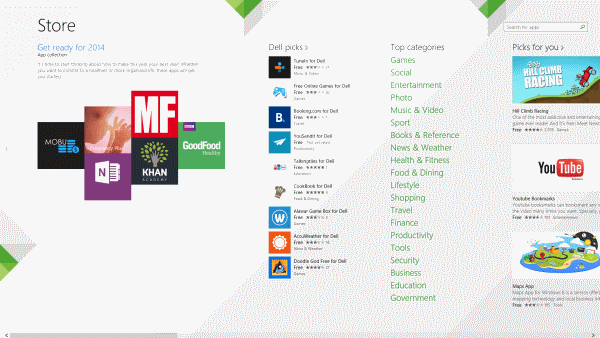
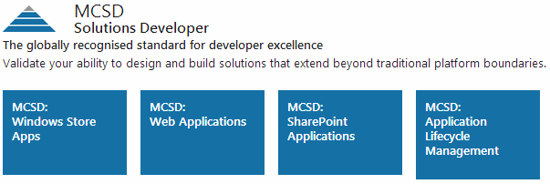

It is important in the world of software development that every developer re-train and update their skills regularly. Failure to do so will probably result in stagnation and loss of earnings over an extended period.There has been a massive shift over the last few years from development of traditional desktop applications being written in Windows Forms (WinForms) and Windows Presentation Foundation (WPF) to the web and mobile. Open standards, including HTML 5 and CSS 3, have been driving a new era in user experience and a large array of new devices are shifting users away from the desktop.

### 1. Sharpen your design skills

Like it or not, the days of developers being able to get away with having no design skills are over. Applications and websites are becoming a lot more design focused and interactive. Websites can make-or-break a business, especially start-ups, so they must be graphical, colourful, and easy to use.

<u>Windows 8 Store Applications</u>

Windows 8 store applications are all the evidence you need here. Love it or hate it, Metro (for lack of an official name) is here to stay, in one form or another, and there is really nowhere to hide with applications like this. You have the entire screen (excluding a 1px border) to fill with graphical, well designed content. Users are simply not going to accept poorly designed, ugly applications. Gone are the days of console applications and drab dull websites. Deal with it.

### 2. Learn a web technology

The World Wide Web has never been as popular as it is today, and the growth is still accelerating. [According to InternetWorldStats.com, there are approximately 2.4 billion people with access to the Internet](http://www.internetworldstats.com/stats.htm 'InternetWorldStats.com'). That's a massive market that businesses can exploit. The easiest way to target the market is with a website that provides products and/or services.

<u>Internet user numbers have exploded in every region over the last 14 years</u>

ASP .NET MVC is a mature Microsoft .NET platform technology for developing web applications rapidly. Other technologies you will need to know include;

* [HTML 5](http://www.w3schools.com/html/html5_intro.asp) / [CSS 3](http://www.htmlgoodies.com/html5/tutorials/learn-css3-from-a-z-getting-started-with-layouts-.html)
* [JavaScript](https://developer.mozilla.org/en-US/docs/Web/JavaScript/Getting_Started)
* [jQuery](http://www.w3schools.com/jquery/default.asp?utm_source=twitterfeed&utm_medium=twitter)
* [Knockout](http://knockoutjs.com/documentation/introduction.html) / [AngularJS](https://geekli.st/zmilan/links/20659)

Alternatives to ASP .NET MVC include ASP .NET WebForms (WinForms for the web), [PHP](http://www.php.net/manual/en/getting-started.php) and [MonoRail](http://www.castleproject.org/projects/monorail/).

### 3. Go mobile

The last couple of years have seen an explosion in mobile devices. The Apple iPhone effectively opened the market in 2007 and since then we have since seen a large variety of devices hit the market. Everything from Smartphones, to Tablets, to [Phablets](http://en.wikipedia.org/wiki/Phablet) and everything else in-between. Mobile devices come in all makes, models, screen sizes and resolutions. Mobile devices can be powered by Apple's iOS, Google's Android, and Microsoft's Windows Phone operating systems. This has [significantly contributed to a global slowdown of PC sales](http://www.businessweek.com/news/2014-01-09/pc-shipments-decline-6-dot-9-percent-in-lackluster-holiday-shopping).

> Manufacturers shipped 315.9 million units, returning to 2009 levels and making it the "worst decline in PC market history," researcher Gartner Inc. said in a statement yesterday. IDC also said shipments had a record decline.

Learn to write for mobile. Whether its iOS, Android or Windows Phone ... pick one. Or alternatively check out Xamarin, which for a <strike>small</strike> fee will allow you to target any of these operating systems from the familiarity of Microsoft Visual Studio (C# or VB).

### 4. Get certified

If you want to demand a top salary when seeking new employment, getting certified will give you an edge. Whilst getting certified is not the be all and end all, if you're going for a well-paid job and there are many candidates, being certified will help you stand out from the crowd. Before seeking certifications, you should think hard about what you want to learn. Really hard. If you develop using Microsoft technologies, [there are lots of certification routes you can take](http://www.microsoft.com/learning/en-gb/certification-overview.aspx).

<u>Microsoft Certified Solutions Developer</u>

When you decide on the route you want to take, each route will consist of multiple parts/exams you must sit. **You should complete every exam in the route**. You must not stop after finishing one exam. If you really want to better yourself and improve your skillset, you should learn a range of new skills. Chances are at least one of the exams that make up a complete certification is either new to you, or an area in which you need improvement.

### 5. Develop your personal brand

[Personal branding](http://andrewtokeley.net/archive/2008/07/16/so-whatrsquos-your-personal-developer-brand.aspx) is the act of actively marketing your skills and yourself as a brand. I like to think about personal branding slightly differently. To me, your personal brand is all about other people's perception of you. Before you can work on improving your personal brand, you should find out what people think your skills are. (Asking them may be a good approach, I'll leave this one for you to decide on). Once you have identified what your personal brand is, you may want to focus on improving on those particular skills, or you may want to step out of your comfort zone and learn new skills and demonstrate those new skills to the people around you.

### 6. Start a blog

You should start a blog not for fame or fortune, but for you. A blog is a really good way of getting what you've learnt/experienced out of your head and at the same time you'll giving something back to the development community/your peers. Writing a blog will;

* Improve your writing and documentation skills, which are essential for a well-rounded software developer.
* Improve your thought process. If you're writing for the world, you need to think hard about what you write and help you write at a high standard, in a way that is accessible to all developers.
* It'll improve your confidence. Writing on a blog helps improve your self-confidence and self-belief.

Don't worry about traffic to your blog at first, this will come naturally over time. Focus more on writing high quality content that people actually need/are interested in, and traffic will come to you. Most importantly, write regularly, and write for humans and not robots.

### 7. Set a career goal

If you want to get anywhere in life, it's important to know **where** you're going and **how** you're going to get there. You can do this by setting yourself some goals and creating a plan on how you can achieve them. Do you want a promotion? Start by identifying your weaknesses and create an action plan on how you can improve on those areas. It is also important to understand what you can do well and use it to get yourself noticed. Go above and beyond on a project and deliver what the client wants to a high standard. Make sure you use best testing practices, such as; unit testing, test driven development (TDD), or business driven development (BDD) to ensure that your project/feature is as robust as is reasonably possible. This will help you get noticed and help you get what you want. Don't be afraid to get your manager/team leader involved. Most companies want driven and self-motivated employees who can actively contribute to projects and make a real difference. You'll be surprised how forthcoming your manager/team leader will be regarding telling you where/how you need to improve. A willingness to listen, learn and be open minded are skills that every company wants. And if you really want to help your chances of achieving your career goal, don't be afraid to stick your neck out from time to time. Taking calculated risks can be a key to success.

### 8. Do something

A brilliant way of refining your skills and getting noticed is to do something. You could;

1.  Create a mobile application (Android, iOS, or Windows Phone)
2.  Write your own blog site
3.  Create a website for a friend or family
4.  Write a utility tool to automate simple tasks you do frequently at work (WinForms or WPF)
5.  Contribute your time and skills to an open source, non-profit project. There are many projects on [GitHub](https://help.github.com/articles/fork-a-repo) and [CodePlex](http://www.codeplex.com/site/search/openings) that are crying out for contributors.

Having a project to work on is a great way of motivating yourself and learn something new at the same time. Nobody ever got noticed hiding in a cave, so take a risk and create something for other people to use. If your application/website becomes popular, you may even make a little money over time, a nice bonus.

### 9. Read other development blogs

The best way to learn new skills and get perspec15tive is to read blogs from other developers. After all, the best way to learn is from the experts, and the experts are software developers too! Also, you may want to read the blogs of developers whom work on your team/in your company. If you see them contributing actively to the community, it will help motivate you to improve yourself and help improve your relationship with that person (by giving you something to chat about). Creating good relationships with your peers is important to your future success.

### 10. Work hard, enjoy yourself, and grow a beard

Make sure you work hard and have fun. Remember you work in one of the most challenging and exciting industries in the world, so enjoy it. You should look after yourself by eating well and getting regular exercise, which will improve your concentration and make you more productive at work.

