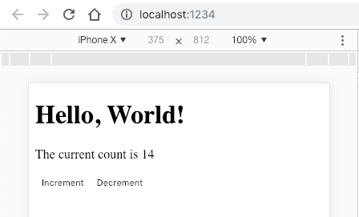

I have been using Webpack for quite some time now, and I have found it to be slow, frustrating to configure and debug, tedious to change and upgrade (and do not even get me started on the documentation!).

I have had the **exact opposite experience** with Parcel.js.

I have found Parcel.js to be **fast**, **easy** to configure and the documentation has been **excellent** so far.

## Build a React app with Parcel.js from scratch

We can create a React app from scratch with Parcel with minimal effort.

To get started, run the following commands in your terminal;

```shell
mkdir react-with-parceljs && cd react-with-parceljs
npm init -y && git init
npm install --save react react-dom
npm install --save-dev @babel/core @babel/plugin-proposal-class-properties @babel/preset-env @babel/preset-react parcel-bundler
```

The above commands do the following;

- Create a `package.json` file with default settings and initialise Git so we can commit this code later
- Install React, Babel (and a couple of plugins) and Parcel

First, we need to configure Babel to understand how to compile ES6 to ES5 and how to compile JSX to standard JavaScript.

To do this, create a new file called `.babelrc` and add the following;

```json
{
  "presets": ["@babel/preset-env", "@babel/preset-react"],
  "plugins": ["@babel/plugin-proposal-class-properties"]
}
```

Add a `.gitignore` file and add the following (to keep our repository nice and clean);

```text
node_modules
.cache
dist
```

Then create a new directory called `src` and add a file called `index.html` as follows;

```html
<!DOCTYPE html>
<html lang="en">
  <head>
    <meta charset="UTF-8" />
    <meta name="viewport" content="width=device-width, initial-scale=1.0" />
    <meta http-equiv="X-UA-Compatible" content="ie=edge" />
    <title>React with Parcel.js</title>
  </head>
  <body>
    <h1>Hello, World!</h1>
    <div id="root"></div>
  </body>
</html>
```

Finally, add the following NPM script to your `package.json` file;

```json
"scripts": {
  "start": "parcel ./src/index.html"
}
```

Run `npm start` in your terminal and you are up and running.

On my machine (2018 MacBook pro) the build time was **54ms**. That is **insanely fast**, we are talking multiple seconds for Webpack to achieve the same thing.

## Add React to your Parcel.js web app

You might be surprised to know that we do not need to do anything particularly special to get React working in our web app.

Open `index.html` and add a `script` tag to `index.js` (we will create this next) as follows;

```html
<script src="index.js"></script>
```

Now create a new file called `index.js` and add the following;

```javascript
import React from 'react'
import ReactDOM from 'react-dom'
import App from './app.js'

ReactDOM.render(<App />, document.getElementById('root'))
```

All familiar stuff so far.

Now create a new file called `app.js` and add the following;

```javascript
import React from 'react'
import Counter from './counter.js'

function App() {
  return <Counter count={10} />
}

export default App
```

Then create a new file called `counter.js` and add the following;

```javascript
import React from 'react'

class Counter extends React.Component {
  state = {
    count: this.props.count || 0
  }

  updateCount = increment => {
    const { count } = this.state

    if (increment) {
      this.setState({
        count: count + 1
      })
    } else {
      this.setState({
        count: count - 1
      })
    }
  }

  render() {
    const { count } = this.state

    return (
      <div>
        <p>The current count is {count}</p>
        <button onClick={() => this.updateCount(true)}>Increment</button>
        <button onClick={() => this.updateCount(false)}>Decrement</button>
      </div>
    )
  }
}

export default Counter
```

That is our React application complete.

Go refresh your browser and interact with the **Increment** and **Decrement** buttons, and observe that the application is working as expected.

## Bonus: Add Hot Module Reloading (HMR) for React to Parcel.js

Expecting this to take several hours, blood, sweat and tears? Sorry to disappoint you.

First install `react-hot-loader` as follows;

```shell
npm i -D react-hot-loader
```

Now add it as a plugin to Babel (open `.babelrc` and change as follows);

```json
{
  "presets": ["@babel/preset-env", "@babel/preset-react"],
  "plugins": ["@babel/plugin-proposal-class-properties", "react-hot-loader/babel"]
}
```

Finally, open `index.js` and add the below code to accept changes as they are made, as follows;

```javascript
if (module.hot) {
  module.hot.accept()
}
```

That's it, you now have Hot Module Reloading. It is 8:05am, I had that estimated as 1 day...what now?!



## Summary

We just looked at Parcel.js, a lightning fast zero configuration Webpack replacement for building our JavaScript bundles. Parcel has a built-in development server with hot module reloading, making developing quick and easy!
