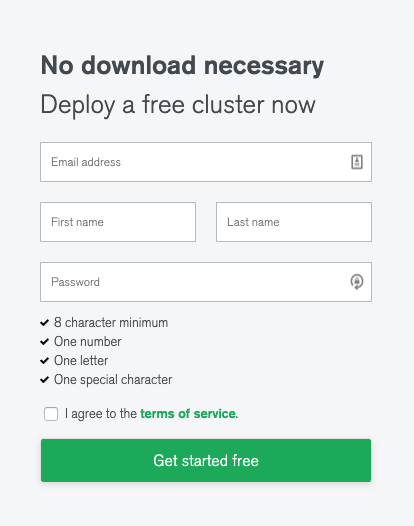
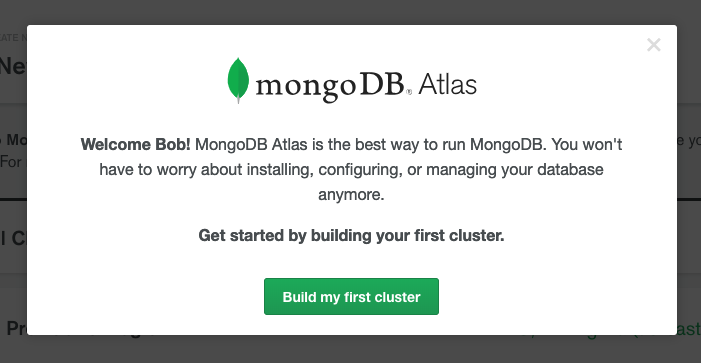

MongoDB Atlas is a fully managed service that has a fantastic free tier available for developers learning how to build document databases. MongoDB has a long-established history, is battle hardened, and is often used as part of the M.E.A.N (Mongo, Express, Angular, Node) stack (as well as other variants). There is no better time than now to learn and start using MongoDB in production environments to improve the performance of your web applications.

Let's get started.

## How to create a database in MongoDB Atlas

Creating a database in MongoDB Atlas is fairly straight forward, so we will walk through some of those steps here.

### Sign up with MongoDB

Head over to [MongoDB Atlas](https://www.mongodb.com/cloud/atlas) or [MLab](https://mlab.com/signup/) and create a free account.



Accept the terms and conditions and go to the dashboard.

### Create your first MongoDB cluster

A modal should appear asking you to build your first MongoDB cluster.



Click **Build my first cluster**.

Choose a cloud provider (we will be using AWS) and choose a free tier. At the time of writing, **us-east-1** has a free service, which is indicated with a **FREE TIER AVAILABLE** tag.

Optionally, give your cluster a name and click **Create Cluster** at the bottom of the screen. It will take up to several minutes for your cluster to be created.

## Create a Node.js project with Moogoose

This post will do the minimum possible required to get you up and running, whilst other posts will focus on more advanced functionality.

Create a new folder on your computer, called **MongoAtlasNodeMongoose** and open your terminal to that folder. Run the following command;

```bash
npm init -y
```

This will give you a `package.json` so we can add some dependencies.

Run the following command;

```bash
npm i --save mongoose
```

This will install Mongoose so we can refer to it from code.

Create a new file called `index.js` and add the following code;

```javascript
const username = process.argv[2].split('=')[1]
console.log(`Hello, ${username}`)
```

This code retrieves a `username` passed in from the terminal (which you will see next). We will later use that by saving it to the database and retrieving it.

Run the following command;

```bash
node ./index.js --user=bob
```

You should see the following;

```text
Hello, bob
```

We're all set to wire up Mongoose and connect to our MongoDB Atlas database.

## Use Mongoose to add and retrieve data from MongoDB Atlas database

To work with MongoDB, we need to define the shape of our data (the Schema), connect to the database, run our query and then close the connection, so let's get started.

### Define a User schema with Mongoose

Create a new file called `userSchema.js` and add the following;

```javascript
const mongoose = require('mongoose')

const userSchema = new mongoose.Schema({
  username: {
    type: String,
    required: [true, 'Username is required']
  },
  created: {
    type: Date,
    required: [true, 'Created date is required']
  }
})

module.exports = userSchema
```

Let's take a minute to analyse the schema;

- We use `mongoose.Schema` and pass an object for each `field` in our table
- We define the type of each `field` using built in JavaScript types
- We specify if the `field` is required, and the error to provide if the field is not provided
- We `export` the schema so it can be used later

We will `import` the schema shortly.

### How to retrieve the connection string for your MongoDB Atlas database

Once your database has been created, on the **Clusters** dashboard you should be a **Connect** button. Click **Connect** and you should see the following modal;


There are a few steps here to retrieve your connection string.

- Whitelist your current IP address. Click **Add your current IP address** so that you can connect to your database remotely. MongoDB Atlas should recognise your IP and prefill it for you.
- Create a new MongoDB user. Set a username and password and make note of those of these as we will need them shortly. Click **Create MongoDB User** to finish the process.
- Click **Choose a connection method**, then click **Connect Your Application**.
- Choose \*\*Standard Connection String (For drivers compatible with MongoDB 3.4+) and copy the connection string.

Go back to your Node application (`index.js`) and add the following line of code;

```javascript
const connectionString = '<YOUR CONNECTION STRING HERE>'
```

Be sure to replace `<PASSWORD>` with the password you specified earlier.

### How to connect to MongoDB Atlas using Node and Mongoose

All the pieces are in place, so let's connect to the database, save some data, and then retrieve it based on what we pass as the `user` parameter in the terminal.

Remove all the code from `index.js` (except the `connectionString`) and add the following;

```javascript
const mongoose = require('mongoose')
const userSchema = require('./userSchema.js')
const User = mongoose.model('user', userSchema, 'user')

async function createUser(username) {
  return new User({
    username,
    created: Date.now()
  }).save()
}

async function findUser(username) {
  return await User.findOne({ username })
}

;(async () => {
  const connector = mongoose.connect(connectionString)
  const username = process.argv[2].split('=')[1]

  let user = await connector.then(async () => {
    return findUser(username)
  })

  if (!user) {
    user = await createUser(username)
  }

  console.log(user)
  process.exit(0)
})()
```

And as before, let's walk through this code to ensure we understand what it does;

- Tell Mongoose about our user model, and its schema
- We have a function called `createUser`, which accepts the `username` parameter passed in from the command line and uses it to create a new `User` entity with a `Date` which represents when the entity was created
- We have another function called `findUser`, which finds a single entity in the database whose username matches the username given to it (this prevents us from adding duplicate entries in the database!)
- We connect to MongoDB using the `connectionString` we defined earlier
- First, we attempt to find the user in the database, if the user does not exist, then we create it and log the user to the `console`.

Run the following command (several times if you like!);

```bash
node ./index.js --user=bob
```

A new user should be added to the database the first time your run the command. You will notice that MongoDB has conveniently added an `_id` property for us (so we do not have to generate our own!). If you run the same command you should see the exact same entity retrieved with the same `_id`.

```text
➜  MongoAtlasNodeMongoose node ./index.js --user=bob
(node:80784) DeprecationWarning: current URL string parser is deprecated, and will be removed in a future version. To use the new parser, pass option { useNewUrlParser: true } to MongoClient.connect.
{ _id: 5c726f304a30a73b707814a0,
  username: 'bob',
  created: 2019-02-24T10:17:20.727Z,
  __v: 0 }
```

Congratulations, you have successfully connected to MongoDB Atlas using Mongoose and Node.js! You have also added data and then later retrieved it.

## Summary

MongoDB Atlas has a generous free tier (512MB storage) which is perfect for getting started. Mongoose has an excellent API for defining schemas/models, connecting to the database and querying data. We learnt how to write a simple application to connect to MongoDB Atlas, create users and retrieve them.
