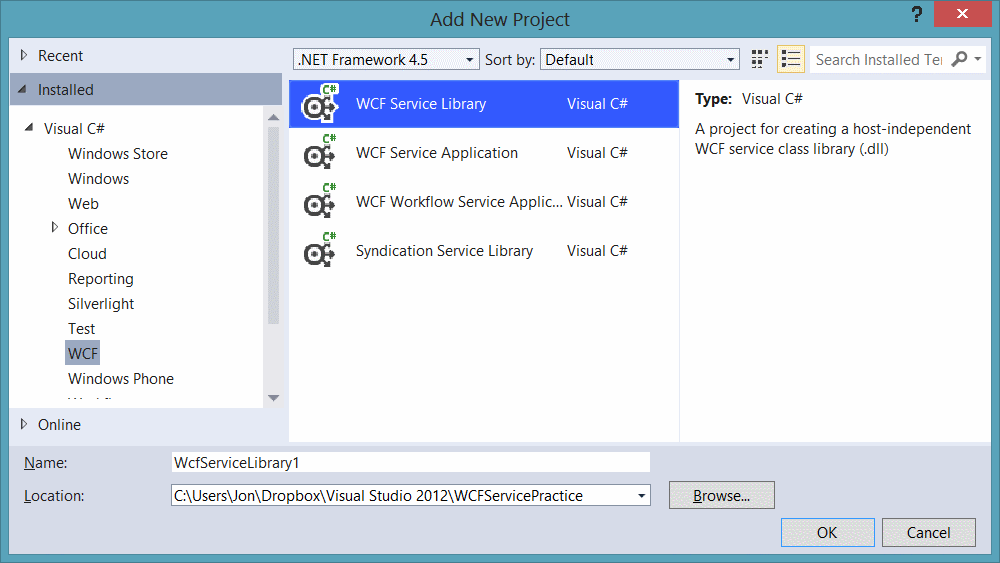

A problem I have had with WCF since I first discovered it a few years ago is related to Service References. The fact that I have to rely on the ServiceModel Metadata Utility Tool (Svcutil.exe) to generate a proxy class on my behalf left a sour taste in my mouth. A good solution would be for me to be able to write code myself to take this pain away.

### A Simple Approach

One approach to do this is to take over the responsibility of creating bindings and endpoints yourself in your consuming application to take over this job, and its really a lot simpler than it seems. To make this work, we are going to need to place all of our Service Contracts and Data Contracts into a shared library, which can be consumed by our client application. I suggest creating a new project using the '_WCF Service Library'_ project template;



Move your Service Contracts and Data Contracts into the shared library and update your main WCF service application project to reflect the changes (add a reference to the shared library).

### Consuming the WCF Service

Consumption of the service is now reasonably trivial. You need to create a `Binding`, an `Endpoint` and a `Channel`;

```csharp
BasicHttpBinding binding = new BasicHttpBinding();
EndpointAddress endpoint = new EndpointAddress("http://localhost:51011/PracticeService.svc");

IPracticeService service = ChannelFactory<IPracticeService>.CreateChannel(binding, endpoint);
```

I like to neaten this up a little and create a helper class which hides away some of this logic;

```csharp
public class ServiceFactory<T> where T : class
{
    private T _service;

    public T GetService(string address)
    {
        return _service ?? (_service = GetServiceInstance(address));
    }

    private static T GetServiceInstance(string address)
    {
        BasicHttpBinding binding = new BasicHttpBinding();
        EndpointAddress endpoint = new EndpointAddress(address);

        return ChannelFactory<T>.CreateChannel(binding, endpoint);
    }
}
```

Making my initialisation code now a little simpler;

```csharp
//Get an instance of the service
ServiceFactory<IPracticeService> serviceFactory = new ServiceFactory<IPracticeService>();
IPracticeService service = serviceFactory.GetService("http://localhost:51011/PracticeService.svc");
```

To call the `GetData` method on my service, I simply treat the `service` object like it were any other;

```csharp
//Call the GetData method
Console.WriteLine(service.GetData(10));
```

### Limitations

For me, this solution is only suitable for smaller, simpler applications as a lot of the configuration that makes WCF so powerful is taken away by this approach. Our binding is hard coded, meaning that if we change it in our WCF service, we would need to also change it in our consuming application.

### Summary

We can remove the service reference (proxy class) from our projects very simply by creating our own `Binding`, `Endpoint` and `ChannelFactory` objects. This approach may not scale well as our bindings are hard coded and our Service Contracts/Data Contracts have to live in a seperate WCF Service Application Library project.
