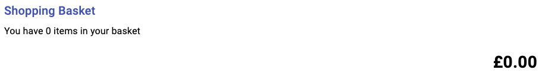

Redux, a predictable state container for JavaScript applications, has justifiably had a bad reputation in the past for being overly complex and verbose. Whilst this can still be true, times have changed, the library has changed and evolved, and combined with the amazing [Redux Toolkit](https://redux-toolkit.js.org/), many of the historic complains have been alleviated.

Having recently re-discovered the joys of a well architected React application with a Redux-backed state container, I felt obligated to share my learnings with others to spread word of the good work that has been done in this area. Redux is not a replacement for other state management tools (like Hooks and Context API in React), but instead can be complimentary and is most useful for global shared state.

Hooks are often used to manage state in a narrow subset of components (often 1), whilst Context API is hierarchical, meaning it only applies to a subset of components in your application. Redux is global, meaning its state can be accessed anywhere in your application.

**The purpose of this post** is to introduce Redux Toolkit, and use it to build a basic shopping basket. Subsequent posts in this series focus on accepting payments using Stripe, so this is a foundational post.


**You will learn** the following;

- How to get started with Redux Toolkit
- How to create a simple shopping basket with add, remove functions, and running totals that update dynamically.

<div class="media bg-light border border-dark rounded p-3 mt-1 mb-3">
  
  <div class="media-body align-self-center">
    <h5 class="mt-0 mb-0">Open source</h5>
    The complete code for this post is open source, and available to view and use on <a href="https://github.com/jpreecedev/shopping-basket-tutorial" target="_blank">GitHub</a>.
  </div>
</div>

<small>By the way, I am British. <code>Shopping Basket === Shopping Cart</code> 😜. In the UK a shopping basket is often referred to as a _trolley_.</small>

You should have basic knowledge of TypeScript to follow along with this post, or just ignore the types altogether (delete them).

## Introducing Redux Toolkit

For this practical tutorial we will build a shopping basket using React, Redux Toolkit, and Material UI.

So that we don't have to spend a bunch of time setting up our repository, I have created a starter template that takes care of setting up Next.js and Material UI for you, so we can get on with building out our project.

Clone the repo;

```bash
git clone https://github.com/jpreecedev/shopping-basket-tutorial-starter
cd shopping-basket-tutorial-starter

# using NPM
npm install && npm run dev

# using Yarn
yarn && yarn dev
```

You should now be able to open your browser to `http://localhost:3000` and see a shopping basket.



Before continuing, we need some products.

In `global.d.ts`, we have defined a `ProductItem` as follows;

```typescript
export interface ProductItem {
  id: string
  title: string
  description: string
  price: number
  imageUrl: string
  added?: boolean
}
```

A `ProductItem` object will hold some details about each product, and will also have the flag `added`, which determines if the product has been added to the basket, or not. A product cannot be added to the basic multiple times and we will not track quantity.

Let's get some products displayed on the screen. To do this, we first need to define some products.

Create a new directory in the root of your project, called `store`, and add a new file called `state.ts`.

```bash
mkdir store && cd store && touch state.ts
```

Open `state.ts` and add the following;

```typescript
import { ProductItem } from '../global'

const INITIAL_STATE: ProductItem[] = [
  {
    id: '123',
    title: 'Blue t-shirt',
    description: 'No fancy sizing charts here, one t-shirt size to rule them all',
    imageUrl: '/blue-tshirt.png',
    price: 399
  },
  {
    id: '456',
    title: 'Yellow t-shirt',
    description:
      'This unique t-shirt is guaranteed to fit nobody, not even new born babies',
    imageUrl: '/yellow-tshirt.png',
    price: 499
  },
  {
    id: '789',
    title: 'Red t-shirt',
    description: 'The only product on our site that might actually be worth buying',
    imageUrl: '/red-tshirt.png',
    price: 799
  }
]

export { INITIAL_STATE }
```

Hopefully the code here is self-explanatory. Every product has an `id`, which we will use to add/remove a product from the basket.

With some products defined, we can start exploring Redux Toolkit.

## Working with Slices

Distilled right down, slices are reducers and actions merged in to one.

You might be accustomed to writing code like this, or at least seen code like this in React applications you may have worked on;

```typescript
// Actions
export const ADD_TO_BASKET = 'ADD_TO_BASKET'

export const addToBasket = item => dispatch => {
  dispatch({
    type: ADD_TO_BASKET,
    payload: item
  })
}

// Reducers
const itemsReducer = (state, action) => {
  if (typeof state === 'undefined') {
    return DEFAULT_STATE
  }

  switch (action.type) {
    case Actions.items.ADD_TO_BASKET:
    // add item to basket using `state` and `action` props
    default:
      return state
  }
}
```

I lifted this code straight out of one of my production applications.

I have problems with this code;

- I do not like having to define constants for my actions, its repetitive and feels redundant.
- Defining actions is repetitive and prone to error.
- Switch blocks are ugly, convoluted, and require too much _thinking_ and reading to understand what they are doing.

Slices, from Redux Toolkit, can greatly simplify this code for us.

```typescript
const basketSlice = createSlice({
  name: 'basket',
  initialState: INITIAL_STATE,
  reducers: {
    add: (state, action) => {
      // add item to basket using `state` and `action` props
    }
  }
})

export const { add } = basketSlice.actions
```

Now we have dramatically less code that is easier to read and understand.

Actions have been completely re-imagined. Actions are now defined directly on the reducer, and are simply exported so we can call them directly. Notice there are no more magical constant strings to be seen. Also, the switch blocks are gone (whoop 🥳).

Previously, we would configure our store roughly as follows;

```typescript
-const initialiseStore = (initialState: AppState = loadState()) => {
-  return createStore(rootReducer, initialState, composeWithDevTools(applyMiddleware(thunk)))
-}
```

Now that code has also been greatly simplified.

```typescript
const store = configureStore({ reducer: basketSlice.reducer })
```

Redux Toolkit takes care of connecting us to the Redux DevTools extension.

Inside your `store` directory, create a new file called `index.ts`, and add the following code;

```typescript
import { createSlice, configureStore } from '@reduxjs/toolkit'
import { INITIAL_STATE } from './state'

const basketSlice = createSlice({
  name: 'basket',
  initialState: INITIAL_STATE,
  reducers: {
    add: (state, action) => {
      // add item to basket using `state` and `action` props
    }
  }
})

const store = configureStore({ reducer: basketSlice.reducer })

export const { add } = basketSlice.actions

export { basketSlice, store }
```

Thats all the Redux code we need.

Ok that is enough gushing about Redux Toolkit, let's start wiring up our basket.

## How to build a shopping basket with React and Redux

Before we can add a product to the basket, we need to display the products on screen.

With our `store` already defined, we need to let our application know about it. We do this by wrapping our application in a `Provider`, from the `react-redux` package.

Open `pages/index.tsx` and make the following changes;

```diff
import React from "react"
import { Container, Box } from "@material-ui/core"
+import { Provider } from "react-redux"

+import { store } from "../store"
import { Basket } from "../components/Basket"
import { Product } from "../components/Product"

const ShoppingBasket = () => {
  return (
+    <Provider store={store}>
       <Container maxWidth="md">
         <Box mt={5} mb={5}>
           <Product />
         </Box>
         <Box mt={5} mb={5}>
           <Basket />
         </Box>
       </Container>
+    </Provider>
  )
}

export default ShoppingBasket
```

### How to retrieve state from the Redux store

With our application now aware of our store (and the products we created earlier), we can go ahead and retrieve them from the store and display them to the customer.

Open `components/Product.tsx` and go to line `86`.

```typescript
const products = [] // TODO
```

In order to display our products, we need to populate this array with data from our store. We do this using a `Selector`, or, more specifically, the `useSelector` hook.

Make the following changes;

```diff
// At the top of the file
+import { useSelector } from "react-redux"

-const products = [] // TODO
+const products = useSelector((state: ProductItem[]) => state)
```

We're quite literally _selecting_ all the state from the store in this case. When your store is more complex, you could fetch specific state from the store here, in a fashion that is reminiscent of `mapStateToProps` from Redux yester-year.

With the selector in place, you should now have 3 products displayed on screen. Each product is also a button, which when pressed should add that product to your basket. Clicking the button currently does nothing, so let us wire that up next.

## How to update your Redux store using dispatch

We want to add each product to the basket when clicked. To do this, we need two pieces.

- We need to dispatch our `add` action (that we defined earlier on our reducer) with the product that was clicked
- Then we need to update the product in the store, by setting `added` to true.

The code for handling the users click is on line `98`;

```typescript{8}
<ButtonBase
  focusRipple
  key={product.id}
  className={classes.image}
  focusVisibleClassName={classes.focusVisible}
  disabled={product.added}
  onClick={() => {
    /* Add to basket */
  }}
  style={{
    width: `${100 / products.length}%`
  }}
>
```

This is where we will dispatch our action. Make the following changes;

```diff
+import { store, add } from "../store"

<ButtonBase
  focusRipple
  key={product.id}
  className={classes.image}
  focusVisibleClassName={classes.focusVisible}
  disabled={product.added}
-  onClick={() => {
-    /* Add to basket */
-  }}
+  onClick={() => store.dispatch(add(product))}
  style={{
    width: `${100 / products.length}%`
  }}
>
```

The product will be forward to our reducer so we can take action on it.

Open `store/index.ts`. This is our slice as it stands;

```typescript
const basketSlice = createSlice({
  name: 'basket',
  initialState: INITIAL_STATE,
  reducers: {
    add: (state, action) => {
      // add item to basket using `state` and `action` props
    }
  }
})
```

We need to update the `add` action to do two things;

- Find the product in the store and update it, setting `added` to true
- Return a brand-new copy of the state. We're not mutating the state here, we are returning a brand-new copy of it. This is how Redux works.

Make the following changes;

```diff
const basketSlice = createSlice({
  name: "basket",
  initialState: INITIAL_STATE,
  reducers: {
    add: (state, action) => {
-      // add item to basket using `state` and `action` props
+      return state.map(item => {
+        if (item.id !== action.payload.id) {
+          return item
+        }
+
+        return {
+          ...item,
+          added: true
+        }
+      })
    }
  }
})
```

We use the product `id` to find the product and set its `added` value to `true`. Notice that on each iteration of `map`, we are returning a new copy of the product by spreading the old one and then changing the `added` flag to `true`.

Whilst we are here, we might as well wire up the `remove` action as well. Can you guess what the code is?

Make the following changes;

```diff{26}
const basketSlice = createSlice({
  name: "basket",
  initialState: INITIAL_STATE,
  reducers: {
    add: (state, action) => {
      return state.map(item => {
        if (item.id !== action.payload.id) {
          return item
        }

        return {
          ...item,
          added: true
        }
      })
-    }
+    },
+    remove: (state, action) => {
+      return state.map(item => {
+        if (item.id !== action.payload.id) {
+          return item
+        }
+
+        return {
+          ...item,
+          added: false
+        }
+      })
+    }
  }
})
```

And don't forget to update your exports to ensure we can import the action into other places in our application;

```diff
-export const { add } = basketSlice.actions
+export const { add, remove } = basketSlice.actions
```

Removing is the same as adding, except we set `added` to `false` instead of `true`.

With the `add` action defined now we can click the button for each product and they will be added into the basket. This works, but the change of state is not reflected on screen, that is because we are not retrieving the products from the store. Let's correct that.

Open `components/basket.tsx` and find line 40;

```typescript{3}
const Basket = () => {
  const classes = useStyles({})
  const products = [] // TODO

  return (
    <>
      <Typography component="h2" variant="h6" color="primary" gutterBottom>
        Shopping Basket
      </Typography>
```

In the same fashion as before, we need to use a selector to retrieve the products from our store.

Make the following change;

```diff
+import { useSelector } from "react-redux"

const Basket = () => {
  const classes = useStyles({})
-  const products = [] // TODO
+  const products = useSelector((state: ProductItem[]) => state)

  return (
    <>
      <Typography component="h2" variant="h6" color="primary" gutterBottom>
        Shopping Basket
      </Typography>
```

Refresh the page, and add products to the basket. You should now see on screen the products displayed immediately. There is also a running total of the price of everything that has been added.

With the basket now working correctly, we just need to wire up the delete button.

In `components/basket.tsx`, we have the following code;

```typescript
<ListItemSecondaryAction>
  <IconButton
    edge="end"
    aria-label="delete"
    onClick={() => {
      /* Remove from basket */
    }}
  >
    <DeleteIcon />
  </IconButton>
</ListItemSecondaryAction>
```

Make the following changes;

```diff
+import { store, remove } from "../store"

<ListItemSecondaryAction>
  <IconButton
    edge="end"
    aria-label="delete"
-    onClick={() => {
-      /* Remove from basket */
-    }}
+    onClick={() => store.dispatch(remove({ id: product.id }))}
  >
    <DeleteIcon />
  </IconButton>
</ListItemSecondaryAction>
```

Clicking the `delete` button should remove the product from the basket.

## Summary

In this tutorial we briefly discussed some of the differences between traditional Redux code, and Redux Toolkit. We then went on to define some state for our store. We then created a _slice_, which is kind of a conjunction of reducers and actions. To retrieve data from our store, we used a selector hook (`useSelector`), which is reminiscent of `mapStateToProps`. Finally, we wired up our add and remove buttons to dispatch our actions to the store and update our state. Doing this caused our basket to be immediately updated, and that change immediately reflected on screen.
