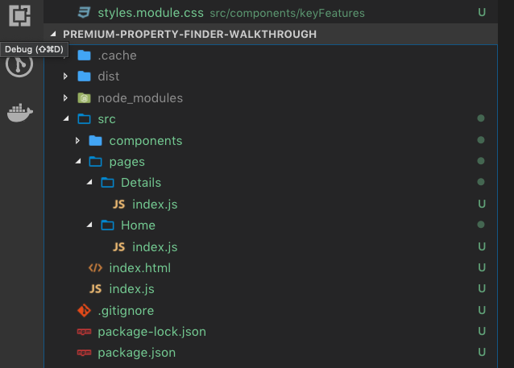
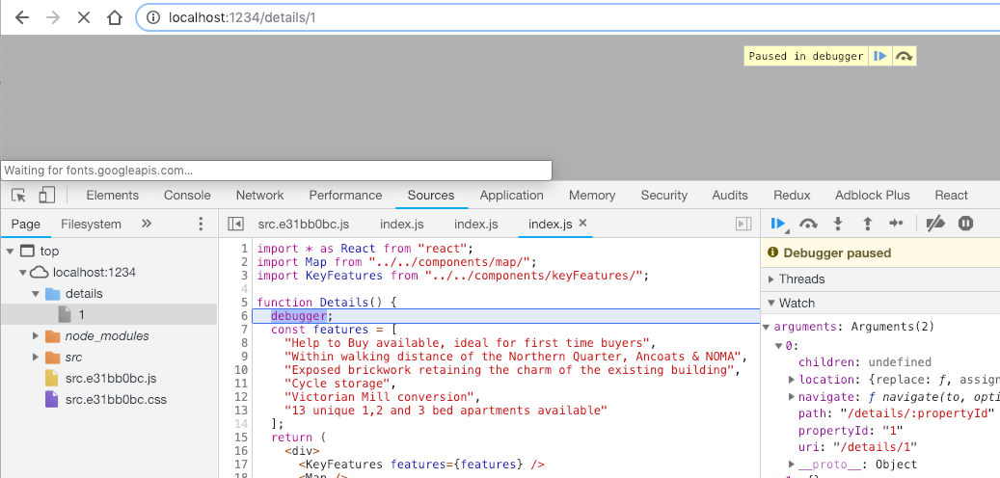

We are building a property listings website, called **Premium Property Finder**, using React. Our website is a Single Page Application (SPA), designed to load fast and dynamically update based on user interaction or network changes.

Traditionally, a user navigates a website by clicking a link (or some other form of interaction) which redirects them to the next page. This process of navigating causes the entire next web-page (including all of its CSS, JavaScript etc) to be (re-)requested and (re-)downloaded from the web-servers, (re-)interpreted and executed. This is slow, like, really slow.

With a _single page_ application, the user stays on one page and instead pieces of the page are changed and updated. This is great because the page will generally update significantly faster compared to the classic method, even when the device is a slow mobile phone running on 2G.

**Note for clarification as this is also a standalone post**. This post is part of a mini-series where we are building a real estate property listing website, complete with routing and advanced forms.

## Examples of Non-SPA vs SPA

Take [Microsoft.com](https://www.microsoft.com).

The website is well optimised for the web, its assets are compressed, its JavaScript minified, etc.


When I click a link to a different section of the website, the page entirely changes.

Compare that experience to this experience (navigating around the React.js documentation).


It feels fast, because it is fast. No waiting around for things to render.

Now with the sales pitch out of the way, let's add routing to our own application.

## How to add Routing to a React SPA, using @reach/router

[@reach/router](https://reach.tech/router) is not exactly the default choice for routing in React. A common choice for routing in [react-router](https://github.com/ReactTraining/react-router) from ReactTraining.

`@reach/router` is less feature rich and much newer than `react-router`. However, it supports all the functionality that we need and it is super easy to get working quickly. The API for `@reach/router` is very similar to that of `react-router`, so with a few small changes you could switch if you choose to, but stick with me here, it is a fantastic little router and I am having a lot of success with it so I highly recommend giving it a try.

To add `@reach/router`, run the following command;

```shell
npm install --save @reach/router
```

**Note** this is a runtime dependency, so we use `--save` instead of `--save-dev`.

With `@reach/router` installed, open `src/index.js` and import the router;

```javascript
import { Router } from '@reach/router'
```

Then wrap our existing `<App />` component with `<Router />` in the `render` method as shown;

```jsx
const rootElement = document.getElementById('root')
ReactDOM.render(
  <Router>
    <App default />
  </Router>,
  rootElement
)
```

**Note** one small change here. We have to add the `default` attribute to our `<App />` component, otherwise `@reach/router` will not know where to route us to! We will expand this code later.

Head to the browser and confirm all is still working. You will not see much change at this point, as we need more pages to route to!

## How to add pages to a React SPA, using @reach/router

I have said _pages_ because I think of routing in my head as navigating between pages (like the classical way), just in a faster way.

If I were to MASSIVELY oversimplify what is happening here... we are toggling the visibility of collections of components depending on a path in the URL. The reality is that a LOT more is going on here than that, but we will not drill into details in this post.

When we started this project we created two components, `<KeyFeatures />` and `<Map />`. Currently we are using these components on the _home_ page, but really, they are meant for the _details_ page. Let's fix that.

Under `src` create;

- A new folder called `pages`
- In `pages`, create a new folder called `Details`, and a new file within called `index.js`
- In `pages`, create a new folder called `Home`, and a new file within called `index.js`

Your project should look like this;



Open `src/index.js` and cut the imports for `Map` and `KeyFeatures`, and paste them in `Details/index.js`. Cut `<Map />`, `<KeyFeatures />`, and the `features` array from the `App` function, then create a new `function` in `Details/index.js` and paste them in, as follows;

```jsx
import * as React from 'react'
import Map from './components/map/'
import KeyFeatures from './components/keyFeatures/'

function Details() {
  const features = [
    'Help to Buy available, ideal for first time buyers',
    'Within walking distance of the Northern Quarter, Ancoats & NOMA',
    'Exposed brickwork retaining the charm of the existing building',
    'Cycle storage',
    'Victorian Mill conversion',
    '13 unique 1,2 and 3 bed apartments available'
  ]
  return (
    <div>
      <KeyFeatures features={features} />
      <Map />
    </div>
  )
}

export default Details
```

Your `App` function is now quite empty and is no longer serving a purpose, so go ahead and delete it.

Finally, we need to tell the router about our new pages. Update the `render` function in `src/index.js` as follows (full code shown for complete reference);

```jsx
import React from 'react'
import ReactDOM from 'react-dom'
import { Router } from '@reach/router'

import Home from './pages/Home'
import Details from './pages/Details'

const rootElement = document.getElementById('root')
ReactDOM.render(
  <Router>
    <Home default />
    <Details path="/details" />
  </Router>,
  rootElement
)
```

We replaced the `<App />` component with our new `<Home />` component (page) and set that component as the default route. We have also added our `<Details />` component.

When working with one component, we did not need to specify a path. However, when working with more than one component we need to tell the router when it should serve up what. In this case, when the user navigates to `/details` we want to serve up the `<Details />` component.

## How to get route parameters from @reach/router

The details page we have wired up so far is working great. If we navigate the browser to [http://localhost:1234/details](http://localhost:1234/details) we see the `<Map />` and `<KeyFeatures />` components displayed as before.

We need a little extra plumbing now to make this page actually useful.

Currently, every details page will be exactly the same. We need some piece of information that will allow us to vary the content of the page based on the property the user clicked on the previous page.

To achieve this, we use _route params_.

A route param is denoted in `@reach/router` using `:key` syntax.

For example;

```text
http://localhost:1234/details/:propertyId
```

In the above example, `:propertyId` is a variable value.

`:propertyId` is a placeholder for _some value_ which we can reference from code.

Open `src/index.js` and update the `path` for `<Details />` as follows;

```jsx
<Details path="/details/:propertyId" />
```

The `:propertyId` is available now to us in code, but how?

Let's play with Google Chrome's debugger a bit here. Chrome has several useful tools available to help us _discover_ potentially hidden features.

First, update the URL in your browser to `http://localhost:1234/details/111`.

Open the Chrome debugger and press `Cmd+Option+i` (Mac OS) or `F12` (Windows) to bring up sources. Press `Cmd+P` or `Ctrl+P` and type `Details.js` and select the result.

I realise that `Details.js` is not the name of our file, but Chrome has a fuzzy search which helps us find the right `index.js` in a world full of `index.js`es (the first useful trick).

Place a breakpoint on line `6` by clicking on the line number and refresh the page. Chrome should now hit the breakpoint and pause the execution of the application (the second useful trick, as you can hover around and see the values of things).



On the right-hand side you should have a panel called `Watch` (see screenshot above for reference). Expand the panel and add a new watch using the `+` on the right-hand side. Set the watch to a variable called `arguments`.

Every JavaScript function has an ~~array~~ object(ish) called `arguments` (gotta love JavaScript). You can interrogate this object to see what it contains. In this case, there is one(ish) argument with several properties related to routing, including `location`, `path`, and our `propertyId` from our route. (Our final useful trick).

We now know that we have a variable available to us called `propertyId` that we can destructure from props as follows;

```jsx
// ...
function Details({ propertyId }) {
  const features = [
    'Help to Buy available, ideal for first time buyers',
    'Within walking distance of the Northern Quarter, Ancoats & NOMA',
    'Exposed brickwork retaining the charm of the existing building',
    'Cycle storage',
    'Victorian Mill conversion',
    '13 unique 1,2 and 3 bed apartments available'
  ]
  return (
    <div>
      Show details for property with Id of {propertyId}
      <KeyFeatures features={features} />
      <Map />
    </div>
  )
}
// ...
```

Add it to your resulting JSX as shown above, and refresh the page. Whatever value gets passed through the URL is now available to us in our function. Neat huh?!

## Summary

For this post we discussed what a Single Page Application is (SPA) and what the benefits of building your website to be an SPA might be (faster navigation). We added `@reach/router` to our project and added two routes, one for our _home_ page and one for a separate _details_ page. We then discussed what route params are and how to utilise them in our code, learning some handy Google Chrome debugging tips along the way.
