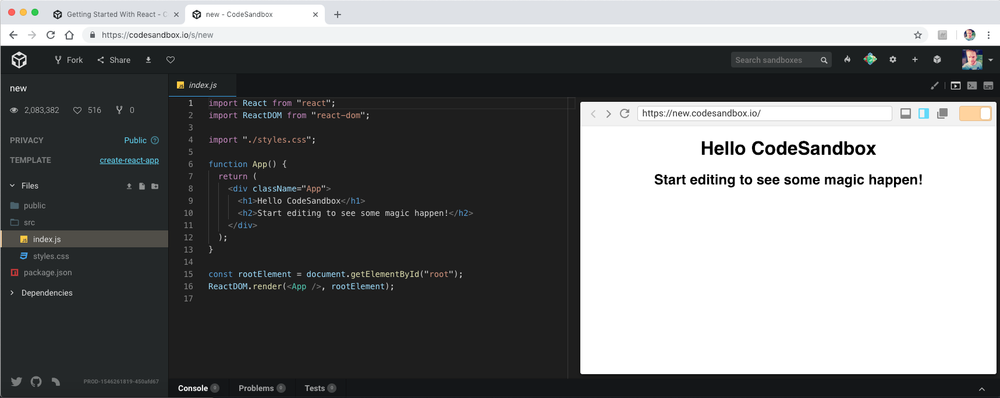
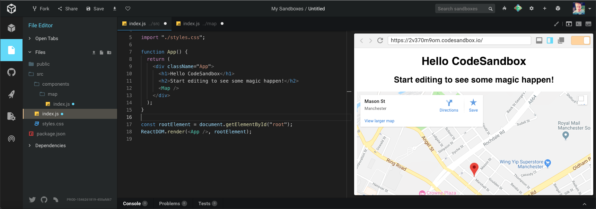
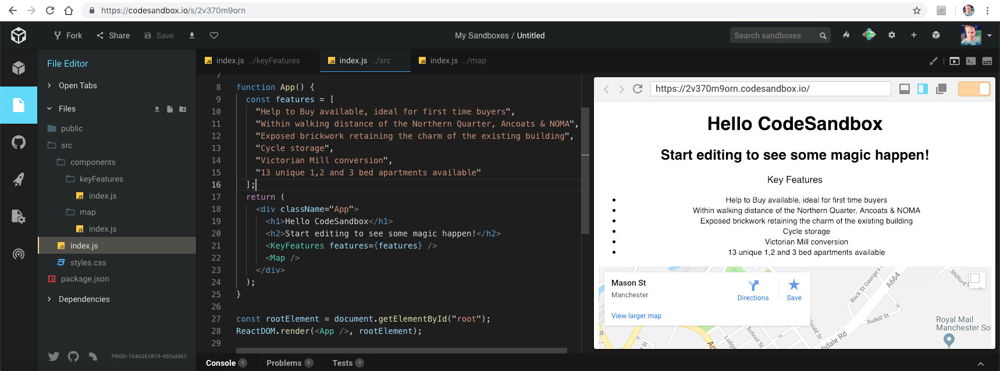

To get up and running quickly developing a React web application, you can use [CodeSandbox](https://codesandbox.io/), a fantastic browser-based development environment.

Head over to CodeSandbox and if you do not already have an account, I highly recommend creating one so that you can easily save your work and refer back to it later.

We will create a couple of components and then migrate our code from CodeSandbox to our local machine in the next post in this series.

**Note for clarification as this is a standalone post**. This post is also part of a mini-series where we are building a real estate property listing website, complete with routing and advanced forms. A _property_ === Real estate === a house/flat/apartment etc.

## Getting started with CodeSandbox

We will create two new components;

- `<KeyFeatures />` will display a list of selling points for a property
- `<Map />` will display a Google Map with the location of the property highlighted with a pin

Go to CodeSandbox and create a new sandbox based on the React `create-react-app` project starter.



You should now have an empty sandbox that just displays some basic text.

## How to create your first React component

Create a new directory under the `src` directory, called components.

Now, create a new folder called `map` and add a new file called `index.js`. We will add the logic for our `<Map />` component in here.

We have two choices now regarding how we want to write our component. We can choose either a `class` based React component, or a stateless functional component.

A `class` based React `Component`;

```javascript
class Map extends React.Component {
  // logic
}
```

A stateless functional component;

```javascript
function Map() {
  // logic
}
```

Deciding as to which style to use is easy. I ask the following questions to myself;

1. Do I need any local state?
2. Do I need to use any lifecycle functions?

If the answer to either of the questions above is _yes_, then I will always choose a `class` based component. All other times, I use a stateless functional component. Stateless functional components are lighter and more performant than classes, and are easy to reason about.

For a quick refresher, lifecycle functions are functions on your component that React will call automatically at certain points during the lifecycle of the component.

Lifecycle functions will get called automatically when (non-exhaustive list);

- `render` - Your component is ready to be rendered
- `componentDidMount` - When your component was mounted (inserted into the DOM tree)
- `componentDidUpdate` - When your component was updated
- `componentWillUnmount` - When your component is about to be destroyed

An example might be...

```javascript
class Example extends React.Component {
  componentDidMount() {
    // XHR logic usually goes here
  }
  render() {
    // Return some markup to be rendered
  }
}
```

Now, in your `map/index.js` file, add the following code;

```javascript
import React from 'react'

function Map() {
  const address = 'Mason Street, Manchester, Greater Manchester, M4'
  const search = `https://maps.google.com/maps?q=${address}&t=&z=16&ie=UTF8&iwloc=&output=embed`

  return (
    <div className="mapouter">
      <div className="gmap_canvas">
        <iframe
          title={address}
          src={search}
          width="100%"
          height="500"
          id="gmap_canvas"
          frameBorder="0"
          scrolling="no"
          marginHeight="0"
          marginWidth="0"
        />
      </div>
    </div>
  )
}

export default Map
```

Let's break this down;

- We import the `React` library. You may notice that we do not directly use `React` anywhere in this code, so you might think it is redundant. Remember, however, that when our build tool compiles our JSX, it will convert it to nested `React.createElement` calls. This is where the `import` is used.
- We define a plain old ES5 function (you could write an ES6 arrow function, its practically the same thing in this context) called `Map`, which we `export` at the bottom of the file.
- We construct a URL for Google Maps.
- We return some JSX, as required for Google Maps to work properly.
- As we defined two constants, called `address` and `search`, we have to pass these two values to Google Maps so that our map loads correctly.

We have hardcoded an address for now, but we will make this component more flexible later.

Now that we have defined our `<Map />` component we now have to use it.

Open `index.js` at the top of the project (in `src`) and `import` the `<Map />` component as follows;

```javascript
import Map from './components/map/'
```

Use the `<Map />` component by adding it below the `<h2>` tag as shown below;

```javascript
function App() {
  return (
    <div className="App">
      <h1>Hello CodeSandbox</h1>
      <h2>Start editing to see some magic happen!</h2>
      <Map />
    </div>
  )
}
```

And assuming all is well, you should see a Google Map showing in the preview on the right-hand side;



Let's move on.

## Create your first class based React component

This is a little arbitrary, but I wanted to show you how to create a `class` based React component, for future reference.

This component will also be a little different in that we will pass `props` to it, which we did not do with the first component.

The next component we will build will be called `<KeyFeatures />`, which will display the main selling points (features) for the property, and will take those features as `props`. We will also use CSS imports to tweak the styling a bit.

Create a new directory in `src` called `keyFeatures`, and create a new file called `index.js`.

Add the following code;

```javascript
import React from 'react'

class KeyFeatures extends React.Component {
  render() {
    const { features } = this.props

    return (
      <>
        <p>Key Features</p>
        <ul>
          {features.map(feature => (
            <li key={feature}>
              <small>{feature}</small>
            </li>
          ))}
        </ul>
      </>
    )
  }
}

export default KeyFeatures
```

Once again, let's break this down;

- We import the React library, as discussed before
- We define an ES6 `class`, which inherits from `React.Component`, and `export` the class at the end
- We utilise the `render` lifecycle function to return our JSX
- We use the ES6 functional array method `map` to loop over each feature and output a `<li>`, which is part of a `<ul>`.
- We receive the `features` from outside of this component (we will pass them down from the `<App />` component)

We have some funky syntax here, `<>` and `</>`, which we have not touched on properly.

A JavaScript function can only return one value.

Consider the following code;

```html
<p>Key Features</p>
<ul>
  {features.map(feature => (
  <li key="{feature}"><small>{feature}</small></li>
  ))}
</ul>
```

What happens to this code at compile time? It gets transformed to this (some bits chopped for brevity);

```javascript
React.createElement('p', null, 'Key Features')
React.createElement(
  'ul',
  null,
  features.map(function(feature) {
    return React.createElement(
      'li',
      { key: feature },
      React.createElement('small', null, feature)
    )
  })
)
```

We cannot return two values from a single function, so we need a container element. Historically, React developers would wrap this code in an outer `<div>`. This works just fine, but after a while you find you end up with many empty `<div>` tags on a page that do not really do anything. This gives the DOM tree unnecessary depth, which _could_ hamper performance (and just looks messy).

To solve this problem, the React team introduced `React.Fragment`, so now you could write the code as follows;

```html
<React.Fragment>
  <p>Key Features</p>
  <ul>
    {features.map(feature => (
    <li key="{feature}"><small>{feature}</small></li>
    ))}
  </ul>
</React.Fragment>
```

At runtime, the `Fragment` does not end up in the DOM tree, it just disappears, which is great. This is a good solution, it just looks ugly. `<></>` syntax is an abstraction over `<React.Fragment />` to remove the ugliness.

Now to use our `<KeyFeatures />` component, open the main `index.js` and `import` the component as follows;

```javascript
import KeyFeatures from './components/keyFeatures/'
```

Add the following features inside the `App` function;

```javascript
const features = [
  'Help to Buy available, ideal for first time buyers',
  'Within walking distance of the Northern Quarter, Ancoats & NOMA',
  'Exposed brickwork retaining the charm of the existing building',
  'Cycle storage',
  'Victorian Mill conversion',
  '13 unique 1,2 and 3 bed apartments available'
]
```

And use the `<KeyFeatures />` above the existing `<Map />` component, passing in the features as props;

```javascript
function App() {
  const features = [
    'Help to Buy available, ideal for first time buyers',
    'Within walking distance of the Northern Quarter, Ancoats & NOMA',
    'Exposed brickwork retaining the charm of the existing building',
    'Cycle storage',
    'Victorian Mill conversion',
    '13 unique 1,2 and 3 bed apartments available'
  ]
  return (
    <div className="App">
      <h1>Hello CodeSandbox</h1>
      <h2>Start editing to see some magic happen!</h2>
      <KeyFeatures features={features} />
      <Map />
    </div>
  )
}
```

CodeSandbox should now update showing our lovely application so far;



## How to utilise CSS modules in CodeSandbox

You may notice that your list items are horizontally centered. This is because there is a style in `style.css` that centers all text inside or nested within the `<App />` component. We want to add an exclusion for just our list.

We have two options here, we could add a CSS class to `styles.css` and use it in our component. The alternative is to use a scoped CSS style that does the same thing but will only ever be applied to our component and nothing else.

In the **keyFeatures** component directory, create a new file called `styles.module.css` and add the following CSS class;

```css
.list {
  text-align: left;
}
```

You can directly `import` this file into your `keyFeatures/index.js` file and refer to the CSS classes as if they were JavaScript objects.

Add the `import`;

```javascript
import styles from './styles.module.css'
```

And update your `<ul>` so that it uses the list CSS class as follows;

```javascript
<ul className={styles.list}>
```

Your list text should now we left aligned, and nowhere else on the page should the layout change.

Here is the finished sandbox if you have encountered any problems getting this far;

<iframe src="https://codesandbox.io/embed/2v370m9orn" style="width:100%; height:500px; border:0; border-radius: 4px; overflow:hidden;" sandbox="allow-modals allow-forms allow-popups allow-scripts allow-same-origin"></iframe>

## Summary

We discussed how to quickly get started building a React application with CodeSandbox, which deals with all the configuration automatically and gets out of the way so you can just start coding. We created two components, `<Map />` and `<KeyFeatures />`, one was a stateless functional component and the other was a `class` based React component. We also touched on CSS modules, which we will make heavy use of as we begin to flesh out our website.

## Next Steps

We have walked forwards quite slowly in this post to make sure we cover as much of the basics as we can. Going forward, we will pick up the pace and really start building out our application. We will migrate our project to our computer so we can work with our preferred editor, add a CSS framework, and start building out our home page. Stick around!
