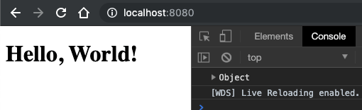

So far, our application writes out to the console, which is not terribly helpful. Let's get something up and running in the browser before we configure our React code.

To get our website up and running, we will need Webpack Dev Server, which is a simple HTTP server. We will also need a couple of plugins to make everything work properly.

Start by creating an `index.html` file in `src` and add the following code;

```html
<!DOCTYPE html>
<html lang="en">
  <head>
    <meta charset="UTF-8" />
    <meta name="viewport" content="width=device-width, initial-scale=1.0" />
    <meta http-equiv="X-UA-Compatible" content="ie=edge" />
    <title>Webpack 4 - React From Scratch</title>
  </head>
  <body>
    <h1>Hello, World!</h1>
    <div id="root"></div>
  </body>
</html>
```

Now we need to configure Webpack to inject the path to our JavaScript bundle directly into the HTML file for us, so we do not need to reference it directly. This is helpful because when running a production build, we do not know the name of the file that will be generated (remember, we used a random hash!).

To do this, we need to use `html-webpack-plugin`. Open `webpack.config.js` and add the following to the `plugins` section;

```javascript
module.exports = {
  ///...
  plugins: [
    ///...
    new HtmlWebPackPlugin({
      template: './src/index.html',
      filename: './index.html'
    })
    ///...
  ]
}
```

And we need to use another plugin called `html-loader`, to deal with any file that has a `.html` file extension.

Run the following command to install both packages;

```shell
npm install --save-dev html-webpack-plugin html-loader
```

The last step is to tell Webpack that when it encounters HTML files, it should use the `html-loader` we just installed.

Open `webpack.config.js` and add the following to `module` > `rules`;

```javascript
module.exports = {
  ///...
  module: {
    rules: [
      ///...
      {
        test: /\.html$/,
        use: [
          {
            loader: 'html-loader',
            options: { minimize: !isDevelopment }
          }
        ]
      }
    ]
  }
  ///...
}
```

**Note**: When running in production mode, the processed HTML will be automatically compressed (all whitespace removed) to make the file as small as possible to maximise transfer speed across the wire.

Go to your `package.json` file and add the following NPM script, so we can now start using Webpack Dev Server;

```json
"start": "cross-env NODE_ENV=development webpack-dev-server --config webpack.config.js"
```

Run the command via the terminal and open your browser to `http://localhost:8080` and observe the result as shown;



You should now see the **Hello World** header text is visible, meaning our HTML is working, and in the console we see **World** output, so we know our JavaScript is being loaded and executed.

## Summary

Configuring Webpack Dev Server is quick and easy. The only complication we encounter is getting the correct paths for our compiled assets (JavaScript in this case). This problem is easily solved using `html-webpack-plugin` and `html-loader`, which together take care of processing our HTML files and injecting `<script>` and `<style>` tags automatically at build time for us.

Time to wire up our React application next.
