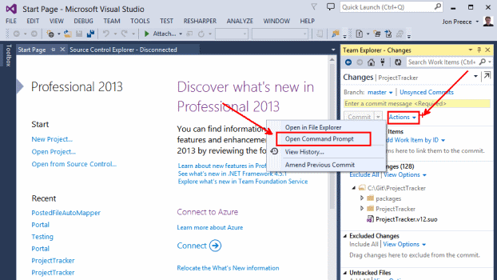
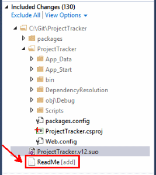
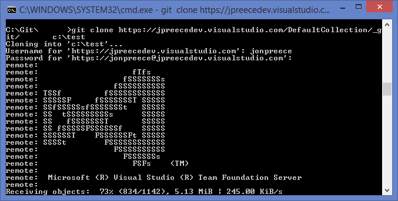
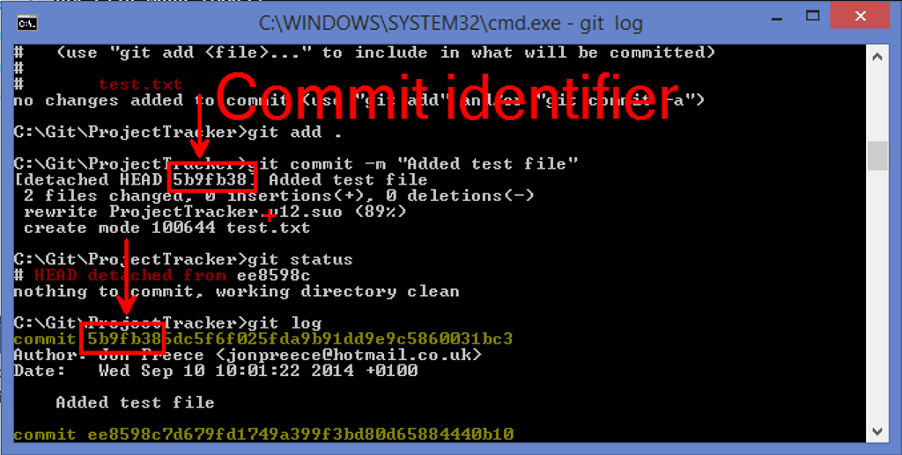
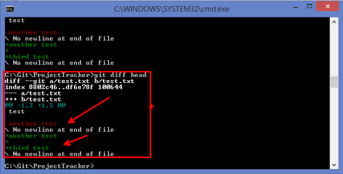
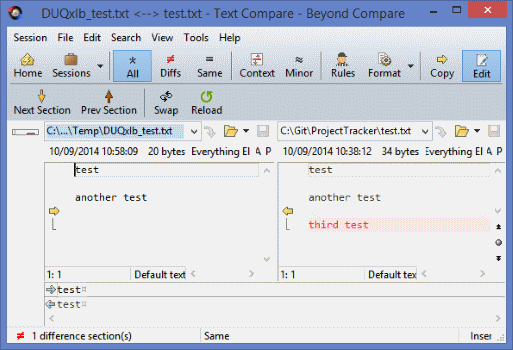
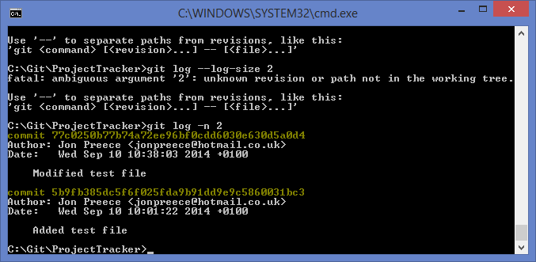

I've been using Git in Visual Studio for quite some time now (since not long after it was released) and I've really grown to like it. I particularly like the speed and general ease of use. I find TFS/TFVC (weather that be a local instance or TFS online) to be slow and unreliable and it really has poor command line support (sorry guys!). It's fair to say that I've been a little bit intimidated by Git and have rarely (OK never!) strayed away from the UI available through Visual Studio. Until now. Visual Studio barely scratches the surface when it comes to the wealth of additional functionality available via the command prompt.

**This post looks at some of the most commonly used commands (and how to use them).**

# 10 Git commands for .NET developers

The easiest way to get started is;

1.  Open Visual Studio (and ideally open/create a project)
2.  Open the Team Explorer
3.  Click **Changes**, and then from the **Actions** drop down click **Open Command Prompt**.



As an additional win, you can also bring up _extensive_ formal documentation about any Git command as follows;

```powershell
git help {command}
```

## Terminology Comparison

There are some slight differences in terminology between Git and TFVC, here are some of them;

<table border="1" width="500" cellspacing="0" cellpadding="10">
<tbody>
<tr>
<td valign="top" width="250">

**Git**

</td>

<td valign="top" width="250">

**TFVC**

</td>

</tr>

<tr>

<td valign="top" width="250">Commit Commit Clone Snapshot Commit id (the SHA1 checksum) HEAD Repository Author / Contributor Fork (take a copy of)</td>

<td valign="top" width="250">Changeset Check In Map   Changeset number (sequential number) Current branch Team Project User Branch</td>

</tr>

</tbody>

</table>

## Git Add



Adds a given file to the tracked (uncommitted) list, or adds all untracked files under the given directory. By default, new files are not tracked by Git, they have to be added to the index. **Scenario**

1.  Add a new file to the root directory called **ReadMe** 2\. Run `git add ReadMe`
2.  File is added to the **Included Changes** list
3.  Alternatively, run `git add .` to add all untracked files in the current directory (recursively scans through each sub directory)

## Git Branch

Same concept as in TFVC, you create branches when;

1.  You create branches to make it easier when large teams are developing new functionality
2.  You are releasing the code to live or a test environment
3.  You want to fix bugs <span style="text-decoration: line-through;">and you hate the world</span>

There are a few useful parameters you can pass in to `git branch` here;

1.  `{name-of-new-branch}` if you just want to create a new branch
2.  `--list`, or no parameters, shows a list of current branches
3.  `-m {new-name}` renames the branch
4.  `-d` deletes the branch

Example:

```powershell
git branch {name-of-new-branch}
```

## Git Checkout

Switches the current development branch to the branch specified;

```powershell
git checkout {some-branch}
```

All new changes will be committed to this branch. If the branch does not already exist, you can create it and check it out using a single command;

```powershell
git checkout -b {some-branch}
```

Can also be used to rollback to previous versions of files or specific branches as follows;

```powershell
git checkout {commit-number} {file-name}
```

`{commit-number}` the specific changeset to roll back to `{file-name}` optional, used to roll back a specific file

## Git Clone

Clones (gets a copy of) the specified repository. This example is using Visual Studio online, but should work with self-hosted instances of TFS (simply change the domain to that of your TFS instance, or the IP address of your TFS instance);

```powershell
git clone https://{your-user-name}.visualstudio.com/DefaultCollection/_git/{project-name} {local-path}
```

Replace `{your-user-name}` with your TFS username and `{project-name}` with the name of the project you want to clone. `{local-path}` is the location on your hard drive where you want to store the cloned files. When you successfully connect, you will be prompted to enter your user name and password. When the clone starts, you'll will see some neat ASCII art and the progress of the operation;



## Git Commit

Takes a snapshot (also known as a revision) of the file/folder at the current point in time. A snapshot cannot easily be edited. You can roll back to specific snapshots as required. Before you can take a snapshot, you must stage that changes that will be included. This is done using `git add` (see above). To include all files in the snapshot, use `git add .`. There are a [lot](http://git-scm.com/docs/git-commit) of options you can pass to this command, but the one you will use most often is `-m`, which allows you to pass a message to use to identify the commit at a later time;

```powershell
git commit -m "{your-message-here}"
```

Git will display the first part of the commit identifier, which can be helpful for use later (rolling back the commit for example using the `git reset` command). You can view a recent list of commits using the `git log` command.



## Git Diff

Used to display the differences between the current directory/file and either the index or the most recent commit. To display all the differences (including renames, deletes, adds, modifications etc.) against the index;

```powershell
git diff
```

To display all the differences against the most recent commit;

```powershell
git diff HEAD
```



The standard diff tool will display differences inline (red is the indexed/HEAD copy, green is the local copy). To be honest, I don't find this particularly helpful ... especially when you are working with lots of differences.

### Custom Diff Tool

You can easily configure Git to use a custom tool. I use [Beyond Compare](http://www.scootersoftware.com/download.php) (because I love it), but you can use whatever tool you like. For a full explanation on how to configure Beyond Compare, see [Git for Windows on the Scooter Software website](http://www.scootersoftware.com/support.php?zz=kb_vcs#gitwindows). Use the `git config` command to change the global diff setting;

```powershell
git config --global diff.tool bc3
git config --global difftool.bc3.path "c:/Program Files (x86)/Beyond Compare 4/bcomp.exe"
```

You can also change the configuration for merging, which goes like this;

```powershell
git config --global merge.tool bc3
git config --global mergetool.bc3.path "c:/Program Files (x86)/Beyond Compare 4/bcomp.exe"
```

To run the diff in the custom tool, run `git difftool {file-to-diff}`



I'm much more comfortable working with a proper GUI as I'm so used to using Visual Studio's built in diff tool (which is also great).

## Git Log

Displays recent commits to the current branch. Simple but very useful command that shows a detailed list of revisions, including the SHA1 checksum, the author/contributor, the commit date and the commit message.

```powershell
git log -n {number-to-display}
```

 The `-n` option is optional, but its useful as you could end up with a big list if you work with a larger team.

## Git Pull

Grabs (pulls) the remote repository and merges it into the local copy in a single command. Git pull is actually a short-hand for `git fetch` followed by `git merge`. To pull in all changes that have been made by other collaborators, you should use the `git pull` command.

```powershell
git pull {remote-path}
```

When working with TFS, again the `{remote-path}` is that of the project to pull, for example;

<pre>https://{your-user-name}.visualstudio.com/DefaultCollection/_git/{project-name}</pre>

### Pull Requests

A pull request is a mechanism for developers to request that their changes be merged in to the main branch. **Example:** When using services such as [GitHub](https://github.com/jpreecedev) or [BitBucket](https://bitbucket.org/), public collaboration and participation is possible and encouraged due to the open source nature of the code. Anybody can come along, fork the repository (effectively creating a copy under their own user account) and start making modifications. A pull request is simply a means of notifying the original owner that you want them to review your changes and ultimately merge them back to the master branch. This way anybody can make changes to a project whilst the owner maintains overall control.

## Git Push

All changes you make are stored in your local environment until you push them to the remote repository. This process synchronises your local repository with the remote repository. The basic push command;

```powershell
git push {remote-path} {branch-name}
```

Again the `{remote-path}` option is that of the repository in TFS and `{branch-name}` is the name of the branch to push. This operation will push your commits to the remote repository. In the event of merge conflicts, Git will tell you and give you the opportunity to resolve conflicts when appropriate. To force the push, use the `--force` option. To push all branches, use the `--all` option.

## Git Status

Shows the differences between the local copy and the staging area. Can show lists of files that added/modified/deleted. Also shows which files are untracked (files that need adding using git add). Usage;

```powershell
git status
```

Not to be confused with `git log`, which effectively shows you the history of the branch.

# Summary

Visual Studio only scratches the surface when it comes to utilising functionality available when using Git. Whilst almost all of the above commands can be executed using Visual Studio, this is the first step on the way to moving away from that. Once you start to feel more comfortable, you can start reading the documentation and experimenting with new commands and options (and believe me, there are thousands) that are not available via the UI.
