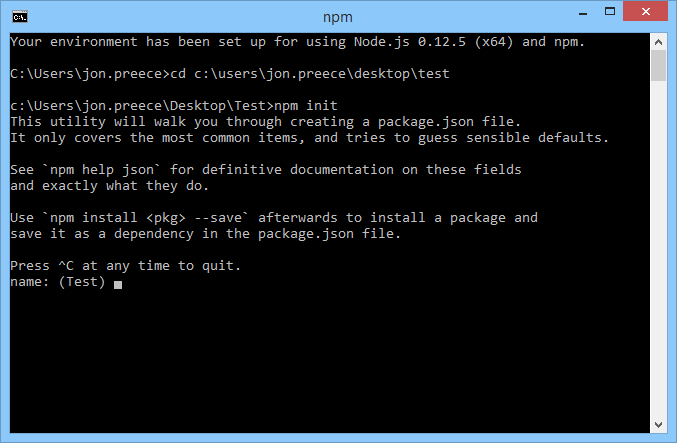
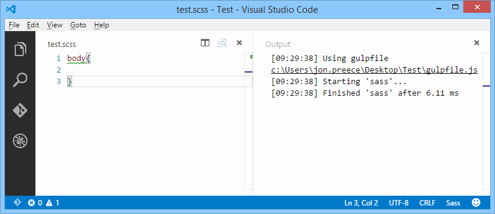

With the task runner built in to VS Code, you can set up Gulp to automatically compile your SASS files to CSS with a simple key press.

## VS Code task runner prerequisites

To be able to get this working, you need the following prerequisites

- Windows, Linux or Mac
- [VS Code](https://www.visualstudio.com/en-us/products/code-vs.aspx)
- [Node.js](https://nodejs.org/) and NPM
- [Gulp.js](http://gulpjs.com/)

To install Gulp run the following command;

<pre>npm install -g gulp</pre>

or

<pre>npm install gulp --save-dev</pre>

To install into your development environment. I'd generally recommend installing gulp globally as you will likely be using it a lot.

You will probably want to install gulp-sass locally in your dev environment. We will get to that shortly.

## Existing Project

If you are using an existing project and you already have a Gulp file (**GulpFile.js**) and a **package.json** file, feel free to skip the next step.

## New Project

Create a new folder for your project, open VS Code and click **File** > **Open Folder**. Point to your new folder and click **OK**.

Open a Node.JS command prompt, and change directory to your new folder.

Now type the following command;

<pre>npm init</pre>

As shown here;



You will be prompted to enter details about your project. Either accept the default by pressing <kbd>Enter</kbd> or enter the details as appropriate. This will generate a **package.json** file for your project.

## Configure the task runner

The quickest, easiest way to configure the task runner is to press <kbd>Ctrl</kbd>+<kbd>Shift</kbd>+<kbd>B</kbd> and click the **Configure Task Runner** button.


VS Code will switch to a file called **tasks.json**. This file contains several possible configurations depending on what you want to do.

Ensure that all configurations are commented out, then all the following configuration;

```json
{
  "version": "0.1.0",
  "command": "gulp",
  "isShellCommand": true,
  "tasks": [
    {
      "taskName": "sass",
      "isBuildCommand": true,
      "showOutput": "silent"
    }
  ]
}
```

This will execute gulp, and will run the **sass** task (which we haven't defined yet).

## GulpFile.js

Either open or create a new file called **GulpFile.js**, at the root of your project.

If you just created a new GulpFile, add the following JavaScript;

```javascript
use strict;

var gulp = require('gulp');
var sass = require('gulp-sass');

gulp.task('sass', function () {
  gulp.src('*.scss')
    .pipe(sass().on('error', sass.logError))
    .pipe(gulp.dest('./'));
});

gulp.task('sass:watch', function () {
  gulp.watch('*.scss', ['sass']);
});
```

or if you are editing an existing configuration, note that you don't need to re-import Gulp.

**Note**: For simplicity, this configuration assumes that your SASS files are in the root of your project. In most cases, this will not be true.

If, for example, your SCSS files are contained in a folder called **Content**, you might use the following path instead;

<pre>./Content/**/*.scss</pre>

The same applies to the destination folder, as defined by;

```javascript
gulp.dest('./')
```

Ensure this path is appropriate to your project structure.

## npm install

To install Gulp into your development environment, go back to **package.json** and add the **devDependencies** section as shown below;

```json
"devDependencies": {
    "gulp": "~3.9.0",
    "gulp-sass": "~2.0.4"
  }
```

Your final **package.json** file may look something like this;

```json
{
  "name": "test",
  "version": "1.0.0",
  "description": "",
  "main": "gulpfile.js",
  "author": "",
  "license": "ISC",
  "devDependencies": {
    "gulp": "~3.9.0",
    "gulp-sass": "~2.0.4"
  }
}
```

Go back to the Node.JS command prompt and type the following command;

<pre>npm install</pre>

This will create a new folder in your project called **node_modules**, which will in turn contain each dependency.

## Compiling the SCSS files

Add a new SCSS file to your project and add some dummy CSS;

```css
body {
}
```

Now with everything set up, press the <kbd>Ctrl</kbd>+<kbd>Shift</kbd>+<kbd>B</kbd> keyboard combination to kick off the task.



If all goes well, the corresponding CSS files should be compiled for you.

## Summary

VS Code has a very powerful and versatile task runner built in that can be configured to run just about any task. We have created a GulpFile, and told VS Code how to run Gulp and which tasks to execute, using the **tasks.json** configuration file. In this case we have configured the Gulp-SASS npm package, but there are no limitations on what packages you can use. You can also add multiple tasks that do just about anything.

## Finally...

If you encounter any problems, let me know via the comments section below, or via [Twitter](https://twitter.com/jpreecedev) and I'll be more than happy to help you out.
