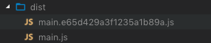

**Please note, this post is part of a wider series (see the end for links)**

We have seen the basics of a Webpack config, but let's take a few steps to make the config more production ready and useful for development.

First, we need to set a Webpack `mode`. We have touched on this a couple of times so far as part of this tutorial. The `mode` will determine if Webpack minifies/compresses our code, or not. This is important to get right because it makes a huge difference to the resulting bundle.

Set the wrong `mode`, and you will not be able to debug your code in the browser, or worse, deploy your code to production that is up to 10 times bigger than it should be.

The best place to set the mode is part of the your NPM script. We will use environment variables to make this work correctly.

**Note**: There is a lot of quirkiness around environment variables across Windows/MAC/Linux, so we will use a helper package that takes this problem away from us.

Run the following in the terminal;

```shell
npm install --save-dev cross-env
```

And update your `build` script as follows;

```json
"build": "cross-env NODE_ENV=development webpack --config webpack.config.js"
```

`cross-env` is simply a package that abstracts the setting of environment variables regardless of the operating system. `NODE_ENV` is now available to us in our `webpack.config.js` file.

We can utilise our environment variable as follows;

```javascript
const isDevelopment = process.env.NODE_ENV !== 'production'

module.exports = {
  mode: isDevelopment ? 'development' : 'production'
  ///...
}
```

We will use `isDevelopment` to configure various plugins as we go along, that is why we have extracted it as a `const`.

Add a new NPM script as follows for production builds;

```json
"build:prod": "cross-env NODE_ENV=production webpack --config webpack.config.js"
```

When we run `npm run build:prod` (probably as part of our CI/CD environment) our assets will be automatically _uglified_, which consists of both removing unnecessary code and renaming objects/classes with much shorter names, so they require less space on disk.

## Cache busting bundled files

To make our website as performant as possible in production, you should be aggressively caching your bundled files. The problem with aggressive caching is how to invalidate the cached file and tell the users browser to use the new version?

Webpack gives us a very simple solution to this problem. Webpack can automatically append a hashed value to our bundle file name, so rather that creating a file every time called `main.js`, we can output a file called `main.xxx1.js` whereby `xxx1` changes for every build.

Open `webpack.config.js` and add the following `output` key/value;

```javascript
module.exports = {
  ///...
  output: {
    filename: isDevelopment ? '[name].js' : '[name].[hash].js'
  }
  ///...
}
```

When running a development build, the file name will not change, the hashed file name is only applied for production builds.

Run the `build:prod` NPM script and observe the `dist` folder.



Make a few changes and re-run `build:prod` and a new file will be created with a new hash. This is great but eventually this folder will become cluttered. We need a way to clean up the `dist` folder between builds.

## Clean up the dist folder automatically before each build

To clean up the `dist` folder before each build, we need to use the `clean-webpack-plugin` Webpack plugin.

Run the following command;

```shell
npm install --save-dev clean-webpack-plugin
```

Open `webpack.config.js` and import the plugin;

```javascript
const CleanWebpackPlugin = require('clean-webpack-plugin')
```

And add it to the `plugins` section as follows;

```javascript
module.exports = {
  ///...
  plugins: [new CleanWebpackPlugin(['dist'])]
  ///...
}
```

We are essentially saying; "Before each build, delete the folder in the current directory called `dist`".

Run the following command;

```shell
npm run build:prod
```

And observe that the old file `main.js` has now disappeared.

## Summary

We took advantage of some very powerful features of Webpack. First, we set the `mode`, which when set to `production` will automatically optimise our JavaScript and other assets for us. Finally, we took advantage of `[hash]`, which is used to automatically add a random string of characters to our bundle names so that we can take advantage of aggressive caching.
