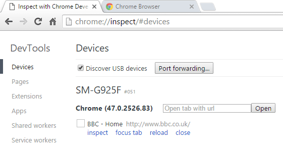
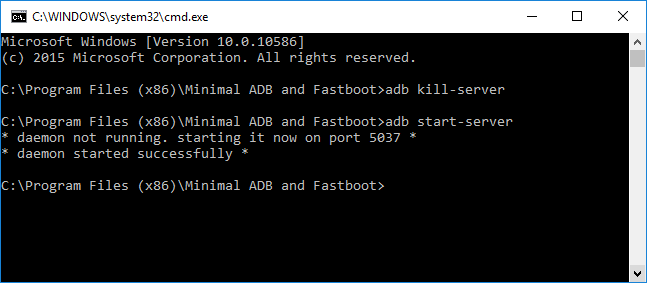
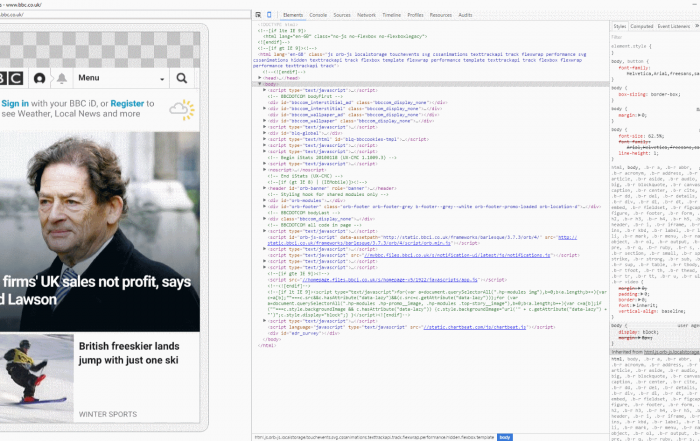

I can't believe I have survived this long as a web developer without knowing you can debug websites (JavaScript, CSS, HTML, TypeScript etc.) directly on your mobile device using Google Chrome developer tools. If you are currently using emulators/simulators or testing solutions such as Browser Stack, you will love this easy and free solution. Be warned, however, you will be expected to download 6+ gigabytes of _stuff_ before the magic begins. I've only tested this on my Samsung Galaxy S6 Edge (running Android 5.1.1) but I believe it also works on an iPhone.

## Prerequisite Software

Before connecting your phone to your computer, please ensure you have all of the following software installed;

*   A recent version of the [Java Development Kit (JDK)](http://www.oracle.com/technetwork/java/javase/downloads/jdk8-downloads-2133151.html)
*   [Android Software Development Kit (SDK)](http://developer.android.com/sdk/index.html)
*   [Android SDK Platform Tools](https://docs.google.com/file/d/0B1S0LCuXCnnmSWh6NGJmSE1BUWc/edit)
*   If you have a Samsung mobile device, ensure you have the [Samsung Android USB Driver for Windows](http://developer.samsung.com/android/tools-sdks/Samsung-Andorid-USB-Driver-for-Windows) installed. If you don't please download a suitable driver for your device. Google maintains a helpful (although not comprehensive) [list of drivers](https://developer.android.com/tools/extras/oem-usb.html#Drivers) to help you out.

## Set up your device

Setting up your device is pretty simple. Start by connecting it to your computer with a USB cable and activate "Developer Mode" via the settings menu. Rather than explain all the individal steps, [just follow this helpful guide](https://developers.google.com/web/tools/chrome-devtools/debug/remote-debugging/remote-debugging#set-up-your-android-device).

## Time to start debugging

If you haven't already done so, go ahead and connect your device to your PC via USB cable. Launch Google Chrome on your device, and launch Google Chrome on your computer. Navigate to [chrome://inspect](chrome://inspect) and your device should be listed.  If your device is not listed, you probably need to restart the ADB server. Run the commands as shown below from a standard or administrator command prompt;  If you still cannot see your device listed, [please check out the troubleshooting guide](https://developers.google.com/web/tools/chrome-devtools/debug/remote-debugging/remote-debugging?hl=en#troubleshooting). When ready, click **inspect** just below the title of the tab with your open web page - or use the convenient **Open tab with url** field to quickly open a new tab. Google Chrome will now open a full screen Developer tools window, with a preview of the web page on the left, with a console window and other helpful tabs (including everything you are used to when debugging web pages in the desktop browser).  You can set breakpoints, use the `debugger` keyword, and debug in the same way you're used to.  Any changes made on the PC are automatically and instantly reflected on the device, and vice versa!

## Summary

Google Chrome has an incredibly useful feature that allows for remote debugging on your Android or IOS device using Google Chrome developer tools. The setup process involves downloading over 6GB of additional _stuff_, but it feels like a small price to pay for such a useful feature.