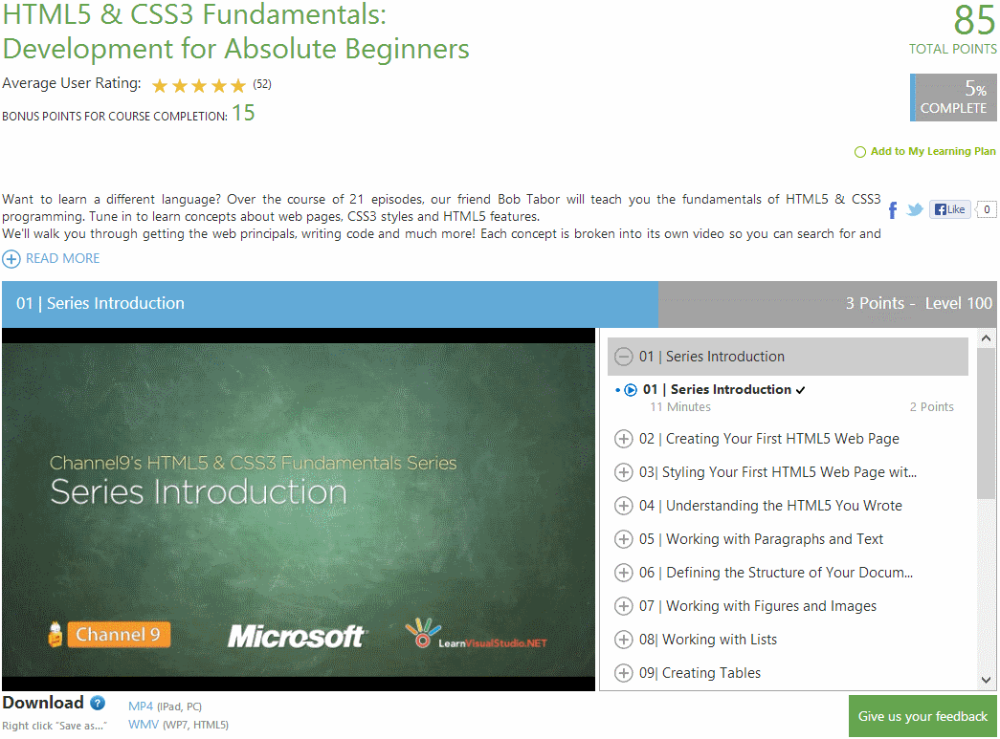

Before you continue reading this blog, you need to be aware of the following; This is not a "quick fix" or an "easy solution". I have not discovered some secret formula to guarantee you pass with 100% marks every time. I am not trying to sell you anything. The exam is genuinely challenging and the only way you are going to pass is by working hard! You will not find any brain dumps here! If you're afraid of working hard to achieve your goals, you best leave now ... Still Here? Congratulations, you are taking your first steps towards passing the exam. The purpose of this post is to link to all the resources that I used when revising for the exam myself. So why 30 days? Well its important to set yourself a target. Setting yourself a target motivates you. If you are paying for this exam yourself (like I did), you'll really want to make sure you give the exam your best shot (after all, £99 is a hefty amount of money!)

### Know the exam objectives

Probably the most important thing you should do before starting studying for any exam is to find out what the exam objectives are. Basically the exam objectives tell you what to study for! There is not much point in learning material that is of no relevance! You can find the exam objectives under the "Skills Measured" section on [the official 70-480 exam page](http://www.microsoft.com/learning/en-us/exam-70-480.aspx 'Microsoft Exam Objective'). You can also find other sites (try [GeeksWithBlogs.net/WTFNext/](http://geekswithblogs.net/WTFNext/archive/2012/10/08/exam-70-480-study-material-programming-in-html5-with-javascript-and.aspx 'GeeksWithBlogs') as an example) that will try and match the objectives with relevant material.

### Books

Books aren't for everybody, some people find it hard to sit down and read a book ... I get that, but you should at least _try_. Microsoft really is your friend here, as one of the two books that I recommend reading is provided by them for free! [Programming Windows 8 Apps with HTML, CSS, and JavaScript](http://blogs.msdn.com/b/microsoft_press/archive/2012/10/29/free-ebook-programming-windows-8-apps-with-html-css-and-javascript.aspx 'Programming Windows 8 Apps with HTML, CSS, and JavaScript') This book was written by Kraig Brockschmidt. It attempts to achieve several goals at the same time. The book is focused on introducing developers to Windows 8 Store Application development using HTML 5, CSS 3 and JavaScript. It is very detailed and contains a lot of useful code samples and links to Microsoft resources. **Pros;** This book is free, gives lots of good sample code, its thorough and its a great resource for anybody looking to write Windows Store applications. Its also the official Microsoft book of the 070-480 exam. **Cons;** Whilst this is the official Microsoft 070-480 exam, it doesn't target the exam itself. What I mean is, there is a lot of generic code in this book, and the book does not target the exam directly (unlike the next book) [Training Guide: Programming in HTML5 with JavaScript and CSS3](http://www.amazon.co.uk/gp/product/0735674388/ref=as_li_tf_tl?ie=UTF8&camp=1634&creative=6738&creativeASIN=0735674388&linkCode=as2&tag=jprecom-21) This book was authored by Glenn Johnson and was written specifically to help you pass the exam by giving hands on, practical examples, specifically target at the exam objectives. Each chapter is divided into manageable sections, complete with hands on exercises (usually one or more per chapter). This book very much helps you learn by doing, which in my opinion, is the best way to learn. I believe that if I hadn't read this book, I genuinely believe I wouldn't have passed the exam.

### Microsoft Virtual Academy (MVA) JumpStart

Microsoft has provided some great FREE training videos on the [Microsoft Virtual Academy](http://www.microsoftvirtualacademy.com/ 'Microsoft Virtual Academy') website, so its only polite that you fully exploit these resources. Depending on what level you are currently at, you may want to start with the [HTML 5 & CSS 3 Fundamentals: Development for Absolute Beginners](http://www.microsoftvirtualacademy.com/training-courses/html5-css3-fundamentals-development-for-absolute-beginners#fbid=Uc7RHJqXjOB 'HTML 5 & CSS3 Fundamentals: Development for Absolute Beginners') video series. You will need a free Microsoft account to access the videos. [caption id="attachment_260" align="alignleft" width="640"]](mvawebsite1.png) MVA Website[/caption]

I also strongly recommend checking out the [Developing HTML 5 with JavaScript and CSS3 Jump Start](http://www.microsoftvirtualacademy.com/training-courses/learn-html5-with-javascript-css3-jumpstart-training#fbid=Uc7RHJqXjOB 'Developing in HTML5 with JavaScript and CSS3 Jump Start') (and the [refresher](http://www.microsoftvirtualacademy.com/training-courses/learn-html5-with-javascript-css3-jumpstart-training#fbid=Uc7RHJqXjOB 'Windows Store Apps with HTML5 Refresh Jump Start')) training courses, brilliantly hosted by [Jeremy Foster](http://codefoster.com/ 'codefoster') and [Michael Palermo](http://palermo4.com/ 'Michael Palermo'). By the way, you should also follow the blogs of these people, as they are constantly posting useful information that you may find helpful.

### Pluralsight Training Videos

[Pluralsight](http://www.pluralsight.com/training/ 'Pluralsight') is a subscription (paid for) site offering training material for developers (and now IT professionals as well) at all levels, and in all stages of their careers. If you don't already have a subscription (??) you can get a free 10 day trial (up to 200 minutes) to give you a taste. The subscription starts [at a mere $29](http://www.pluralsight.com/training/Products/Individual 'Pluralsight') (£12.60 ish) a month. Here are some of the videos I watched whilst preparing for this exam; (Make sure you follow along whilst the presenter is talking!)

- [Building a Site with Bootstrap, AngularJS, ASP.NET, EF and Azure](http://pluralsight.com/training/courses/TableOfContents?courseName=site-building-bootstrap-angularjs-ef-azure&highlight= 'Building a Site with Bootstrap, AngularJS, ASP.NET, EF and Azure') (My Favourite) (By Shawn Wildermuth)
- [HTML Fundamentals](http://pluralsight.com/training/courses/TableOfContents?courseName=html-fundamentals&highlight=matt-milner_html-fundamentals-m1-text!matt-milner_html-fundamentals-m3-lists!matt-milner_html-fundamentals-m4-tables!matt-milner_html-fundamentals-m2-links!matt-milner_html-fundamentals-m0-intro*1!matt-milner_html-fundamentals-m5-images#html-fundamentals-m1-text 'HTML Fundamentals')
- [Building Windows 8 Applications with JavaScript and HTML](http://pluralsight.com/training/courses/TableOfContents?courseName=win8apps-javascript-html&highlight=craig-shoemaker_win8apps-javascript-html-m7-controls*2#win8apps-javascript-html-m7-controls 'Building Windows 8 Applications with JavaScript and HTML')
- [Building HTML5 and JavaScript Apps with MVVM and Knockout](http://pluralsight.com/training/courses/TableOfContents?courseName=knockout-mvvm&highlight=john-papa_knockout-mvvm-m3*1#knockout-mvvm-m3 'Building HTML5 and JavaScript Apps with MVVM and Knockout')
- [Using HTML 5 and CSS 3](http://pluralsight.com/training/courses/TableOfContents?courseName=html5css3-upgrade&highlight=michael-palermo_html5css3-upgrade-m2-tags*6,5!michael-palermo_html5css3-upgrade-m4-forms*1,2#html5css3-upgrade-m2-tags 'Using HTML5 and CSS3')
- [jQuery Fundamentals](http://pluralsight.com/training/courses/TableOfContents?courseName=jquery-fundamentals&highlight=dan-wahlin_jquery-fundamentals-ajax*2#jquery-fundamentals-ajax 'jQuery Fundamentals')
- [HTML 5 Fundamentals](http://pluralsight.com/training/courses/TableOfContents?courseName=html5-fundamentals-2e&highlight= 'HTML 5 Fundamental')

And probably the most important video on the site (from your perspective at least ) ... [HTML 5 Advanced Topics](http://pluralsight.com/training/courses/TableOfContents?courseName=html5-advanced&highlight=craig-shoemaker_html5-advanced-geolocation!craig-shoemaker_html5-advanced-microdata!craig-shoemaker_html5-advanced-webstorage!craig-shoemaker_html5-advanced-webworkers!craig-shoemaker_html5-advanced-websockets!craig-shoemaker_html5-advanced-offline*1#html5-advanced-geolocation 'HTML5 Advanced Topics').

### Summary

It is possible to pass Microsoft exams in 30 days, assuming you have some background knowledge in the subject and are prepared to work (very!) hard. Microsoft make a lot of training resources available to you for free, and there are online training providers that can help you out as well (for a small fee). There is no "one size fits all" or "silver bullet", so you'll want to try a range of resources to find what works best for you. Don't resort to cheating or you will be caught and banned for life! In case anybody is wondering, I passed the exam with a score of 93% in September 2013. If you found this article useful, please leave comments below!
