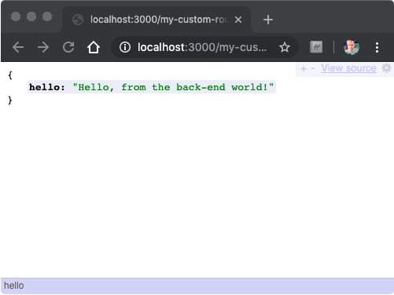

Welcome to our mini-series on _Authentication using Node.js, Express, and Passport.js_. This comprehensive series is designed to teach you everything you need to know, as well as give you all the code required, to add authentication and authorisation to your existing website, or for a new-build from-scratch project.

You will learn;

- How to set-up Next.js (React.js), with a custom Express.js back-end
- How to build a login and registration page, using Material UI
- How to set-up Passport.js with JSON Web Tokens (JWT)
- How to make your application flexible and configurable using _dotenv_
- How to set-up MongoDb using Docker. We will also use Mongoose to simplify database calls, and Mongo Memory Server for effective unit testing
- How to extend the login/registration options with both **Google** and **Facebook** Passport strategies
- How to introduce role-based authorisation, so you can restrict access to certain sections of the website.

# TODO TODO TODO 🚨

# ADD IMAGES OF FINISHED PRODUCT

# TODO TODO TODO 🚨

**Weather you're a seasoned developer or just starting out**, don't worry. We take care to explain the details that matter in a simple and straightforward language that is approachable to all.

Need help? A bit stuck? Leave us a comment and we will try and help you out as best as we can!

Without further ado, let's get started.

## Set up your project quickly with Next.js

The fastest and easiest (and in my opinion, the best) way to get started with a full-stack server-side rendered React application today is using [Next.js](https://nextjs.org/). Next.js gets out of the way and enables us to focus on solving the problem at hand, building our website. Next takes care of all the heavy lifting and is extensible enough that we can plug in our own custom back-end. Helpful, because that is exactly what we will do throughout this series.

**If you already have an existing website that has Express.js already configured, feel free to skip this step.**

<div class="alert alert-primary">
<p class="mb-0">If you need a crash course on getting started with Next.js, you should consider reading my aptly named post <a href="/react/getting-started-nextjs/">Getting started with Next.js</a>.</p>
</div>

First the easy bit, creating a Next project. Open your terminal to an appropriate folder on your computer and run the following command on your terminal of choice;

```shell
npx create-next-app
```

Enter a name for your project. For the purposes of this tutorial I went with `passportjs-next-auth-tutorial`. Next will do a bunch of setup and install all required dependencies.

Run the following;

```shell
cd passportjs-next-auth-tutorial && npm run dev
```

Then open your web browser to `http://localhost:3000`. Congratulations, you’re up and running. Yep, it really is that easy.

At the time of writing, Node 12 still does not have default (turned on) support for ESM (ECMAScript modules). In the interest of future proofing the code, we will install and use `babel-node` instead of calling `node` directly itself. To install `babel-node`, simply run the following;

```shell
npm install --save-dev @babel/node @babel/preset-env
```

With `babel-node` in place, we need to configure Babel itself. In the root of the project, create a new file called `.babelrc` and add the following;

```json
{
  "presets": ["next/babel", "@babel/preset-env"]
}
```

Then we need Express.js, which enables us to write and provide our own middleware.

```shell
npm install --save express
```

Create a new folder at the root of the project called `server` and add in a new file called `index.js`. Add the following code;

```javascript
import express from 'express'
import next from 'next'

const dev = process.env.NODE_ENV !== 'production'
const nextApp = next({ dev })
const handle = nextApp.getRequestHandler()

const port = 3000

nextApp.prepare().then(() => {
  const app = express()

  app.get('/my-custom-route', (req, res) =>
    res.status(200).json({ hello: 'Hello, from the back-end world!' })
  )

  app.get('*', (req, res) => {
    return handle(req, res)
  })

  app.listen(port, err => {
    if (err) throw err
    console.log(`> Ready on localhost:${port}`)
  })
})
```

As we are deviating a little from the default behaviour of Next, we have to take care of a little plumbing. First, we want to ensure that when we make changes to our server code those changes are automatically compiled and the application restarted, otherwise we would have to do this step manually. For this, we will use _Nodemon_, which will restart our process when changes (saves) are made.

Install Nodemon as follows;

```shell
npm install --save-dev nodemon
```

Then update the `package.json` as follows;

```diff
"scripts": {
-  "dev": "next dev",
+  "dev": "nodemon",
  "build": "next build",
  "start": "next start"
},
```

Finally, create a new file in the root of your project, called `nodemon.json` and add the following code;

```json
{
  "watch": ["server"],
  "exec": "NODE_ENV=development babel-node server/index.js",
  "ext": "js"
}
```

You should now be able to re-run `npm run dev` and your server should start listening on `http://localhost:3000` as before.



The difference this time is that now you should be able to hit `http://localhost:3000/my-custom-route` and get a response.

The set-up was straightforward. Let's move on to the good stuff.

## How to build a registration page with Material UI

This application will support two means of registering an account, either using a traditional username and password, or via a social identity provider like Google or Facebook. We will tackle the traditional method first in this series, which is arguably the hardest, and move on the social identity providers later in this series. Both approaches utilise Json Web Tokens (JWT), which simplifies session management and will ensure consistency regardless of what providers we implement now or further down the line.

Before we can do anything though, we will need some forms for the user to complete. Not just any old forms, specifically, a registration form and a login form. Let's do registration first. There is a bit of leg-work involved in getting this right, because of server-side rendering. I think it is worth putting a bit of extra effort in at this stage because we will end up with a half decent working website at the end, which you can put live, and develop further.

Start by installing Material UI as follows;

```shell
npm install --save @material-ui/core
```

Now create a new file in `pages` directory (in the root of your project), called `register.jsx`, and add the following code;

```javascript
import React from 'react'
import Typography from '@material-ui/core/Typography'
import Box from '@material-ui/core/Box'
import { makeStyles } from '@material-ui/core/styles'
import Paper from '@material-ui/core/Paper'
import TextField from '@material-ui/core/TextField'
import Button from '@material-ui/core/Button'

const useStyles = makeStyles(theme => ({
  layout: {
    display: 'flex',
    flexDirection: 'column',
    alignItems: 'center',
    maxWidth: '768px',
    margin: '0 auto'
  },
  paper: {
    padding: theme.spacing(2),
    [theme.breakpoints.up(600 + theme.spacing(3) * 2)]: {
      marginTop: theme.spacing(8),
      padding: `${theme.spacing(6)}px ${theme.spacing(4)}px`
    }
  },
  submit: {
    margin: theme.spacing(3, 0, 2)
  },
  form: {
    width: '100%', // Fix IE 11 issue.
    marginTop: theme.spacing(1)
  },
  buttonProgress: {
    position: 'absolute',
    top: '50%',
    left: '50%',
    marginTop: -12,
    marginLeft: -12
  }
}))

const Register = () => {
  const classes = useStyles({})
  const [formData, setFormData] = React.useState({
    firstName: '',
    lastName: '',
    email: '',
    password: ''
  })
  const [submitting, setSubmitting] = React.useState(false)

  return (
    <main className={classes.layout}>
      <Paper className={classes.paper} elevation={2}>
        <Box
          display="flex"
          alignItems="center"
          justifyContent="center"
          flexDirection="column"
        >
          <Typography component="h1" variant="h4" gutterBottom>
            Register
          </Typography>
        </Box>
        <form method="post" className={classes.form} noValidate>
          <TextField
            margin="normal"
            required
            fullWidth
            id="firstName"
            label="First Name"
            name="firstName"
            autoComplete="fname"
            autoFocus
            defaultValue={formData.firstName}
            onChange={e => setFormData({ ...formData, firstName: e.target.value })}
          />
          <TextField
            margin="normal"
            required
            fullWidth
            id="lastName"
            label="Last Name"
            name="lastName"
            autoComplete="lname"
            defaultValue={formData.lastName}
            onChange={e => setFormData({ ...formData, lastName: e.target.value })}
          />
          <TextField
            margin="normal"
            required
            fullWidth
            id="email"
            label="Email Address"
            name="email"
            autoComplete="email"
            defaultValue={formData.email}
            onChange={e => setFormData({ ...formData, email: e.target.value })}
          />
          <TextField
            margin="normal"
            required
            fullWidth
            name="password"
            label="Password"
            type="password"
            id="password"
            autoComplete="new-password"
            defaultValue={formData.password}
            onChange={e => setFormData({ ...formData, password: e.target.value })}
          />
          <Box mb={6}>
            <Button
              disabled={submitting}
              type="submit"
              fullWidth
              variant="contained"
              color="primary"
              className={classes.submit}
            >
              {submitting && (
                <CircularProgress size={24} className={classes.buttonProgress} />
              )}
              {submitting ? 'Registering...' : 'Register'}
            </Button>
          </Box>
        </form>
      </Paper>
    </main>
  )
}

export default Register
```

When you add `register.jsx`, Next will pick up the change automatically and re-compile itself.

If you're lucky, you will get the following registration form if you navigate your browser to `http://localhost:3000/register`.


Chances are, you didn't get lucky. I didn't get lucky. If you refresh the page, you didn't get lucky a second time.

This is because we need to take care of _properly_ injecting Material UI styles into the body of the document. We need to use a special file in Next to achieve this, called `_document`.

In the `pages` directory, create a new file called `_document.jsx` and add the following code;

```javascript
import React from 'react'
import Document, { Html, Head, Main, NextScript } from 'next/document'
import { ServerStyleSheets } from '@material-ui/styles'
import { createMuiTheme, responsiveFontSizes } from '@material-ui/core/styles'

const theme = responsiveFontSizes(createMuiTheme())

class MyDocument extends Document {
  render() {
    return (
      <Html>
        <Head>
          <meta charSet="utf-8" />
          <meta
            name="viewport"
            content="minimum-scale=1, initial-scale=1, width=device-width, shrink-to-fit=no"
          />
          <meta name="theme-color" content={theme.palette.primary.main} />
          <link
            rel="stylesheet"
            href="https://fonts.googleapis.com/css?family=Roboto:300,400,500,700|Roboto+Slab:400,700|Material+Icons"
          />
          <style jsx global>
            {`
              html,
              body {
                height: 100%;
                width: 100%;
              }
              *,
              *:after,
              *:before {
                box-sizing: border-box;
              }
              body {
                font-family: 'Roboto', 'Helvetica', 'Arial', sans-serif;
                font-size: 1rem;
                margin: 0;
              }
            `}
          </style>
        </Head>
        <body>
          <Main />
          <NextScript />
        </body>
      </Html>
    )
  }
}

MyDocument.getInitialProps = async ctx => {
  // Render app and page and get the context of the page with collected side effects.
  const sheets = new ServerStyleSheets()
  const originalRenderPage = ctx.renderPage

  ctx.renderPage = () =>
    originalRenderPage({
      enhanceApp: App => props => sheets.collect(<App {...props} />)
    })

  const initialProps = await Document.getInitialProps(ctx)

  return {
    ...initialProps,
    // Styles fragment is rendered after the app and page rendering finish.
    styles: [
      <React.Fragment key="styles">
        {initialProps.styles}
        {sheets.getStyleElement()}
      </React.Fragment>
    ]
  }
}

export default MyDocument
```

We don't need to dive into a great deal of detail here. Just know that the styles for Material UI are being injected into the document for you so that the page renders correctly on load and on client-side hydration/hot module reloading.

When you refresh the page, the styles should still work correctly.

The login page is a lot easier to build, I promise.

## How to build a login page with Material UI

Create a new file in the `pages` directory called `login.jsx` and add the following code;

```javascript
import React from 'react'
import { makeStyles } from '@material-ui/core/styles'
import Button from '@material-ui/core/Button'
import Box from '@material-ui/core/Box'
import CircularProgress from '@material-ui/core/CircularProgress'
import Typography from '@material-ui/core/Typography'
import TextField from '@material-ui/core/TextField'
import Paper from '@material-ui/core/Paper'

const useStyles = makeStyles(theme => ({
  layout: {
    display: 'flex',
    flexDirection: 'column',
    alignItems: 'center'
  },
  paper: {
    padding: theme.spacing(2),
    [theme.breakpoints.up(600 + theme.spacing(3) * 2)]: {
      marginTop: theme.spacing(8),
      padding: `${theme.spacing(6)}px ${theme.spacing(4)}px`
    }
  },
  submit: {
    margin: theme.spacing(3, 0, 3)
  },
  form: {
    width: '100%', // Fix IE 11 issue.
    marginTop: theme.spacing(1)
  },
  buttonProgress: {
    position: 'absolute',
    top: '50%',
    left: '50%',
    marginTop: -12,
    marginLeft: -12
  }
}))

const LoginForm = () => {
  const classes = useStyles({})
  const [formData, setFormData] = React.useState({ email: '', password: '' })
  const [submitting, setSubmitting] = React.useState(false)

  return (
    <main className={classes.layout}>
      <Paper className={classes.paper} elevation={2}>
        <Box
          display="flex"
          alignItems="center"
          justifyContent="center"
          flexDirection="column"
        >
          <Typography component="h1" variant="h4" gutterBottom>
            Login
          </Typography>
          <Typography component="p" gutterBottom>
            Log in to your account dashboard
          </Typography>
        </Box>
        <form method="post" className={classes.form} noValidate>
          <TextField
            margin="normal"
            required
            fullWidth
            id="email"
            label="Email Address"
            name="email"
            autoComplete="email"
            autoFocus
            defaultValue={formData.email}
            onChange={e => setFormData({ ...formData, email: e.target.value })}
          />
          <TextField
            margin="normal"
            required
            fullWidth
            name="password"
            label="Password"
            type="password"
            id="password"
            autoComplete="current-password"
            defaultValue={formData.password}
            onChange={e => setFormData({ ...formData, password: e.target.value })}
          />
          <Box mb={6}>
            <Button
              disabled={submitting}
              type="submit"
              fullWidth
              variant="contained"
              color="primary"
              className={classes.submit}
            >
              {submitting && (
                <CircularProgress size={24} className={classes.buttonProgress} />
              )}
              {submitting ? 'Signing in...' : 'Sign In'}
            </Button>
          </Box>
        </form>
      </Paper>
    </main>
  )
}

export default LoginForm
```

And we now have the resulting login form.


As we have already discussed injecting styles into the document, the component should work as expected after when you reload the page. Be sure to navigate to `http://localhost:3000/login` to double check that everything is in order.

With the login and registration pieces in place, we are now ready to start working on wiring up both of these screens, on the front-end and the back-end, in the next post in this mini-series.

## Summary

In the post we have barely scratched the surface, but we have laid some important foundations on solid ground. We created a new full-stack, server-side rendered web application using Next.js. We installed `babel-node` so that we can take advantage of language features that are not yet supported out-of-the-box by Node. Then we extended Next with an Express.js back-end, and we created our own custom API route. We configured Nodemon to automatically restart our server-side code when changes are detected. Finally, we wrote two new pages; login and registration, using Material UI. We will use these pages in subsequent blog posts whereby we flesh out our authentication and authorisation systems, complete with role-based authentication, and secure routes.
