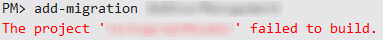

I recently spent several hours tearing my hair out try to figure out why Entity Framework was preventing me from adding a migration to my project. I made some very simple changes to my existing model (I'm developing using the Entity Framework Code First approach) and when trying to add a migration, I was presented with the following error message;

But how can this be? For you see, my project _does_ build...

My project not only builds, but it runs and works just fine ... (up until the point where Entity Framework complains about the out of date model of course!).

### The solution

It was only after considerable head scratching, and tinkering, that I came across the solution. My project specifically targets the x86 platform, as shown below;

If I go ahead and change the build configuration to 'Any CPU' ... I am greeted with a couple of dozen build errors, all relating to missing references! Once I resolved these issues, I was once again able to create migrations. Apparently Entity Framework builds your project in 'Any CPU' when creating migrations (and probably when issuing other commands as well). Hopefully this will help resolve your problem as well.
