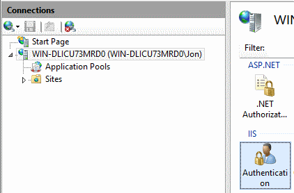

One of the simplest and quickest ways to publish your website to a staging environment is, at least in my opinion, using [Microsoft Web Deploy](http://www.iis.net/downloads/microsoft/web-deploy). This post is about how you approach this, a future article will discuss _why you probably shouldn't do this_. Key points;

1.  The remote server should be running Internet Information Services (IIS) 7.0 or later.
2.  You can use the [Microsoft Web Platform Installer](http://www.microsoft.com/web/downloads/platform.aspx) to install all the extra bits you need to make this work.
3.  You need to set appropriate permissions to allow remote publishing.

## Windows Server 2012 R2

On my local machine, for testing purposes, I have a Windows Server 2012 R2 virtual machine which is bare bones configured. The first thing you need to do is install IIS. You can do this using the Server Manager; Open the **Server Manager** > click **Add roles and features** > select **Role-based or feature-based installation** > select the target server > and finally, select **Web Server (IIS)** and **Windows Deployment Services**. Feel free to drill into each item and ensure you have the following selected (as well as whatever the defaults are);

* Basic Authentication (very important)
* ASP .NET 3.5 / 4.5
* .NET Extensibility 3.5 / 4.5
* IIS Management Console and Management Service (very important)

Once installed, you should be able to open IIS Manager by opening the Start menu, type **inetmgr** and press enter. When IIS Manager opens (referred to herein as IIS), you should be prompted to download Microsoft Web Platform installer. Ensure you do this. Use the Web Platform installer to ensure you have all the following installed;

* IIS 7 Recommended Configuration
* IIS Management Service (should already be installed)
* IIS Basic Authentication (should already be installed)
* Web Deployment Tool (The current version is 3.5 at the time of writing, I also like to install Web Deploy for Hosting Servers as well)
* Current version of the Microsoft .NET Framework
* ASP .NET MVC 3 (as we will be publishing an ASP .NET MVC website)

I like to do a restart at this point, just to ensure that everything is tidied up (although I don't think its 100% necessary, just ensure you restart IIS at the very least).

## Enabling web deployment

The next step is to "switch on" the web management service. This will allow remote users to connect up and deploy the website. For the sake of simplicity, we will use basic authentication. [There are other means of authenticating users](<http://technet.microsoft.com/en-us/library/cc733010(v=ws.10).aspx>), but that is out of the scope of this tutorial.

In IIS, select the server level node and then select the **Authentication** module (under the **IIS** grouping). Simply right click on **Basic Authentication**, and the click **Enable**. Next we need to configure the web management service to accept incoming connections. Again, select the server level node, and select **Management Service**. If the management service is already running, you need to stop it before continuing. To do this, go to the Start Menu and type **services.msc**. This will open the Services manager. Search for **Web Management Service**, right click, and click **Stop**. I ran through this process twice from scratch and the first time the service wasn't running and the second time it was. I not sure what triggers it to run. Tick **Enable Remote Connections** and feel free to accept the default settings for now. You could always revisit this later. Click **Start** on the right hand side to start the service.

## Configure your website

I'm sure you've done this many times before, so I will not regurgitate the details here. Add a new website, give it a host name if you like, and specify the physical path (remember this). Please ensure that you set the application pool to **.NET CL\*\***R Version 4.0.30319\*\* to avoid errors running the website further down the line.

## Set the appropriate permissions for IIS_IUSRS

IIS requires read permissions to access the files that make up your website. The simplest way is to head over to the physical folder for your website (that path you're remembering from earlier), right click the folder, click **Properties > Security** > **Edit** > **Add**. Type **IIS_IUSRS** then click **Check Names**. Click **OK**, then **OK** to close the properties windows.

## Create a Web Deploy Publish Profile

Finally, you can create a web deploy publish profile (simply an XML file with a few basic settings) which you can import into Visual Studio to save you the hassle of having to type anything.

Head back over to IIS, right click on your website, click **Deploy** > **Configure Web Deploy Publishing**. You can (and definitely should) create a restricted user account and grant permission to publish to that account (either an IIS account of a Windows authentication based account). Once you have selected a user, click **Setup**. A message should appear in the **Results** text area;

<pre>Publish enabled for 'WIN-DLICU73MRD0Jon'
    Granted 'WIN-DLICU73MRD0Jon' full control on 'C:inetpubwwwroottestwebsite'
    Successfully created settings file 'C:UsersJonDesktopWIN-DLICU73MRD0_Jon_TestWebsite.PublishSettings'
</pre>

Success! This is your publish profile that you can import into Visual Studio.

## Import your publish profile into Visual Studio

To import your publish profile, open your web solution and from the **Build** menu select **Publish [your website]**.

On the **Profile** tab, click **Import...** and browse to the publish profile you just created. Once imported, switch to the **Connection** tab and type the password for the account you selected earlier on the **Configure Web Deploy Publishing** dialog you saw earlier. If you're feeling lucky, hit the **Validate Connection** button. All should validate properly. If not, please refer to this [little hidden gem](http://www.iis.net/learn/publish/troubleshooting-web-deploy/troubleshooting-web-deploy-problems-with-visual-studio) from the IIS team to help troubleshoot any error messages you might be receiving. Browse to your website using the host name you specified earlier (don't forget to update your hosts file if you are "just testing") and congratulations, after the initial feels like a lifetime compilation period, all should be good. Next time you're ready to publish, simply open the **Publish** dialog in Visual Studio, go straight to the **Preview** tab and hit **Publish**. No more manual deployment for you my friend!

## Summary

The Microsoft Web Deployment tool is a quick and convenient way to publish your website to a staging area for further testing. You use the web deployment tool to generate a publish profile which can be imported into Visual Studio (saving you the hassle of having to type all that connection info) and then call that service and pass it a package which will automatically deploy your site to the appropriate folders.
