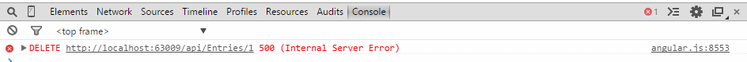

When developing a Web API application recently with an AngularJS front end, I made a basic mistake and then lost 2 hours of my life trying to figure out what was causing the problem ... _async void_. Its pretty common nowadays to use tasks to improve performance/scalability when writing a Web API controller. Take the following code:

```csharp
public async Task<Entry[]> Get() {
 using(var context = new EntriesContext()) {
  return await context.Entries.ToArrayAsync();
 }
}
```

At a high level, when `ToArrayAsync` is executed the call will be moved off onto another thread and the execution of the method will only continue once the operation is complete (when the data is returned from the database in this case). This is great because it frees up the thread for use by other requests, resulting in better performance/scalability (we could argue about how true this is all day long, so lets not do this here!. So what about when you still want to harness this functionality, but you don't need to return anything to the client? `async void`? Not quite Take the following `Delete` method:

```csharp
public async void Delete(int id) {
 using(var context = new EntriesContext()) {
  Entry entity = await context.Entries.FirstOrDefaultAsync(c => c.Id == id);
  if (entity != null) {
   context.Entry(entity).State = EntityState.Deleted;
   await context.SaveChangesAsync();
  }
 }
}
```

The client uses the `Id` property to do what it needs to do, so it doesn't care what actually gets returned...as long as the operation (deleting the entity) completes successfully. To help illustrate the problem, here is the client side code (written in AngularJS, but it really doesn't matter what the client side framework is);

```javascript
$scope.delete = function() {
  var entry = $scope.entries[0]

  $http.delete('/api/Entries/' + entry.Id).then(function() {
    $scope.entries.splice(0, 1)
  })
}
```

When the delete operation is completed successfully (i.e. a 2xx response code), the `then` call-back method is raised and the entry is removed from the `entries` collection. Only this code never actually runs. So why? If you're lucky, your web browser will give you a error message to let you know that _something_ went wrong...  I have however seen this error get swallowed up completely. To get the actual error message, you will need to use a HTTP proxy tool, such as [Fiddler](http://www.telerik.com/fiddler). With this you can capture the response message returned by the server, which should look something like this (for the sake of clarity I've omitted all the HTML code which collectively makes up the yellow screen of death);

> An asynchronous module or handler completed while an asynchronous operation was still pending.

Yep, you have a [race condition](http://en.wikipedia.org/wiki/Race_condition). The method returned before it finished executing. Under the hood, the framework didn't create a `Task` for the method because the method does not return a `Task`. Therefore when calling `FirstOrDefaultAsync`, the method does not pause execution and the error is encountered. To resolve the problem, simply change the return type of the method from `void` to `Task`. Don't worry, you don't actually have to return anything, and the compiler knows not to generate a build error if there is no return statement. An easy fix, when you know what the problem is!

# Summary

Web API fully supports Tasks, which are helpful for writing more scalable applications. When writing methods that don't need to return a value to the client, it may make sense to return `void`. However, under the hood .NET requires the method to return `Task` in order for it to properly support asynchronous functionality.
