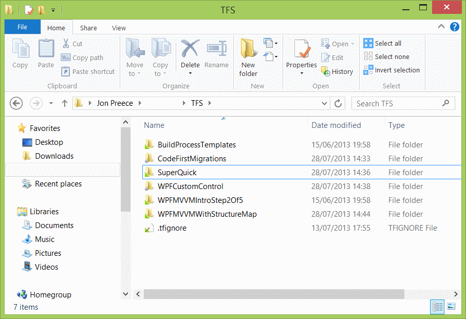
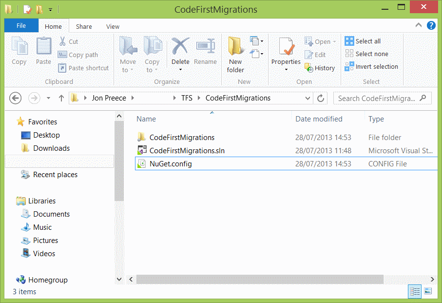

If, like me, you are working on multiple projects that reference the same packages (StructureMap is a great example) you may have noticed that each project has its own version of each package. In this bite sized post, we will look at how to redefine where your packages get installed.

### Root source control folder

Here was my root source control folder before making any changes.



When I dive into each folder, I see a _packages_ folder, which contains each of my packages. Generally I use the same packages across multiple projects. What I would like is to be able to create a folder at the root level, called _Library_ and place all my packages in there. Achieving this takes a bit of effort at first, but will pay off in no time. Go ahead and create the _Library_ folder at the root level. Then for each project, go into the project folder and add a new file called _NuGet.config_. The contents of NuGet.config should match as follows;

```xml
<?xml version="1.0" encoding="utf-8"?>
<settings>
	<repositoryPath>..Library</repositoryPath>
</settings>
```

Your project folder should now look like this;



### The painful bit

Now to finish the job, you must do the following for each project;

1.  Open the project
2.  Uninstall all the packages (ensuring all the references are removed)
3.  Delete the bin directory
4.  Delete the original _packages_ folder
5.  Re-add each package
6.  Save and build

I hope you find this useful, doing this has certainly tidied up my Team Foundation Server (TFS).
