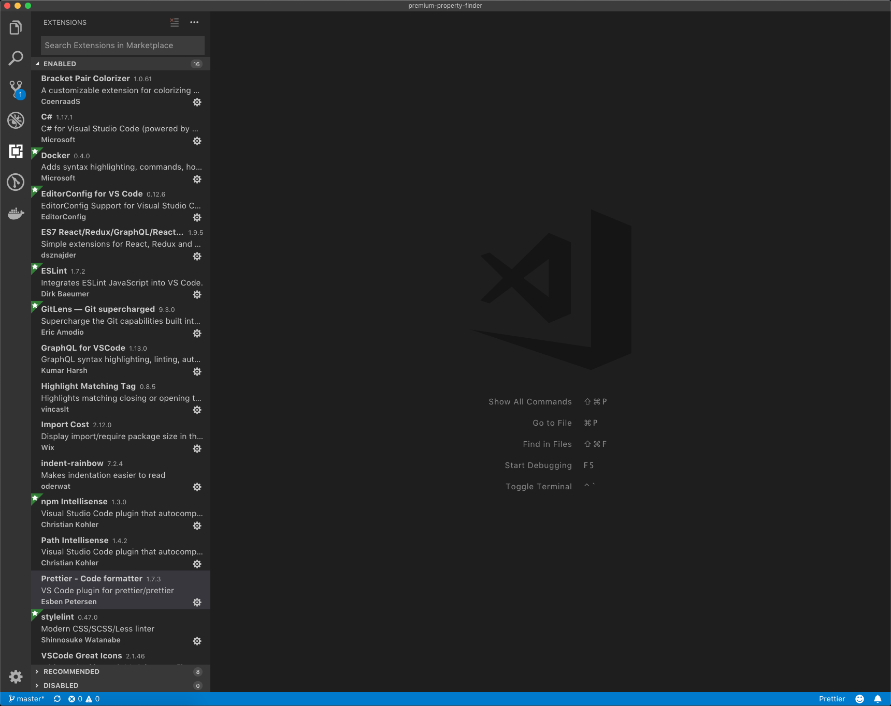
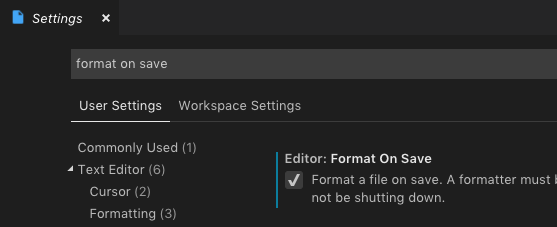

How you set up your development environment can be a very contentious topic, a _religious_ argument in which there may not be one single unified answer, but rather many correct answers.

In this post I will discuss exactly how I configure _my_ coding environment.

Throughout this post I dicuss tools like ESLint and Prettier several times. Should you like to learn about these tools in more detail, I have written a separate, more detailed, blog post on the topic. [How I use ESLint and Prettier for a consistent coding environment](https://developerhandbook.com/javascript/use-eslint-prettier-for-consistent-coding-environment/).

Strictly speaking, none of this is required, you can get along just fine by ignoring all the advice in this post. If you want consistency, linting, formatting and visual goodness, keep on reading.

## VS Code is my primary editor for front-end development

I use VS Code for all front-end development, and I love it. I have found no better tool.



I highly recommend installing at least the following extensions;

- [Bracket Pair Colorizer](https://marketplace.visualstudio.com/items?itemName=CoenraadS.bracket-pair-colorizer) - Makes finding matching brackets easier
- [ES7 React/Redux/GraphQL/React-Native snippets](https://marketplace.visualstudio.com/items?itemName=dsznajder.es7-react-js-snippets) - Has many built in snippets that save tidious repetitive typing
- [ESLint](https://marketplace.visualstudio.com/items?itemName=dbaeumer.vscode-eslint) - Helps to code consistently
- [Indent Rainbow](https://marketplace.visualstudio.com/items?itemName=oderwat.indent-rainbow) - Helps with readability and nesting
- [Prettier](https://marketplace.visualstudio.com/items?itemName=esbenp.prettier-vscode) - Helps to ensure code is formatted consistently

I do have several other extensions installed, which you can see in the screenshot above. These are _more_ optional, but still recommended. I use **all** of them.

Should you choose to install Prettier, I recommend turning on **Format On Save**, as follows;

- In VS Code, click `Main Menu > Preferences > Settings`.
- In **Search settings**, type **Format On Save**
- Ensure option is selected as shown



If you are choosing to use another editor, I recommend finding similar extensions as those mentioned above.

## TL;DR

Next I am going to explain how specifically I configure my React projects. This is all well and good, but by no means vital to getting started.

I created an absolute bare-bones starter project that contains everything discussed below (and nothing else). You can find it on GitHub, [default-project-setup](https://github.com/jpreecedev/default-project-setup).

## ESLint

ESLint is an open source JavaScript linting utility. Linting is the process of running a program that will analyse code for potential errors as well as code that does not adhere to the preferred style.

Here is our ESLint starting point;

```json
{
  "parser": "babel-eslint",
  "parserOptions": {
    "ecmaVersion": 7,
    "sourceType": "module",
    "ecmaFeatures": {
      "jsx": true,
      "modules": true
    }
  },
  "env": {
    "browser": true
  },
  "extends": ["airbnb", "prettier"],
  "rules": {
    "react/prop-types": "off",
    "react/jsx-filename-extension": [1, { "extensions": [".js"] }]
  }
}
```

Add this to your `.eslintrc` file. We will make adjustments here as we go along.

You will need to run the following command to add ESLint to your project;

```shell
npm install --save-dev babel-eslint eslint eslint-config-airbnb eslint-config-prettier eslint-config-import eslint-config-jsx-a11y eslint-config-node eslint-config-prettier eslint-config-promise eslint-config-react prettier stylelint stylelint-config-standard
```

We make use of [Airbnb's styleguide](https://github.com/airbnb/javascript), with a couple of React specific overrides.

## Prettier

Prettier is an opinionated code formatter. Prettier takes your code, moves it around, and "tidies" it up in a standard way. A way that has been agreed by those in the open source community.

I use Prettier as-is, with a single override.

```json
{
  "printWidth": 90,
  "tabWidth": 2,
  "useTabs": false,
  "semi": false,
  "singleQuote": true,
  "trailingComma": "none",
  "bracketSpacing": true,
  "jsxBracketSameLine": false,
  "arrowParens": "avoid"
}
```

I have changed the `printWidth` from `80` to `90`, as i prefer how the code gets formatted at the slightly wider width.

Create a `.prettierrc` file as above.

## Stylelint

[Stylelint](https://github.com/stylelint/stylelint) is like ESLint and Prettier for SCSS/CSS. I love how Stylelint tidies and organises my CSS/SCSS automatically so I do not have to think about it.

I use [stylelint-config-standard](https://github.com/stylelint/stylelint-config-standard) for all my projects and I never override it.

```json
{
  "extends": "stylelint-config-standard"
}
```

Add the above to `.stylelintrc`.

## EditorConfig

EditorConfig helps with consistency as I move around between projects, computers and share code with other team members.

This is my preferred EditorConfig setup;

```text
root = true

[*]
indent_style = space
indent_size = 2
charset = utf-8
trim_trailing_whitespace = true
insert_final_newline = true
end_of_line = lf
# editorconfig-tools is unable to ignore longs strings or urls
max_line_length = null
```

Add the above to `.editorconfig`.

## Summary

How editors/environments are configured can be a contentious topic. I lay out the groundwork for you, and you are free to change the style to suit your own personal needs. I primarily use VS Code for development, with ESLint, Prettier and EditorConfig for linting, formatting and consistency between environments.
