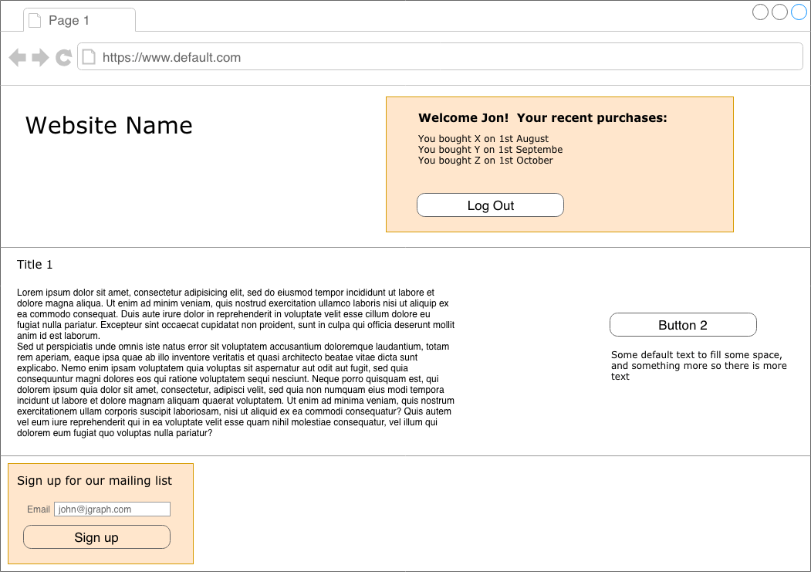

## Overview

Managing state in a React app can be complex enough. Your application may consist of many pages that the user can visit without the need for a full page refresh. You may capture information about the user, through, say, a form in which the user enters their name, their email address, and so on. This information can be stored in local state, Context, or a state management tool like Redux, and shared throughout the application. This is a common scenario and one in which most developers will be accustomed to.

What if, however, you were not building a single page application? What if you worked for a company that already had an established, more traditionally built multiple page application (MPA), to which you are asked to add dynamic elements using React?

Precisely, you have a static/server side rendered NodeJS/Express application with a header, content, and a footer. You have a mailing list sign-up form in the footer, which is an independent React application with its own GIT repository, its own deployment pipeline etc. In your header you have an account management menu, which, again is an independent React application. The account management menu allows the user to log in, see their recent purchases etc all without a page refresh/navigation.

When the user logs in, it no longer makes sense to show the mailing list sign-up form, because that information has already been captured. Instead, we may want to re-frame the form to allow the user to manage their existing mailing list subscription (imagine there are multiple different newsletters the user can subscribe to).

How can the mailing list in the header communicate that state has changed (the user has logged in) to the mailing list sign-up form in the footer?

There is one complication. The website is old, complex, and has been developed over more than 10 years by hundreds of developers from all over the world. The company has previously decided that all client side state would live on the `window`, in an object called `window.__GLOBAL_STATE__`.

This is a simplification of a problem I recently encountered in the real world, and this is a discussion of one approach that was considered to building a robust, scalable solution.

The above diagram shows how we have an account management screen which shows the users recent purchase history (highlighted in orange) and a mailing list subscription form at the bottom. This looks bad to the user because in order to be able to manage their mailing list subscriptions, they have to know that they have to refresh the page to see the appropriate form.
