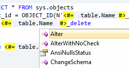
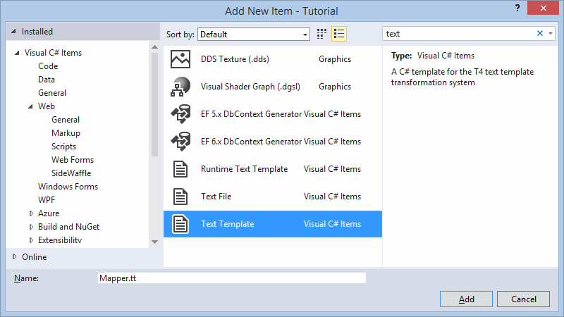

T4 (Text Template Transformation Toolkit) has been around for a while now... its been a part of [Visual Studio since the 2005 release](http://en.wikipedia.org/wiki/Text_Template_Transformation_Toolkit 'T4 Templates'). In case you don't know, T4 can be used to automatically generate files based on templates. You create a text template, which is then transformed (interpreted) by Visual Studio into a working file. T4 can be used to create C# code files, and indeed it forms the basis of the current scaffolding templates you have probably used when creating ASP .NET web applications. You're not limited to using T4 to create code classes, but this is one of its most common usages. I've known of T4 templates for quite a while, and I've edited some of the existing T4 templates in the past (see [Scott Hanselman's post](http://www.hanselman.com/blog/ModifyingTheDefaultCodeGenerationscaffoldingTemplatesInASPNETMVC.aspx 'Modifying the default code generation/scaffolding templates in ASP.NET MVC') for details on how to do this). To be honest, I've only recently found a practical scenario where I would want to write my own T4 templates, mapping lookup tables to enumerations ([C# enum](http://msdn.microsoft.com/en-us/library/sbbt4032.aspx 'Enum')). What is a lookup table? A lookup table consists of data that is indexed and referenced from other tables, allowing the data to be changed without affecting existing foreign key constraints. Its common to add new data to these tables, and even make occasional changes, but lookup tables are unlikely to change much over time.


Take [Adventure Works](http://msftdbprodsamples.codeplex.com/releases/view/55330 'Adventure Works') for example, there are three lookup tables ^. There is a consistent theme across each table, a primary key (the lookup Id) and a Name (a description of the lookup item). We will use T4 templates to map these lookup tables into our code in the form of enumerations, so that we can avoid the dreaded "magic numbers" ... in other words, we give our code some strong typing, which will significantly improve code maintainability over time.

## Tooling

It has to be said, sorry Microsoft, but native tooling for T4 templates is still pretty poor (even after 9 years (as of 2014) since the initial release). Out of the box, Visual Studio lets you run the T4 templates, but not much else. There is no native syntax highlighting, IntelliSense or basically any of the usual Visual Studio goodness we are used to. We're going to need some third party help. There are two main players here;


T4 Editor from Devart.

My preferred tool, offers syntax highlighting, basic IntelliSense, GoTo (code navigation), outlining (collapsible code) and code indentation. Also I partically love how the T4 template is executed every time I hit **Save**, this is a great time saver. The download is very lean (0.63 - 1.79 MB depending on your version) and installs as a simple Visual Studio extension (**.vsix** file extension). The extension is also completely free, which is fantastic.



**[Tangible T4 Editor](http://t4-editor.tangible-engineering.com/t4editor_features.html 'Tangible T4 Editor') from Tangible Engineering** This is a comprehensive tool with advanced IntelliSense, code navigation and validation. Personally I don't use this tool because I didn't like the bulky download, or the full blown Windows installation, but it looks like a decent tool so I recommend you give it a shot. There is a free version, but the full version will set you back an eye watering 99 €. This is not supposed to be a comprehensive review about each product, just a mile-high snapshot. I highly recommend that you test both tools and pick the one that works best for you.

## Basic Set-up

Once you've picked your preferred tooling, its time to set started. For the purposes of this tutorial we will create a simple console application, but the type of project doesn't matter. Add a new **Text Template** using the **Add New Item** dialog (shown below). Call the file **Mapper.tt**;



A new Text Template will be created for you, with a few default assemblies and imports. Please change the **output extension** to **.cs**;

```csharp
<#@ template debug="false" hostspecific="false" language="C#" #>
<#@ assembly name="System.Core" #>
<#@ import namespace="System.Linq" #>
<#@ import namespace="System.Text" #>
<#@ import namespace="System.Collections.Generic" #>
<#@ output extension=".cs" #>
```

Before making any further T4 specific changes, lets add in some simple code and show how to transform the template. Add the following code to **Mapper.tt**;

```csharp
using System;
namespace Tutorial
{
    //Logic goes here
}
```

To transform the template, simply save (if using **Devart \*\***T4 Editor**) or right click on **Mapper.tt** and click **Run Custom Tool\*\*.


You should notice a file appear nested underneath **Mapper.tt**, called \*\*Mapper.cs\*\*. Open the file and see the result of the template transformation. Congratulations, you have written and run your first T4 template.

## A step further

With the "Hello World" stuff out the way, we're free to get to the all the goodness that T4 offers.

### Blocks

If you're familiar with the ASP .NET Web Forms engine tags (<% %> <%= %>) or indeed the PHP equivalent (<? ?>) there really isn't anything new for you to learn here. Otherwise, all you need to know is there are special tags that give instructions to T4 that express how the proceeding text should be interpreted.

<table>

<tbody>

<tr>

<td>Expression Block</td>

<td><#= #></td>

<td>A simple expression, exclude the semi colon at the end.</td>

</tr>

<tr>

<td>Statement Block</td>

<td><# #></td>

<td>Typically multi-line blocks of code</td>

</tr>

<tr>

<td>Class Feature Block</td>

<td><#+ #></td>

<td>Complex structures, including methods, classes, properties etc</td>

</tr>

<tr>

<td>Directive Block</td>

<td><#@ #></td>

<td>Used to specify template details, included files, imports etc</td>

</tr>

</tbody>

</table>

Any text that is not contained within any of these tags is treated as plain text, otherwise the T4 engine will attempt to evaluate each expression/line of code, using the standard C#/VB compilers.

## A simple loop

T4 is designed to work with both C# and VB, so you can just choose the right block and start typing C# as normal, so a loop might look something like this;

```csharp
using System;

namespace Tutorial
{
    <# for(int i = 0; i < 10; i++) { #>
        //This is comment <#= i #>
    <# } #>
}
```

I simply added a statement block for the `for` loop, and an expression block for outputting the value of `i` because the `for` loop itself doesn't have any sort of output, whereas I do want to output the value of `i` in this case.

```csharp
using System;

namespace Tutorial
{
  //This is comment 0
  //This is comment 1
  //This is comment 2
  //This is comment 3
  //This is comment 4
  //This is comment 5
  //This is comment 6
  //This is comment 7
  //This is comment 8
  //This is comment 9
}
```

### Includes

Includes are basically references to other T4 templates. Rather than simply having all our logic in a single file, we can break it up into several smaller files. This will reduce duplication and make our code more readable going forward. Add a new T4 template, call it **SqlHelper.ttinclude**. The **ttinclude** file extension denotes, as I'm sure you have surmised, that this file is basically a child of the parent that references it. We don't need to double up our imports/assembly tags, so you can safely clear out anything that the template gives you by default and start fresh.

## Write some SQL to find your lookup tables

To query our database, we're just going to knock up some very simple ADO .NET code, with a little in-line T-SQL. There is really nothing special here. I highly recommend that you create a scratch application and get this all working before finally dropping it into your template. (Doing this will save your sanity, as the T4 debugging tools are somewhat primitive!) Use the **Class Feature Block** syntax we discussed earlier and drop in the following code;

```csharp
<#+
public static IEnumerable<IGrouping> GetTables()
{
    string connectionString = "Server=.;Database=AdventureWorks2012;Trusted_Connection=True;";

    List tables = new List();
    using (SqlConnection sqlConnection = new SqlConnection(connectionString))
    {
        SqlCommand command = new SqlCommand("DECLARE @tmpTable TABLE ( [RowNumber] int, [Schema] nvarchar(15), [TableName] nvarchar(20), [ColumnName] nvarchar(20), [Sql] nvarchar(200) ) INSERT INTO @tmpTable ([RowNumber], [Schema], [TableName], [ColumnName], [Sql]) SELECT ROW_NUMBER() OVER (ORDER BY KU.TABLE_SCHEMA) AS RowNumber, KU.TABLE_SCHEMA, KU.table_name, column_name, 'SELECT "' + KU.TABLE_SCHEMA + "', "' + KU.TABLE_NAME + "', Name, CAST(ROW_NUMBER() OVER (ORDER BY Name) AS INT) AS RowNumber FROM ' + KU.TABLE_SCHEMA + '.' + KU.TABLE_NAME as [Sql] FROM INFORMATION_SCHEMA.TABLE_CONSTRAINTS AS TC INNER JOIN INFORMATION_SCHEMA.KEY_COLUMN_USAGE AS KU ON TC.CONSTRAINT_TYPE = 'PRIMARY KEY' AND TC.CONSTRAINT_NAME = KU.CONSTRAINT_NAME and ku.table_name in (SELECT TABLE_NAME FROM INFORMATION_SCHEMA.COLUMNS WHERE TABLE_NAME LIKE '%Type' GROUP BY TABLE_NAME, TABLE_SCHEMA) DECLARE @counter INT = 1 DECLARE @total INT = (SELECT COUNT([Schema]) FROM @tmpTable) DECLARE @sqlCommand varchar(1000) WHILE (@counter  1) SET @sqlCommand = CONCAT(@sqlCommand, ' UNION ') SET @sqlCommand = CONCAT(@sqlCommand, @sql) SET @counter = @counter + 1 END EXEC (@sqlCommand)", sqlConnection);
        sqlConnection.Open();

        var reader = command.ExecuteReader();
        while (reader.Read())
        {
            DatabaseTable table = new DatabaseTable();
            table.Schema = reader.GetString(0);
            table.TableName = reader.GetString(1);
            table.Name = reader.GetString(2);
            table.Id = reader.GetInt32(3);

            tables.Add(table);
        }
    }

    return tables.GroupBy(t => t.TableName);
}

public class DatabaseTable
{
    public int Id { get; set; }
    public string Name { get; set; }
    public string TableName { get; set; }
    public string Schema { get; set; }
}

#>
```

You may want to adjust this code a little to work with your set-up (change the connection string for example). In a nutshell, the code will connect to SQL Server, get all the tables whose name ends with **Type**, and return each row in each table as a single query. This code is far from perfect, I am far from a SQL hero, but it gets the job done so I am happy. You may want to use your SQL expertise to tidy it up.

## Tying it all together

Almost there now, we just need to reference our include file, import a couple of assemblies, and update our loop in **Mapper.tt** to call the code we have just written; To add a reference to the include file, add the following underneath the main directive block;

```csharp
<#@ include file="SqlHelper.ttinclude" #>
```

And use the the **assembly** hint tag to bring in a reference to **System.Data;**

```csharp
<#@ assembly name="System.Data" #>
```

And finally add a import for **System.Data.SqlClient**;

```csharp
<#@ import namespace="System.Data.SqlClient" #>
```

You should end up with the following;

```csharp
<#@ template debug="false" hostspecific="false" language="C#" #>
<#@ include file="SqlHelper.ttinclude" #>
<#@ assembly name="System.Core" #>
<#@ assembly name="System.Data" #>
<#@ import namespace="System.Linq" #>
<#@ import namespace="System.Text" #>
<#@ import namespace="System.Collections.Generic" #>
<#@ import namespace="System.Data.SqlClient" #>
<#@ output extension=".cs" #>
```

Now, and I promise this is the last step, update your loop that you created earlier to call out to the database using the methods we created in **SqlHelper.include**;

```csharp
using System;

namespace AutoEnum
{
    <# foreach (var table in GetTables()) { #>
    /// <summary>
    /// The <#= table.Key #> enumeration
    /// </summary>
    public enum <#= table.Key #>
    {
        <# for(int i = 0; i < table.Count(); i++) { #>
        <# var item = table.ElementAt(i); #>
        <#= item.Name.Replace(" ","").Replace("/", "") #> = <#= item.Id #><# if(i < table.Count() - 1) { #>,
        <# } #><# } #>
    };

<#}#>}
```

## The result

Assuming everything is working, correctly, you should end up with the following enumerations in **Mapper.cs;**

```csharp
using System;

namespace AutoEnum
{
    /// <summary>
    /// The AddressType enumeration
    /// </summary>
    public enum AddressType
    {
    Archive = 1,
        Billing = 2,
        Home = 3,
        MainOffice = 4,
        Primary = 5,
        Shipping = 6
    };

    /// <summary>
    /// The ContactType enumeration
    /// </summary>
    public enum ContactType
    {
    AccountingManager = 1,
        AssistantSalesAgent = 2,
        AssistantSalesRepresentative = 3,
        CoordinatorForeignMarkets = 4,
        ExportAdministrator = 5,
        InternationalMarketingManager = 6,
        MarketingAssistant = 7,
        MarketingManager = 8,
        MarketingRepresentative = 9,
        OrderAdministrator = 10,
        Owner = 11,
        OwnerMarketingAssistant = 12,
        ProductManager = 13,
        PurchasingAgent = 14,
        PurchasingManager = 15,
        RegionalAccountRepresentative = 16,
        SalesAgent = 17,
        SalesAssociate = 18,
        SalesManager = 19,
        SalesRepresentative = 20
    };

    /// <summary>
    /// The PhoneNumberType enumeration
    /// </summary>
    public enum PhoneNumberType
    {
    Cell = 1,
        Home = 2,
        Work = 3
    };

}
```

## Summary

Visual Studio has native support for text templates, also known as T4\. Text templates can be used to automatically generate just about anything, but it is common to generate code files based on existing database structures. Out of the box tooling is pretty poor, but there are several third party tools that you can use to enhance the experience. Generally these templates can be a little clunky to write, but once you get the right they can be a real time saver.

## Further Reading

1.  [How to generate multiple outputs from a single template](http://www.olegsych.com/2008/03/how-to-generate-multiple-outputs-from-single-t4-template/ 'How to generate multiple outputs from single T4 template')
2.  [Just about every page on Oleg Sych's blog](http://www.olegsych.com/ 'Oleg Sych')
3.  [Basic introduction about T4 Templates and how to customize them for ASP .NET MVC project](http://architects.dzone.com/articles/basic-introduction-about-t4 'Basic Introduction about T4 Templates & How to customize them for ASP.NET MVC Project')
4.  [T4 template generation, best kept secret in Visual Studio](http://www.hanselman.com/blog/T4TextTemplateTransformationToolkitCodeGenerationBestKeptVisualStudioSecret.aspx 'T4 (Text Template Transformation Toolkit) Code Generation - Best Kept Visual Studio Secret')
