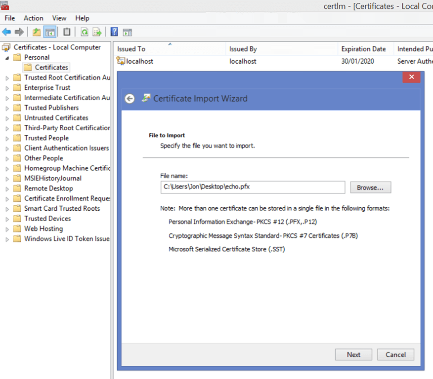
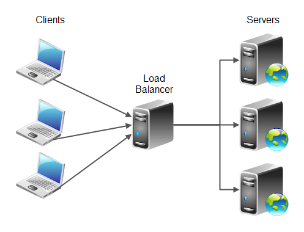

The generally accepted way of authenticating a user with WCF is with a User Name and Password with the [UserNamePasswordValidator](https://msdn.microsoft.com/en-us/library/system.identitymodel.selectors.usernamepasswordvalidator%28v=vs.110%29.aspx) class. So common that [even MSDN has a tutorial](https://msdn.microsoft.com/en-us/library/aa702565%28v=vs.110%29.aspx), and the MSDN documentation for WCF is seriously lacking at best. The username/password approach does what it says on the tin, you pass along a username and password credential from the client to the server, do your authentication, and only if there is a problem then you throw an exception. It's a primitive approach, but it works. But what about when you want to do something a little bit less trivial than that? `ServiceCredentials` is probably what you need. Source code for this post [is available on GitHub](https://github.com/jpreecedev/WCFCustomServiceCredentials 'WCF custom authentication using ServiceCredentials').

## Scenario

I should prefix this tutorial with a disclaimer, and this disclaimer is just my opinion. WCF is incredibly poorly documented and at times counter intuitive. In fact, I generally avoid WCF development like the black plague, preferring technologies such as Web API. The saving grace of WCF is that you have full control over a much more substantial set of functionality, and you're not limited by REST but empowered by SOAP. WCF plays particularly nicely with WPF, my favourite desktop software technology. I've never used WCF as part of a web service before, and I doubt I ever will. Tangent aside, sometimes its not appropriate to authenticate a user with simply a username or password. You might want to pass along a User Name and a License Key, along with some kind of unique identification code based on the hardware configuration of the users computer. Passing along this kind of information in a clean way can't be done with the simple `UserNamePasswordValidator`, without using some hacky kind of delimited string approach ("UserName~LicenseKey~UniqueCode"). So this is what we will do for this tutorial; pass a User Name, License Key and "Unique Key" from the client to the server for authentication and authorization. And for security, we will avoid using [WsHttpBinding](https://msdn.microsoft.com/en-us/library/system.servicemodel.wshttpbinding%28v=vs.110%29.aspx) and instead create a [CustomBinding](https://msdn.microsoft.com/en-us/library/ms731377%28v=vs.110%29.aspx) and use an SSL certificate (PFX on the server, CER on the client). The reasons for this are discussed throughout this tutorial, but primarily because I've encountered so many problems with `WsHttpBinding` when used in a load balanced environment that its just not worth the hassle. As a final note, we will also go "configuration free". All of this is hard coded because I can't make the assumption that if you use this code in a production environment that you will have access to the machine certificate store, which a lot of web hosting providers restrict access to. As far as I know, the SSL certificate cannot be loaded from a file or a resource using the Web.config.

## Server Side Implementation

### Basic Structure

All preamble aside, lets dive straight in. This tutorial isn't about creating a full featured WCF service (a quick Google of the term "WCF Tutorial" presents about 878,000 results for that) so the specific implementation details aren't important. What is important is that you have a Service Contract with at least one Operation Contract, for testing purposes. Create a new WCF Service Application in Visual Studio, and refactor the boiler plate code as follows;

```csharp
[ServiceContract]
public interface IEchoService
{
    [OperationContract]
    string Echo(int value);
}

public class EchoService : IEchoService
{
    public string Echo(int value)
    {
        return string.Format("You entered: {0}", value);
    }
}
```

And rename the SVC file to EchoService.svc. Open up the Web.config file and delete everything inside the `<system.serviceModel>` element. You don't need any of that.

### NuGet Package

It is not exactly clear to me why, but you'll also need to install the NuGet package [Microsoft ASP.NET Web Pages](https://www.nuget.org/packages/Microsoft.AspNet.WebPages/) (Install-Package Microsoft.AspNet.WebPages). I suppose this might be used for the WSDL definition page or the help page. I didn't really look into it.

## Hosting In Local IIS (Internet Information Services)

I'm hosting this in IIS on my local machine (using a self-signed certificate) but I've thoroughly tested on a real server using a "real" SSL certificate, so I'll give you some helpful hints of that as we go along. First things first;

1.  Open IIS Manager (inetmgr)
2.  Add a new website called "echo"
3.  Add a HTTP binding with the host name "echo.local"
4.  Open up the hosts file (C:\Windows\System32\drivers\etc) and add an entry for "echo.local" and IP address 127.0.0.1
5.  Use your [favourite SSL self signed certificate creation tool](http://blog.pluralsight.com/selfcert-create-a-self-signed-certificate-interactively-gui-or-programmatically-in-net) to generate a certificate for cn=echo.local. Be sure to save the SSL certificate in PFX format, this is important for later.
6.  The quickest way I've found to generate the CER file (which is the certificate excluding the private key, for security) is to import the PFX into the **Personal** certificate store for your local machine. Then right click > All Tasks > Export (excluding private key) and select **DER encoded binary X.509 (.CER)**. Save to some useful location for use later. Naturally when doing this "for real", your SSL certificate provider will provide the PFX and CER (and tonnes of other formats) so you can skip this step. This tutorial assumes you don't have access to the certificate store (either physically or programmatically) on the production machine.
7.  DO NOT add a binding for HTTPS unless you are confident that your web host fully supports HTTPS connections. More on this later.
8.  Flip back to Visual Studio and publish your site to IIS. I like to publish in "Debug" mode initially, just to make debugging slightly less impossible.



Open your favourite web browser and navigate to [http://echo.local/EchoService.svc?wsdl](http://echo.local/EchoService.svc?wsdl). You won't get much of anything at this time, just a message to say that service metadata is unavailable and instructions on how to turn it on. Forget it, its not important.

## Beyond UserNamePasswordValidator

Normally at this stage you would create a `UserNamePasswordValidator`, add your database/authentication/authorization logic and be done after about 10 minutes of effort. Well forget that, you should expect to spend at least the next hour creating a myriad of classes and helpers, authenticators, policies, tokens, factories and credentials. Hey, I never said this was easy, just that it can be done.

### Factory Pattern

The default WCF Service Application template you used to create the project generates a [ServiceHost](https://msdn.microsoft.com/en-us/library/system.servicemodel.servicehost%28v=vs.110%29.aspx) object with a Service property that points to the actual implementation of our service, the guts. We need to change this to use a `ServiceHostFactory`, which will spawn new service hosts for us. Right click on the **EchoService.svc** file and change the `Service` property to `Factory`, and `EchoService` to `EchoServiceFactory`;

```csharp
//Change
Service="WCFCustomClientCredentials.EchoService"

//To
Factory="WCFCustomClientCredentials.EchoServiceFactory"
```

Just before we continue, add a new class to your project called **EchoServiceHost** and derive from `ServiceHost`. This is the actual `ServiceHost` that was previously created automatically under the hood for us. We will flesh this out over the course of the tutorial. For now, just add a constructor that takes an array of base addresses for our service, and which passes the type of the service to the base.

```csharp
public class EchoServiceHost : ServiceHost
{
    public EchoServiceHost(params Uri[] addresses)
        : base(typeof(EchoService), addresses)
    {

    }
}
```

Now add another new class to your project, named `EchoServiceFactory`, and derived from `ServiceHostFactoryBase`. Override `CreateServiceHost` and return a new instance of `EchoServiceHost` with the appropriate base address.

```csharp
public override ServiceHostBase CreateServiceHost(string constructorString, Uri[] baseAddresses)
{
    return new EchoServiceHost(new[]
    {
        new Uri("http://echo.local/")
    });
}
```

We won't initialize the `ServiceHost` just let, we'll come back to that later.

## Custom ServiceCredentials

[ServiceCredentials](https://msdn.microsoft.com/en-us/library/ms731370%28v=vs.110%29.aspx) has many responsibilities, including; serialization/deserialization and authentication/authorization. Not to be confused with [ClientCredentials](https://msdn.microsoft.com/en-us/library/system.servicemodel.description.clientcredentials%28v=vs.110%29.aspx), which has the additional responsibility of generating a token which contains all the fields to pass to the service (User Name, License Key and Unique Code). There is a [pretty decent tutorial on MSDN](<https://msdn.microsoft.com/en-us/library/ms730868(v=vs.110).aspx>) which explains some concepts in a little bit more detail that I will attempt. The `ServiceCredentials` will (as well as all the aforementioned things) load in our SSL certificate and use that to verify (using the private key) that the certificate passed from the client is valid before attempting authentication/authorization. Before creating the `ServiceCredentials` class, add each of the following;

1.  `EchoServiceCredentialsSecurityTokenManager` which derives from `ServiceCredentialsSecurityTokenManager`.
2.  `EchoSecurityTokenAuthenticator` which derives from `SecurityTokenAuthenticator`.

Use ReSharper or Visual Studio IntelliSense to stub out any abstract methods for the time being. We will flesh these out as we go along. You will need to add a reference to `System.IdentityModel`, which we will need when creating our authorization policies next. You can now flesh out the `EchoServiceCredentials` class as follows;

```csharp
public class EchoServiceCredentials : ServiceCredentials
{
    public override SecurityTokenManager CreateSecurityTokenManager()
    {
        return new EchoServiceCredentialsSecurityTokenManager(this);
    }

    protected override ServiceCredentials CloneCore()
    {
        return new EchoServiceCredentials();
    }
}
```

If things are not clear at this stage, stick with me... your understanding will improve as we go along.

## Namespaces and constant values

Several namespaces are required to identify our custom token and its properties. It makes sense to stick these properties all in one place as constants, which we will also make available to the client later. The token is ultimately encrypted using a Symmetric encryption algorithm (as shown later), so we can't see the namespaces in the resulting SOAP message, but I'm sure they're there. Create a new class called **EchoConstants**, and add the following;

```csharp
public class EchoConstants
{
    public const string EchoNamespace = "https://echo/";

    public const string EchoLicenseKeyClaim = EchoNamespace + "Claims/LicenseKey";
    public const string EchoUniqueCodeClaim = EchoNamespace + "Claims/UniqueCode";
    public const string EchoUserNameClaim = EchoNamespace + "Claims/UserName";
    public const string EchoTokenType = EchoNamespace + "Tokens/EchoToken";

    public const string EchoTokenPrefix = "ct";
    public const string EchoUrlPrefix = "url";
    public const string EchoTokenName = "EchoToken";
    public const string Id = "Id";
    public const string WsUtilityPrefix = "wsu";
    public const string WsUtilityNamespace = "http://docs.oasis-open.org/wss/2004/01/oasis-200401-wss-wssecurity-utility-1.0.xsd";

    public const string EchoLicenseKeyElementName = "LicenseKey";
    public const string EchoUniqueCodeElementName = "UniqueCodeKey";
    public const string EchoUserNameElementName = "UserNameKey";
}
```

All these string values (except for the WsUtilityNamespace) are arbitrary values. They give the message structure and conformity with open standards. We will use these constant values throughout the remainder of the tutorial.

## Security Token

Lets work through this starting with the most interesting classes first, and work backwards in descending order. The [SecurityToken](<https://msdn.microsoft.com/en-us/library/system.identitymodel.tokens.securitytoken(v=vs.110).aspx>) contains all our custom credentials that we will ultimately use to determine if the user is allowed to use the service. A security token can contain pretty much anything you want, as long as the token itself has a unique ID, and a valid from/to date and time. Add the following class to your project;

```csharp
public class EchoToken : SecurityToken
{
    private readonly DateTime _effectiveTime = DateTime.UtcNow;
    private readonly string _id;
    private readonly ReadOnlyCollection<SecurityKey> _securityKeys;

    public string LicenseKey { get; set; }
    public string UniqueCode { get; set; }
    public string UserName { get; set; }

    public EchoToken(string licenseKey, string uniqueCode, string userName, string id = null)
    {
        LicenseKey = licenseKey;
        UniqueCode = uniqueCode;
        UserName = userName;

        _id = id ?? Guid.NewGuid().ToString();
        _securityKeys = new ReadOnlyCollection<SecurityKey>(new List<SecurityKey>());
    }

    public override string Id
    {
        get { return _id; }
    }

    public override ReadOnlyCollection<SecurityKey> SecurityKeys
    {
        get { return _securityKeys; }
    }

    public override DateTime ValidFrom
    {
        get { return _effectiveTime; }
    }

    public override DateTime ValidTo
    {
        get { return DateTime.MaxValue; }
    }
}
```

There are a few things to note here;

1.  The token has a unique identifier, in this case a random Guid. You can use whatever mechanism you like here, as long as it results in a unique identifier for the token.
2.  The token is valid from now until forever. You might want to put a realistic timeframe in place here.
3.  I don't know what `SecurityKeys` is for, and it doesn't seem to matter.

Before you rush off to MSDN, here is what it says;

> Base class for security keys.

Helpful. We're not quite ready to use this token yet, so we'll revisit later. All the pieces come together at once, like a really dull jigsaw.

## Authorization Policy

We only care at this point about authorizing the request based on the User Name, License Key and Unique Code provided in the token. We could however use an Authorization Policy to limit access to certain service methods based on any one of these factors. If you want to restrict access to your API in this way, [see the MSDN documentation](<https://msdn.microsoft.com/en-us/library/system.identitymodel.policy.iauthorizationpolicy(v=vs.110).aspx>) for more information. If, however, the basic authorization is good enough for you, add the following code;

```csharp
public class EchoTokenAuthorizationPolicy : IAuthorizationPolicy
{
    private readonly string _id;
    private readonly IEnumerable<ClaimSet> _issuedClaimSets;
    private readonly ClaimSet _issuer;

    public EchoTokenAuthorizationPolicy(ClaimSet issuedClaims)
    {
        if (issuedClaims == null)
        {
            throw new ArgumentNullException("issuedClaims");
        }

        _issuer = issuedClaims.Issuer;
        _issuedClaimSets = new[] { issuedClaims };
        _id = Guid.NewGuid().ToString();
    }

    public ClaimSet Issuer
    {
        get { return _issuer; }
    }

    public string Id
    {
        get { return _id; }
    }

    public bool Evaluate(EvaluationContext context, ref object state)
    {
        foreach (ClaimSet issuance in _issuedClaimSets)
        {
            context.AddClaimSet(this, issuance);
        }

        return true;
    }
}
```

The key to this working is the `Evaluate` method. We are just adding each claim to the `EvaluationContext` claim set, without doing any sort of checks. This is fine because we will do our own authorization as part of the `SecurityTokenAuthenticator`, shown next.

## Security Token Authentication and Authorization

Now that we have our Authorization Policies in place, we can get down to business and tell WCF to allow or deny the request. We must create a class that derives from `SecurityTokenAuthenticator`, and override the `ValidateTokenCore` method. If an exception is thrown in this method, the request will be rejected. You're also required to return the authorization policies, which will be evaluated accordingly and the request rejected if the token does not have the claims required to access the desired operation. How you authorize/authenticate the request is down to you, but will inevitably involve some database call or similar tasks to check for the existence and legitimacy of the given token parameters. Here is a sample implementation;

```csharp
public class EchoSecurityTokenAuthenticator : SecurityTokenAuthenticator
{
    protected override bool CanValidateTokenCore(SecurityToken token)
    {
        return (token is EchoToken);
    }

    protected override ReadOnlyCollection<IAuthorizationPolicy> ValidateTokenCore(SecurityToken token)
    {
        var echoToken = token as EchoToken;

        if (echoToken == null)
        {
            throw new ArgumentNullException("token");
        }

        var authorizationException = IsAuthorized(echoToken.LicenseKey, echoToken.UniqueCode, echoToken.UserName);
        if (authorizationException != null)
        {
            throw authorizationException;
        }

        var policies = new List<IAuthorizationPolicy>(3)
        {
            CreateAuthorizationPolicy(EchoConstants.EchoLicenseKeyClaim, echoToken.LicenseKey, Rights.PossessProperty),
            CreateAuthorizationPolicy(EchoConstants.EchoUniqueCodeClaim, echoToken.UniqueCode, Rights.PossessProperty),
            CreateAuthorizationPolicy(EchoConstants.EchoUserNameClaim, echoToken.UserName, Rights.PossessProperty),
        };

        return policies.AsReadOnly();
    }

    private static Exception IsAuthorized(string licenseKey, string uniqueCode, string userName)
    {
        Exception result = null;

        //Check if user is authorized.  If not you must return a FaultException

        return result;
    }

    private static EchoTokenAuthorizationPolicy CreateAuthorizationPolicy<T>(string claimType, T resource, string rights)
    {
        return new EchoTokenAuthorizationPolicy(new DefaultClaimSet(new Claim(claimType, resource, rights)));
    }
}
```

## Token Serialization

Before we can continue, we have neglected to discuss one very important detail. WCF generates messages in XML SOAP format for standardised communication between the client and the server applications. This is achieved by serializing the token using a token serializer. Surprisingly, however, this doesn't happen automatically. You have to give WCF a hand and tell it exactly how to both read and write the messages. It gives you the tools (an `XmlReader` and `XmlWriter`) but you have to do the hammering yourself. The code for this isn't short, so I apologise for that. Here is an explanation of what happens;

1.  `CanReadTokenCore` is called when deserializing a token. The responsibility of this method is to tell the underlying framework if this class is capable of reading the token contents.
2.  `ReadTokenCore` is called with an `XmlReader`, which provides access to the raw token itself. You use the `XmlReader` to retrieve the parts of the token of interest (the User Name, Unique Code and License Key) and ultimately return a new `SecurityToken` (`EchoSecurityToken`).
3.  `CanWriteTokenCore` is called when serializing a token. Return true if the serializer is capable of serializing then given token.
4.  `WriteTokenCore` is called with an `XmlWriter` and the actual `SecurityToken`. Use both objects to do the serialization manually.

And the code itself;

```csharp
public class EchoSecurityTokenSerializer : WSSecurityTokenSerializer
{
    private readonly SecurityTokenVersion _version;

    public EchoSecurityTokenSerializer(SecurityTokenVersion version)
    {
        _version = version;
    }

    protected override bool CanReadTokenCore(XmlReader reader)
    {
        if (reader == null)
        {
            throw new ArgumentNullException("reader");
        }
        if (reader.IsStartElement(EchoConstants.EchoTokenName, EchoConstants.EchoNamespace))
        {
            return true;
        }
        return base.CanReadTokenCore(reader);
    }

    protected override SecurityToken ReadTokenCore(XmlReader reader, SecurityTokenResolver tokenResolver)
    {
        if (reader == null)
        {
            throw new ArgumentNullException("reader");
        }
        if (reader.IsStartElement(EchoConstants.EchoTokenName, EchoConstants.EchoNamespace))
        {
            string id = reader.GetAttribute(EchoConstants.Id, EchoConstants.WsUtilityNamespace);

            reader.ReadStartElement();

            string licenseKey = reader.ReadElementString(EchoConstants.EchoLicenseKeyElementName, EchoConstants.EchoNamespace);
            string companyKey = reader.ReadElementString(EchoConstants.EchoUniqueCodeElementName, EchoConstants.EchoNamespace);
            string machineKey = reader.ReadElementString(EchoConstants.EchoUniqueCodeElementName, EchoConstants.EchoNamespace);

            reader.ReadEndElement();

            return new EchoToken(licenseKey, companyKey, machineKey, id);
        }
        return DefaultInstance.ReadToken(reader, tokenResolver);
    }

    protected override bool CanWriteTokenCore(SecurityToken token)
    {
        if (token is EchoToken)
        {
            return true;
        }
        return base.CanWriteTokenCore(token);
    }

    protected override void WriteTokenCore(XmlWriter writer, SecurityToken token)
    {
        if (writer == null)
        {
            throw new ArgumentNullException("writer");
        }
        if (token == null)
        {
            throw new ArgumentNullException("token");
        }

        var EchoToken = token as EchoToken;
        if (EchoToken != null)
        {
            writer.WriteStartElement(EchoConstants.EchoTokenPrefix, EchoConstants.EchoTokenName, EchoConstants.EchoNamespace);
            writer.WriteAttributeString(EchoConstants.WsUtilityPrefix, EchoConstants.Id, EchoConstants.WsUtilityNamespace, token.Id);
            writer.WriteElementString(EchoConstants.EchoLicenseKeyElementName, EchoConstants.EchoNamespace, EchoToken.LicenseKey);
            writer.WriteElementString(EchoConstants.EchoUniqueCodeElementName, EchoConstants.EchoNamespace, EchoToken.UniqueCode);
            writer.WriteElementString(EchoConstants.EchoUserNameElementName, EchoConstants.EchoNamespace, EchoToken.UserName);
            writer.WriteEndElement();
            writer.Flush();
        }
        else
        {
            base.WriteTokenCore(writer, token);
        }
    }
}
```

## Service Credentials Security Token Manager

A long time ago... in a blog post right here, you created a class called `EchoServiceCredentialsSecurityTokenManager`. The purpose of this class is to tell WCF that we want to use our custom token authenticator (`EchoSecurityTokenAuthenticator`) when it encounters our custom token. Update the `EchoServiceCredentialsSecurityTokenManager` as follows;

```csharp
public class EchoServiceCredentialsSecurityTokenManager : ServiceCredentialsSecurityTokenManager
{
    public EchoServiceCredentialsSecurityTokenManager(ServiceCredentials parent)
        : base(parent)
    {
    }

    public override SecurityTokenAuthenticator CreateSecurityTokenAuthenticator(SecurityTokenRequirement tokenRequirement, out SecurityTokenResolver outOfBandTokenResolver)
    {
        if (tokenRequirement.TokenType == EchoConstants.EchoTokenType)
        {
            outOfBandTokenResolver = null;
            return new EchoSecurityTokenAuthenticator();
        }
        return base.CreateSecurityTokenAuthenticator(tokenRequirement, out outOfBandTokenResolver);
    }

    public override SecurityTokenSerializer CreateSecurityTokenSerializer(SecurityTokenVersion version)
    {
        return new EchoSecurityTokenSerializer(version);
    }
}
```

The code is pretty self explanatory. When an `EchoToken` is encountered, use the `EchoSecurityTokenAuthenticator` to confirm that the token is valid, authentic and authorized. Also, the token can be serialized/deserialized using the `EchoSecurityTokenSerializer`.

## Service Host Endpoints

The last remaining consideration is exposing endpoints so that the client has "something to connect to". This is done in `EchoServiceHost` by overriding the `InitializeRuntime` method, as shown;

```csharp
protected override void InitializeRuntime()
{
    var baseUri = new Uri("http://echo.local");
    var serviceUri = new Uri(baseUri, "EchoService.svc");

    Description.Behaviors.Remove((typeof(ServiceCredentials)));

    var serviceCredential = new EchoServiceCredentials();
    serviceCredential.ServiceCertificate.Certificate = new X509Certificate2(Resources.echo, string.Empty, X509KeyStorageFlags.MachineKeySet);
    Description.Behaviors.Add(serviceCredential);

    var behaviour = new ServiceMetadataBehavior { HttpGetEnabled = true, HttpsGetEnabled = false };
    Description.Behaviors.Add(behaviour);

    Description.Behaviors.Find<ServiceDebugBehavior>().IncludeExceptionDetailInFaults = true;
    Description.Behaviors.Find<ServiceDebugBehavior>().HttpHelpPageUrl = serviceUri;

    AddServiceEndpoint(typeof(IEchoService), new BindingHelper().CreateHttpBinding(), string.Empty);

    base.InitializeRuntime();
}
```

The code does the following;

1.  Define the base URL of the and the service URL
2.  Remove the default implementation of `ServiceCredentials`, and replace with our custom implementation. Ensure that the custom implementation uses our SSL certificate (in this case, the SSL certificate is added to the project as a resource). If the PFX (and it must be a PFX) requires a password, be sure to specify it.
3.  Define and add a metadata endpoint (not strictly required)
4.  Turn on detailed exceptions for debugging purposes, and expose a help page (again not strictly required)
5.  Add an endpoint for our service, use a custom binding. (DO NOT attempt to use `WsHttpBinding` or `BasicHttpsBinding`, you will lose 4 days of your life trying to figure out why it doesn't work in a load balanced environment!)

### Custom Http Binding

In the interest of simplicity, I want the server and the client to use the exact same binding. To make this easier, I've extracted the code out into a separate helper class which will be referenced by both once we've refactored (discussed next). We're using HTTP right now but we will discuss security and production environments towards the end of the post. The custom binding will provide some level of security via a Symmetric encryption algorithm that will be applied to aspects of the message.

```csharp
public Binding CreateHttpBinding()
{
    var httpTransport = new HttpTransportBindingElement
    {
        MaxReceivedMessageSize = 10000000
    };

    var messageSecurity = new SymmetricSecurityBindingElement();

    var x509ProtectionParameters = new X509SecurityTokenParameters
    {
        InclusionMode = SecurityTokenInclusionMode.Never
    };

    messageSecurity.ProtectionTokenParameters = x509ProtectionParameters;
    return new CustomBinding(messageSecurity, httpTransport);
}
```

Note, I've increased the max message size to 10,000,000 bytes (10MB ish) because this is appropriate for my scenario. You might want to think long and hard about doing this. The default message size limit is relatively small to help ward off DDoS attacks, so think carefully before changing the default. 10MB is a lot of data to receive in a single request, even though it might not sound like much. With the endpoint now exposed, a client (if we had one) would be able to connect. Lets do some refactoring first to make our life a bit easier.

## Refactoring

In the interest of simplicity, I haven't worried too much about the client so far. We need to make some changes to the project structure so that some of the lovely code we have written so far can be shared and kept DRY. Add a class library to your project, called Shared and move the following classes into it (be sure to update the namespaces and add the appropriate reference).

1.  BindingHelper.cs
2.  IEchoService.cs
3.  EchoSecurityTokenSerializer.cs
4.  EchoConstants.cs
5.  EchoToken.cs

## Client Side Implementation

We're about 2/3 of the way through now. Most of the leg work has been done and we just have to configure the client correctly so it can make [first contact](http://www.asset1.net/tv/pictures/movie/star-trek-2009/star-trek-VIII-first-contact-18-4.jpg) with the server. Create a new console application (or whatever you fancy) and start by adding a reference to the Shared library you just created for the server. Add the SSL certificate (CER format, doesn't contain the private key) to your project as a resource. Also add a reference to **System.ServiceModel**.

## Custom ClientCredentials

The `ClientCredentials` works in a similar way to `ServiceCredentials`, but a couple of subtle differences. When you instantiate the `ClientCredentials`, you want to pass it all the arbitrary claims you want to pass to the WCF service (License Key, Unique Code, User Name). This object will be passed to the serializer that you created as part of the server side code (`EchoSecurityTokenSerializer`) later on. First things first, create the `EchoClientCredentials` class as follows;

```csharp
public class EchoClientCredentials : ClientCredentials
{
    public string LicenseKey { get; private set; }
    public string UniqueCode { get; private set; }
    public string ClientUserName { get; private set; }

    public EchoClientCredentials(string licenseKey, string uniqueCode, string userName)
    {
        LicenseKey = licenseKey;
        UniqueCode = uniqueCode;
        ClientUserName = userName;
    }

    protected override ClientCredentials CloneCore()
    {
        return new EchoClientCredentials(LicenseKey, UniqueCode, ClientUserName);
    }

    public override SecurityTokenManager CreateSecurityTokenManager()
    {
        return new EchoClientCredentialsSecurityTokenManager(this);
    }
}
```

The `ClientCredentials` has an abstract method `CreateSecurityTokenManager`, where we will use to tell WCF how to ultimately generate our token.

### Client side Security Token Manager

As discussed, the `ClientCredentialsSecurityTokenManager` is responsible for "figuring out" what to do with a token that it has encountered. Before it uses its own underlying token providers, it gives us the chance to specify our own, by calling `CreateSecurityTokenProvider`. We can check the token type to see if we can handle that token ourselves. Create a new class, called `EchoClientCredentialsSecurityTokenManager`, that derives from `ClientCredentialsSecurityTokenManager`, and add the following code;

```csharp
public class EchoClientCredentialsSecurityTokenManager : ClientCredentialsSecurityTokenManager
{
    private readonly EchoClientCredentials _credentials;

    public EchoClientCredentialsSecurityTokenManager(EchoClientCredentials connectClientCredentials)
        : base(connectClientCredentials)
    {
        _credentials = connectClientCredentials;
    }

    public override SecurityTokenProvider CreateSecurityTokenProvider(SecurityTokenRequirement tokenRequirement)
    {
        if (tokenRequirement.TokenType == EchoConstants.EchoTokenType)
        {
            // Handle this token for Custom.
            return new EchoTokenProvider(_credentials);
        }
        if (tokenRequirement is InitiatorServiceModelSecurityTokenRequirement)
        {
            // Return server certificate.
            if (tokenRequirement.TokenType == SecurityTokenTypes.X509Certificate)
            {
                return new X509SecurityTokenProvider(_credentials.ServiceCertificate.DefaultCertificate);
            }
        }
        return base.CreateSecurityTokenProvider(tokenRequirement);
    }

    public override SecurityTokenSerializer CreateSecurityTokenSerializer(SecurityTokenVersion version)
    {
        return new EchoSecurityTokenSerializer(version);
    }
}
```

The code is pretty verbose, and we can see clearly what is happening here. We can inspect the token type and see if it makes that of our Echo token. If we find a match, return an `EchoTokenProvider` (coming next) which is just simply a wrapper containing our claims. Note that we also are able to reuse the token serializer that we created as part of the server side work, a nice (not so little) time saver!

### Security Token Provider

In this case, the security token provider is nothing more than a vessel that contains our client credentials. The token provider instantiates the token, passes the client credentials, and passes the token off for serialization.

```csharp
public class EchoTokenProvider : SecurityTokenProvider
{
    private readonly EchoClientCredentials _credentials;

    public EchoTokenProvider(EchoClientCredentials credentials)
    {
        if (credentials == null) throw new ArgumentNullException("credentials");

        _credentials = credentials;
    }

    protected override SecurityToken GetTokenCore(TimeSpan timeout)
    {
        return new EchoToken(_credentials.LicenseKey, _credentials.UniqueCode, _credentials.ClientUserName);
    }
}
```

## Test Client

The client side code for establishing a connection with our service is relatively simple. We need each of the following:

1.  Define the endpoint (the address) of our service
2.  Create an instance of `EchoClientCredentials`
3.  Load the SSL certificate (the public key aspect at least) and pass to the credentials object we just instantiated
4.  Remove the default implementation of `ClientCredentials` and pass in our own
5.  Create a channel factory, and call our service method

Here is an example of what your client code would look like;

```csharp
var serviceAddress = new EndpointAddress("http://echo.local/EchoService.svc");

var channelFactory = new ChannelFactory<IEchoService>(new BindingHelper().CreateHttpBinding(), serviceAddress);

var credentials = new EchoClientCredentials("license key", "unique code", "user name");
var certificate = new X509Certificate2(Resources.echo);
credentials.ServiceCertificate.DefaultCertificate = certificate;

channelFactory.Endpoint.Behaviors.Remove(typeof(ClientCredentials));
channelFactory.Endpoint.Behaviors.Add(credentials);

var service = channelFactory.CreateChannel();
Console.WriteLine(service.Echo(10));
```

## Security and Production Environment Considerations

Throughout this tutorial I have used HTTP bindings and told you explicitly not to use HTTPS, and there is a very good reason for that. If you have a simple hosting environment, i.e. an environment that is NOT load balanced, then you can go ahead and make the following changes;

* Change your service URL to HTTPS
* Change `HttpTransportBindingElement` (on the server, inside the `BindingHelper`) to `HttpsTransportBindingElement`.
* Add a HTTPS binding in IIS

Re-launch the client and all should be good. If you get the following error message, you're in big trouble.

> The protocol 'https' is not supported.

After 4 days of battling with this error, I found what the problem is. Basically WCF requires end to end HTTPS for HTTPS to be "supported". Take the following set up;



Some hosting companies will load balance the traffic. That makes absolutely perfect sense and is completely reasonable. The communications will be made from the client (laptop, desktop or whatever) via HTTPS, that bit is fine. If you go to the service via HTTPS you will get a response. However, and here's the key, the communication between the load balancer and the physical web server probably isn't secured. I.e. doesn't use HTTPS. So the end-to-end communication isn't HTTPS and therefore you get the error message described. To work around this, use a HTTPS binding on the client, and a HTTP binding on the server. This will guarantee that the traffic between the client and the server will be secure (thus preventing MIM attacks) but the traffic between the load balancer and the physical web server will not be secure (you'll have to decide for yourself if you can live with that).

## Quirks

I've encountered a few quirks whilst developing this service over the last few weeks. Quirks are things I can't explain or don't care to understand. You must make the following changes to the server side code, or else it might not work. If you find any other quirks, feel free to let me know and I'll credit your discovery; **You must add the `AddressFilterMode` 'Any' to the service implementation, or it won't work.**

```csharp
[ServiceBehavior(AddressFilterMode = AddressFilterMode.Any)]
```

## Summary

A lot of work is required to be able to do custom authentication using `ServiceCredentials` with WCF, no fewer than 18 classes in total. For cases when a trivial User Name and password simply won't suffice, you can use this approach. WCF works really well when developing non-web based applications, but the lack of documentation can make development and maintenance harder than it should be. Be careful when using in a load balanced environment, you may need to make some changes to your bindings as already discussed.
