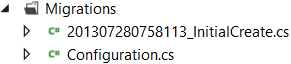

Recently I wrote a WPF application using Entity Framework Code First and released it into the wild. Shortly after, the business requirements changed and I had to make changes to the model. Thus, I was introduced to Code First migrations. I did a lot of research on Code First migrations and could only really find the most simple of examples, and almost [robotic documentation on MSDN](http://msdn.microsoft.com/en-us/data/jj591621.aspx 'Code First Migrations') that provided minimal help. This post aims to provide a clearer view on migrations, and how to properly create them. Before we can start with migrations, we need to create our normal C# code and then add in Entity Framework using NuGet. Once done, we can create our first migration and then explore a second migration.

### The Code

The code is going to revolve around the common idea of customers and orders.

[](codestructure21.png)

Code structure; An `Order` has a collection of `Product` and a `Customer`, the `Customer` has a `CustomerName`. Any properties that are marked as virtual are navigation properties, and are lazy loaded by Entity Framework at runtime.

```csharp
public class Customer {
 public int Id {
  get;
  set;
 }
 public int CustomerNameId {
  get;
  set;
 }
 public virtual CustomerName CustomerName {
  get;
  set;
 }
}
public class CustomerName {
 public int Id {
  get;
  set;
 }
 public string FirstName {
  get;
  set;
 }
 public string LastName {
  get;
  set;
 }
}
public class Product {
 public int Id {
  get;
  set;
 }
 public string Description {
  get;
  set;
 }
 public decimal Price {
  get;
  set;
 }
}
public class Order {
 public int Id {
  get;
  set;
 }
 public int CustomerId {
  get;
  set;
 }
 public virtual Customer Customer {
  get;
  set;
 }
 public virtual List<Product> Products {
  get;
  set;
 }
 public DateTime Placed {
  get;
  set;
 }
}
```

With the code structure in place, we can now introduce Entity Framework. Go ahead and use the package manager console, or the library package manager to install Entity Framework.

```powershell
install-package EntityFramework
```

### Enabling Migrations

Before enabling migrations, ensure that you have a DbContext class that contains a DbSet for use throughout the application;

```csharp
public class Context: DbContext {
 public DbSet<Order> Orders {
  get;
  set;
 }
}
```

Entity Framework uses the DbContext class to determine the structure of your database. The key to making migrations work properly is to create an initial migration that will set up your database into its initial state when you deploy the application. In the package manager console window, type the following command;

<pre>Enable-Migrations</pre>

You will notice that this process has has created a new folder (_Migrations_), and two new files; (_Configuration.cs_ and _InitialCreate_, prefixed with a Date/Time stamp)

[](entityframeworkinitialcreate1.png)

### A word about seed data

At the time of writing, the current version of Entity Framework is 5.0.0.0 (public release). I have found that seed data does not behave in the way that I expect. Open _Configuration.cs_ and observe the seed data method;

```csharp
protected override void Seed(CodeFirstMigrations.Context context) {
 // This method will be called after migrating to the latest version.

 //  You can use the DbSet<T>.AddOrUpdate() helper extension method
 //  to avoid creating duplicate seed data. E.g.
 //
 //    context.People.AddOrUpdate(
 //      p => p.FullName,
 //      new Person { FullName = "Andrew Peters" },
 //      new Person { FullName = "Brice Lambson" },
 //      new Person { FullName = "Rowan Miller" }
 //    );
 //
}
```

Note that the comment clearly states that the method will be called directly after migrating to the latest version. I've found that, in reality, this method is called every time your application starts up. I suppose this is why the `AddOrUpdate` extension method was added, to prevent duplicate seed data. Analysing the Visual Studio IntelliSense documentation closely, its pretty clear what this method expects for the first parameter;

[](addorupdate1.png)

For the `AddOrUpdate` method, we must pass in a parameter that will determine if the seed data is ADDED or UPDATED. Unfortunately, this doesn't seem to work when passing in the primary key of the table (the `Id` property). For me, this is a major limitation and hopefully it will be resolved in future releases. The solution here is to skip the seed data method altogether, and add some logic in the application start-up method to determine if the seed data needs to be added or updated. The final step is to update your initializer to use the `MigrateDatabaseToLatestVersion` database initializer;

```csharp
public class Initializer: MigrateDatabaseToLatestVersion <Context, Configuration> {}
```

You can now deploy your application to your customers, knowing that when the customer runs the program for the first time, the database will be created as you expect and and seed data will also be added.

### Your second migration

Your second migration now should be straight forward. Simply go ahead and make the desired changes to your model. We will add the following class;

```csharp
[Table("CreditCardInformation")] public class CreditCardInformation {
 public int Id {
  get;
  set;
 }
 public CreditCardType CreditCardType {
  get;
  set;
 }
 public string CreditCardNumber {
  get;
  set;
 }
 public DateTime StartDate {
  get;
  set;
 }
 public DateTime EndDate {
  get;
  set;
 }
}
```

Note that the Table attribute used above is to ensure that Entity Frameworks pluralisation service doesn't incorrectly name our table. Add a `CreditCardInformation` property to `Customer`.

```csharp
public class Customer {
 public int Id {
  get;
  set;
 }
 public int CustomerNameId {
  get;
  set;
 }
 public virtual CustomerName CustomerName {
  get;
  set;
 }
 public virtual CreditCardInformation CreditCardInformation {
  get;
  set;
 }
}
```

Now you are ready to create a migration. You can name the migration simply by passing the desired name in as a parameter.

```powershell
Add-Migration AddCreditCardInformation
```

Your migration will look something like this;

```csharp
public partial class AddCreditCardInformation: DbMigration {
 public override void Up() {
  CreateTable("dbo.CreditCardInformation", c => new {
   Id = c.Int(nullable: false, identity: true),
   CreditCardType = c.Int(nullable: false),
   CreditCardNumber = c.String(),
   StartDate = c.DateTime(nullable: false),
   EndDate = c.DateTime(nullable: false),
  }).PrimaryKey(t => t.Id);

  AddColumn("dbo.Customers", "CreditCardInformation_Id", c => c.Int());
  AddForeignKey("dbo.Customers", "CreditCardInformation_Id", "dbo.CreditCardInformation", "Id");
  CreateIndex("dbo.Customers", "CreditCardInformation_Id");
 }

 public override void Down() {
  DropIndex("dbo.Customers", new [] {
   "CreditCardInformation_Id"
  });
  DropForeignKey("dbo.Customers", "CreditCardInformation_Id", "dbo.CreditCardInformation");
  DropColumn("dbo.Customers", "CreditCardInformation_Id");
  DropTable("dbo.CreditCardInformation");
 }
}
```

Entity Framework gives us the ability to roll back a migration if needed. When a roll back occurs, the Down method on the migration is called and the changes are reverted. To perform a rollback, simply run the following command;

```powershell
Update-Database -TargetMigration:"NameOfMigrationToRollBackTo"
```

If you try to run the application at this time, you will get the following error message;

<pre>The model backing the 'Context' context has changed since the database was created.
Consider using Code First Migrations to update the database.</pre>

This is because you need to commit the changes to your database, you can do this using the following command;

```powershell
Update-Database
```

Run the application again, and all should work as you expect.

### Summary

Entity Framework Code First migrations are an exciting and powerful new feature that will dramatically simplify your deployment and update process. The `MigrateDatabaseToLatestVersion` database initialization strategy will take care of automatically updating your database to the most current version, and can even help with seed data. Seed data is made easy thanks to a new `AddOrUpdate` extension method, but is limited in that you cannot use the table primary key as the identifier.
