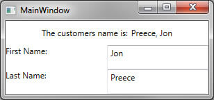

The purpose of this series of tutorials is to introduce the Model-View-ViewModel (MVVM) design pattern, and look at how to correctly implement it in a Windows Presentation Foundation (WPF) application. This series is targeted at developers of all levels, but especially at developers who are looking to make the transition from Windows Forms to WPF.

### Capturing user input

In the previous walkthrough we; set up our view model, bound it to the view, and added a property for our model class. We then displayed a customer name on the UI. Let's go ahead and make this slightly more interactive. We want to expand our UI so that user can go ahead and update the customer details. Update your code to the following;

```xml
<Window x:Class="CustomerPortal.MainWindow"
	xmlns="http://schemas.microsoft.com/winfx/2006/xaml/presentation"
	xmlns:x="http://schemas.microsoft.com/winfx/2006/xaml"
	xmlns:local="clr-namespace:CustomerPortal" Title="MainWindow" Height="140" Width="350">
	<Window.DataContext>
		<local:MainWindowViewModel />
	</Window.DataContext>
	<Grid Margin="10">
		<Grid.RowDefinitions>
			<RowDefinition Height="Auto" />
			<RowDefinition />
			<RowDefinition />
		</Grid.RowDefinitions>
		<Grid.ColumnDefinitions>
			<ColumnDefinition />
			<ColumnDefinition />
		</Grid.ColumnDefinitions>
		<StackPanel Orientation="Horizontal"
                    Grid.ColumnSpan="2"
                    VerticalAlignment="Center"
                    HorizontalAlignment="Center"
                    Margin="10">
			<TextBlock Text="The customers name is:"
                       Margin="0,0,5,0" />
			<TextBlock Text="{Binding Customer.LastName, Mode=OneWay}" />
			<TextBlock Text=","
                       Margin="0,0,5,0" />
			<TextBlock Text="{Binding Customer.FirstName, Mode=OneWay}" />
		</StackPanel>
		<TextBlock Text="First Name:"
                   Grid.Row="1"/>
		<TextBox Text="{Binding Customer.FirstName}"
                 Grid.Row="1"
                 Grid.Column="1" />
		<TextBlock Text="Last Name:"
                   Grid.Row="2" />
		<TextBox Text="{Binding Customer.LastName}"
                 Grid.Row="2"
                 Grid.Column="2" />
	</Grid>
</Window>
```

The UI should now look something like this;

[](updatedui1.jpg)

Let's take a moment to review the behaviour...go ahead and make changes to the First Name and Last Name text boxes. You will notice that when the text box loses focus, the Customers Name label is updated with the new values. I can also assure you that the underlying model is also being updated to reflect these changes.

### An unexpected situation

This works because the UI is instigating the update. The user is making a change to a control which is bound to our model, and WPF knows to push this change to the model for us automatically. So what happens when we instigate the change from our model class? Take the following code;

```csharp
protected override void AfterDelayElapsed() {
 Customer.FirstName = "Bob";
 Customer.LastName = "Smith";
}
```

The above method (which is located in our MainWindowViewModel class) runs after a period of time (in this case 10 seconds) has elapsed. Its reasonable to assume that because we have a TwoWay binding to the property on our view, the view should just be updated automatically. This is not the case. When making changes to your model classes, you have to inform the runtime that said property has changed. This practice is known as **raising change notifications** in WPF. (and is arguably the vein of every WPF developers life). There are several approaches you can take for raising change notifications, and they all start in the same way.

- Your class must implement the `INotifyPropertyChanged` interface ([System.ComponentModel.INotifyPropertyChanged](http://msdn.microsoft.com/en-us/library/system.componentmodel.inotifypropertychanged.aspx 'INotifyPropertyChanged')). This can be either on the individual class itself, or on a base class (the recommended approach)
- The above interface provides an event that must be called, passing in the name of the property that has changed.

**Base Classes Are Your Friend** I highly recommend that instead of implementing `INotifyPropertyChanged` directly on all of your model and view-model classes, you create a base class (called for example; BaseNotification or BaseViewModel or BaseModel) and implement the interface on there instead. Then it is customary to have a protected method that actually takes care of raising the event. First example implementation:

```csharp
public class BaseNotification: INotifyPropertyChanged {
 public event PropertyChangedEventHandler PropertyChanged;

 protected virtual void OnPropertyChanged(string propertyName) {
  PropertyChangedEventHandler handler = PropertyChanged;
  if (handler != null) {
   handler(this, new PropertyChangedEventArgs(propertyName));
  }
 }
}
```

Using this first approach, you will need to convert all your automatic properties on your model/view-model classes to properties with backing fields (full blown properties) and raise the `OnPropertyChanged` method passing in the name of the property. For example;

```csharp
public class Customer: BaseNotification {
 private string _firstName;
 private string _lastName;

 public string FirstName {
  get {
   return _firstName;
  }
  set {
   _firstName = value;
   OnPropertyChanged("FirstName");
  }
 }

 public string LastName {
  get {
   return _lastName;
  }
  set {
   _lastName = value;
   OnPropertyChanged("LastName");
  }
 }

}
```

This approach is less than ideal because we effectively have [magic strings](http://en.wikipedia.org/wiki/Magic_string 'Magic Strings') in our code, and this is bad. Not wrong, but bad. If you are using the .NET Framework 4.5, you can easily eliminate the magic string by adding the [CallerMemberName](http://msdn.microsoft.com/en-us/library/system.runtime.compilerservices.callermembernameattribute.aspx 'System.Runtime.CompilerServices.CallerMemberName') attribute to the the PropertyName parameter on your `OnPropertyChanged` method.

```csharp
protected virtual void OnPropertyChanged([CallerMemberName] string propertyName = "") {
 PropertyChangedEventHandler handler = PropertyChanged;
 if (handler != null) {
  handler(this, new PropertyChangedEventArgs(propertyName));
 }
}
```

Note that the `CallerMemberName` attribute requires that the PropertyName parameter is an optional parameter. So with this in mind, a property on our model class would now look like this;

```csharp
public string FirstName {
 get {
  return _firstName;
 }
 set {
  _firstName = value;
  OnPropertyChanged();
 }
}
```

Don't forget to add the using statement at the top of the file;

```csharp
using System.Runtime.CompilerServices;
```

### A Better Way

You're in luck, there is one final way to resolve this nuisance...and we need to take a second to thank the open source community for this one. Whilst there are several packages available, I am particularly fond of [PropertyChanged.Fody](http://nuget.org/packages/PropertyChanged.Fody/ 'PropertyChanged.Fody') ... a free & open source project hosted on NuGet. [](capture1.jpg) From a (very!) high level, this tool (and tools like it) convert your automatic properties into properties with backing fields and inject the `OnPropertyChanged` method call for you...all at compile time! (hold for applause) So as long as your class either implements `INotifyPropertyChanged` directly, or gets it from a base model class, your work is done.

### Summary

We can easily update the model from our view thanks to two way bindings, however when updating our model we need to notify the runtime that the property has changed...this is known as change notifications. There are two main approaches to raising change notifications; implement `INotifyPropertyChanged` and raising the PropertyChanged event manually using a variety of techniques, or using a third party compile time tool to do this for us. Next we will look at Events and Commands in WPF.

### Revisions

Updated 26/6/13 - Altered description of `CallerMemberName`. Thanks [Leom Burke](http://leomburke.wordpress.com/ 'Leom Burke')!
