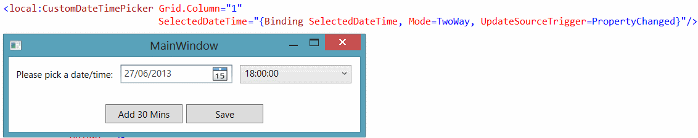

The purpose of this series of tutorials is to introduce the Model-View-ViewModel (MVVM) design pattern, and look at how to quickly and simply implement it in a Windows Presentation Foundation (WPF) application. This series is targeted at developers of all levels, but especially at developers who are looking to make the transition from Windows Forms to WPF. This final part of the series assumes you have at least read the previous parts, or have a good working knowledge of WPF and the MVVM design pattern.

### User Controls

User controls are controls that you have created for use throughout your application. Often user controls are a composite of existing WPF controls, pieced together to simplify code, improve maintainability by improving code reuse, and provide a consistent look and feel throughout your application. In this tutorial we are going to look at how to create a date time picker as a single, unified control that accepts a `DateTime` object as its value.



To make this possible, we will need to create the following;

* Resource dictionary to store all our styles/layout behaviour (called CustomControls.xaml)
* A class for the control behavioural logic itself (called CustomDateTimePicker.cs)
* A view and a view model for displaying and binding (called MainWindow.xaml and MainWindowViewModel.cs)

Go ahead and add the above files into your project. If you followed on from earlier parts of this post, simply stick with your existing project.

### CustomDatePicker behavioural logic

Our user control is going to be a composite control that consists of a DatePicker and a ComboBox (for the times, shown in 30 minute intervals. When we provide a `DateTime` object to the control, it is going to split the values and display them accordingly. Likewise, when the user selects a date/time, that value is going to be reflected back to our view model. Start by firing up the CustomDatePicker.cs file, make sure its `public` and inherits from `UserControl`. Also, ensure that the class implements the `INotifyPropertyChanged` interface, to ensure change notifications are created when appropriate.

```csharp
public class CustomDateTimePicker: UserControl, INotifyPropertyChanged {
 #region INotifyPropertyChanged Members

 public event PropertyChangedEventHandler PropertyChanged;

 protected virtual void OnPropertyChanged(string propertyName) {
  PropertyChangedEventHandler handler = PropertyChanged;
  if (handler != null) handler(this, new PropertyChangedEventArgs(propertyName));
 }

 #endregion
}
```

Start by adding a dependency property to the control, called SelectedDateTime. This will be the property that we will bind to on our view model, to both provide data to the control, and receive data from it;

```csharp
#region Dependency Properties
  public static readonly DependencyProperty SelectedDateTimeProperty = DependencyProperty.Register("SelectedDateTime", typeof(DateTime), typeof(CustomDateTimePicker), new PropertyMetadata(GetDefaultDateTime(), Changed));

  public DateTime SelectedDateTime {
    get {
      return (DateTime) GetValue(SelectedDateTimeProperty);
    }
    set {
      SetValue(SelectedDateTimeProperty, value);
    }
  }
#endregion
```

Amongst other things, a dependency properties accept bindings and raise their own change notifications (normal properties do not). Next we are going to need some private methods/members.

```csharp
  #region Private Members

    private DateTime _date;
    private bool _isInternallyChanging;
    private TimeSpan _time;

  #endregion

  #region Private Methods

  private static void Changed(DependencyObject d, DependencyPropertyChangedEventArgs e) {
    CustomDateTimePicker picker = d as CustomDateTimePicker;
    if (picker == null) return;

    if (picker._isInternallyChanging)
      return;

    DateTime dateTime = (DateTime) e.NewValue;

    picker.Date = dateTime.Date;
    picker.Time = TimeSpan.Parse(dateTime.ToString("HH:00"));
  }

  private static ObservableCollection<TimeSpan> GetDefaultTimes() {
    ObservableCollection<TimeSpan> times = new ObservableCollection<TimeSpan>();

    DateTime today = DateTime.Today;
    for (DateTime time = today.AddHours(0); time < today.AddHours(24); time = time.AddMinutes(30)) {
      times.Add(time.TimeOfDay);
    }

    return times;

  }

  private static DateTime GetDefaultDateTime() {
    return DateTime.Parse(DateTime.Now.ToString("dd-MMM-yyyy HH:00"));
  }

  private void SetSelectedDate() {
    _isInternallyChanging = true;
    SelectedDateTime = new DateTime(Date.Year, Date.Month, Date.Day, Time.Hours, Time.Minutes, Time.Seconds);
    _isInternallyChanging = false;
  }

  #endregion
```

The static method `Changed` is a call back method that gets raised whenever the value of the dependency property gets changed. We need to keep an eye on the new value, so that whenever it changes (as long as we arent making the changes internally), we can split the value and display each part in the corresponding control. The other private methods are helper methods to populate the times combo box, get the selected date etc. Finally, add the constructor and the public properties to ensure that the times combo box is populated and to ensure that there is a property for each control to bind to (Date and Time split parts);

```csharp
#region Constructor
  public CustomDateTimePicker() {
    Times = GetDefaultTimes();
  }
#endregion

#region Public Properties

  public DateTime Date {
    get {
      return _date;
    }
    set {
      _date = value;
      SetSelectedDate();
    }
  }
  public TimeSpan Time {
    get {
      return _time;
    }
    set {
      _time = value;
      SetSelectedDate();
    }
  }
  public ObservableCollection<TimeSpan> Times {
    get;
    set;
  }
#endregion
```

### The controls user interface

All we need to do now, in relation to the code for our custom control, is to design its visual appearance. This is achieved by using a style and control template. First things first, make sure that the resource dictionary you have added in reference in the App.xaml file;

```xml
<Application.Resources>
	<ResourceDictionary Source="CustomControls.xaml" />
</Application.Resources>
```

Add the following code to your resource dictionary;

```xml
<Style TargetType="{x:Type local:CustomDateTimePicker}">
	<Setter Property="Width" Value="300" />
	<Setter Property="HorizontalAlignment" Value="Left" />
	<Setter Property="Template">
		<Setter.Value>
			<ControlTemplate TargetType="{x:Type local:CustomDateTimePicker}">
				<Grid>
					<Grid.ColumnDefinitions>
						<ColumnDefinition />
						<ColumnDefinition Width="10" />
						<ColumnDefinition />
					</Grid.ColumnDefinitions>
					<DatePicker SelectedDate="{Binding Date, RelativeSource={RelativeSource TemplatedParent}}" />
					<ComboBox SelectedItem="{Binding Time, RelativeSource={RelativeSource TemplatedParent}}"
                                ItemsSource="{Binding Times, RelativeSource={RelativeSource TemplatedParent}}"
                                Grid.Column="2" />
				</Grid>
			</ControlTemplate>
		</Setter.Value>
	</Setter>
</Style>
```

Lets look closely and what we have here. We have basically created a style that targets our user control. Our user control (as it inherits from `UserControl`) has a property called `Template`, which contains the layout logic itself. (Technically, the `Template` property lives on the Control object, which UserControl itself inherits from). The `Template` property expects a control template, which we have given it. And inside the control template is simply the layout for our control. You see we have added a grid, the date picker and the combo box itself. Notice that the bindings back to the CustomDateTimePicker file are a little different that usual. Instead we use either a TemplateBinding (rather than a standard Binding) or a standard binding with the relative source pointing back to the public property. TemplateBinding only works with dependency properties.

### Consuming our custom control

To consume the user control, rather bind a value to it, start by adding a property to your view model (called SelectedDateTime) and give it a default value in the constructor;

```csharp
public MainWindowViewModel() {
 SelectedDateTime = DateTime.Now;
}
public DateTime SelectedDateTime {
 get;
 set;
}
```

Now flip over to the xaml, and add the control;

```xml
<local:CustomDateTimePicker Grid.Column="1" SelectedDateTime="{Binding SelectedDateTime, Mode=TwoWay, UpdateSourceTrigger=PropertyChanged}"/>
```

### Summary

There are many ways to create custom controls in WPF. We have seen one approach here where we create a code file that inherits from `UserControl` and and we define the layout for that control in a resource dictionary.
